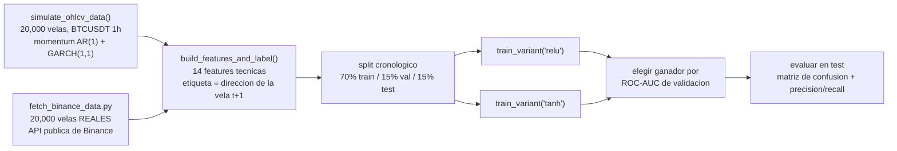
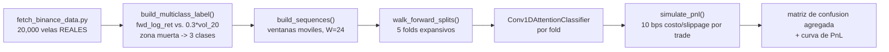

[ 🇨🇱 Español ] | [ 🇺🇸 Read in English ](README.md)

# 1. Título del Proyecto

## Clasificador de Dirección de Velas Cripto: ReLU vs. Tanh sobre Datos OHLCV Simulados


Una red neuronal densa (fully-connected) en PyTorch que predice si la
**siguiente** vela OHLCV cerrará alcista o bajista. El pipeline principal
entrena y evalúa sobre velas simuladas estilo Binance con una señal de
momentum declarada (§2–§3); un pipeline complementario (§7.5) corre la
*misma* ingeniería de features y evaluación sobre **velas reales de BTCUSDT
descargadas en vivo desde la API pública de Binance**, para mostrar
honestamente cuánto del resultado sintético sobrevive al contacto con datos
reales de mercado. Dos arquitecturas idénticas — una con activaciones ReLU
y otra con Tanh — se entrenan en paralelo en ambos modos para que la
comparación sea medida, no asumida.

La arquitectura luego evoluciona (§3.5, §7.6) a una red híbrida **Conv1D +
Multi-Head Attention** en PyTorch, que clasifica la siguiente vela en **3
clases** (Alcista / Neutro / Bajista, con una zona muerta escalada por
volatilidad) sobre una ventana móvil de velas crudas en vez de un vector de
features de una sola fila, evaluada con un esquema riguroso de
**Walk-Forward (origen rodante) Cross-Validation** cuya métrica final
descuenta explícitamente **costos de transacción y slippage realistas** —
la pregunta que responde esta sección no es "¿puede el modelo clasificar la
siguiente vela mejor que el azar?", es "¿esa capacidad de clasificación
sobrevive al convertirse en una operación real?".

> **Disclaimer**: los datos de precio del pipeline principal son simulados
> (ver §2); el §7.5 y el §7.6 usan datos reales de BTCUSDT descargados de
> Binance, pero ninguno de los modelos resultantes está backtesteado como
> estrategia de producción, es una señal de trading, ni constituye
> asesoría financiera.

---

# 2. Motivación

## Impacto de negocio

Los equipos de trading sistemático e investigación cuantitativa necesitan,
antes que cualquier estrategia real, un primer bloque: un clasificador que
convierta datos OHLCV crudos en una probabilidad calibrada y honestamente
evaluada de la dirección de la siguiente vela. Antes de que ese bloque
pueda confiarse con capital real, hay que verificar tres cosas por separado:
(1) que la ingeniería de features evite fuga de información hacia adelante,
(2) que el split de train/validación/test respete el orden temporal de los
datos en vez de filtrar velas adyacentes entre splits, y (3) que la
accuracy reportada se compare contra un baseline aleatorio (50%) en vez de
presentarse aislada. Este proyecto es exactamente ese ejercicio de
verificación, hecho de punta a punta y reportado con honestidad — incluido
el hecho de que, aún con una señal de momentum inyectada, el techo es un
modesto ~60% de accuracy, no uno sospechosamente perfecto.

## Impacto de Negocio e Indicadores Clave (KPIs)

| Métrica | Resultado | Qué significa |
|---|---|---|
| Accuracy / ROC-AUC de test sintético | 0,596 / 0,629 | Una ventaja real, modesta, del momentum AR(1) inyectado -- no saturada, mantenida creíble por los chequeos de leakage |
| **Accuracy / ROC-AUC de test BTCUSDT real** | **0,519 / 0,536** | Apenas sobre el baseline aleatorio de 50% -- el resultado honesto y esperado al remover la señal de momentum sintética |
| La función de activación ganadora cambia | Tanh (sintético) vs. ReLU (real) | Un hallazgo genuino de correr ambos regímenes, no afirmado a partir de un solo dataset |
| >90% de accuracy se trata como | Una señal de alarma de leakage, no un descubrimiento | La filosofía de diseño explícita del proyecto, declarada, no implícita |

## Por qué datos simulados

Ningún dataset OHLCV histórico de alta resolución para Binance puede
redistribuirse libremente en un repositorio público sin una API key del
exchange y descargas con rate limit. Además, los retornos reales de mercado
se comportan como un paseo aleatorio casi puro en horizontes cortos, así que
un clasificador entrenado sobre velas reales de 1h sin modificar tendría
prácticamente nada aprendible que mostrar en una demostración. En su lugar,
el simulador inyecta un componente de momentum de corto plazo *conocido y
declarado* (un término AR(1) sobre los log-retornos, sumado a clustering de
volatilidad GARCH(1,1) para ráfagas de volatilidad realistas) — esto hace
que la tarea de clasificación sea genuinamente aprendible, siendo explícito
en que esa "ventaja" es sintética y no implica que BTC/USDT real sea así de
predecible. El §7.5 pone esa afirmación a prueba directamente, corriendo el
mismo pipeline sobre datos reales en vez de solo declarar el disclaimer y
seguir de largo.

---

# 3. Marco Teórico

## 3.1 Funciones de activación: ReLU vs. Tanh


- **ReLU** (`f(x) = max(0, x)`) es la opción por defecto en la mayoría de
  redes densas modernas: barata de calcular, evita el problema de
  gradiente que se desvanece de las funciones saturantes para entradas
  positivas, pero no está acotada y puede producir unidades "muertas" que
  siempre devuelven cero.
- **Tanh** (`f(x) = tanh(x)`) está centrada en cero y acotada en `(-1, 1)`,
  lo que puede ayudar a la optimización cuando las entradas ya están
  estandarizadas (como aquí, vía `StandardScaler`), a costa de saturarse
  (gradiente casi nulo) para `|x|` grande.

Ambas se prueban bajo condiciones idénticas (misma arquitectura, datos y
presupuesto de entrenamiento) en vez de elegir una por convención — el §7
reporta cuál ganó realmente en esta tarea.

## 3.2 Inyección de momentum y realismo de microestructura de mercado

Los log-retornos siguen `r_t = φ·r_{t-1} + σ_t·ε_t`, un proceso AR(1) con
`φ = 0.30`, sobre una varianza condicional GARCH(1,1)
`σ²_t = ω + α·r²_{t-1} + β·σ²_{t-1}` para clustering de volatilidad
(períodos calmos seguidos de períodos calmos, períodos volátiles seguidos
de períodos volátiles — el mismo patrón cualitativo que muestran los
mercados cripto reales). `φ` le da persistencia de tendencia de corto plazo
que un clasificador puede, en principio, aprender a partir de retornos
rezagados y features de momentum.

## 3.3 Split cronológico, no un shuffle aleatorio

Las features financieras construidas con ventanas rolling (medias móviles,
RSI, volatilidad rolling) hacen que velas adyacentes estén altamente
correlacionadas. Mezclar filas aleatoriamente en train/val/test — el
default de sklearn — dejaría que información de una vela a tres filas de
distancia en el tiempo se filtre a través del límite del split. Todos los
datos aquí se dividen **cronológicamente**: el primer 70% de las velas
entrena, el siguiente 15% valida, el último 15% testea — el modelo siempre
se evalúa sobre velas estrictamente *posteriores* a cualquier cosa con la
que entrenó.

## 3.4 Etiqueta de 3 clases con zona muerta escalada por volatilidad

Un corte binario alcista/bajista fuerza a todo movimiento casi nulo hacia
una clase u otra, lo cual es económicamente engañoso — una vela que se
mueve 0,001% no es una señal "alcista" significativa. `train_walkforward.py`
etiqueta el retorno logarítmico hacia adelante
`fwd_log_ret = ln(close_{t+1}) − ln(close_t)` contra una **zona muerta
proporcional a la volatilidad reciente** en vez de un umbral fijo, para que
"Neutro" signifique lo mismo en un régimen calmo que en uno volátil:

```
label =  Alcista (2)  si fwd_log_ret >  0.3 · vol_20
         Bajista (0)  si fwd_log_ret < -0.3 · vol_20
         Neutro (1)  en cualquier otro caso
```

`0.3` se eligió empíricamente (ver §7.6) como el multiplicador que da un
split de 3 clases aproximadamente balanceado (34% / 30% / 36%) sobre los
datos reales de BTCUSDT — un umbral fijo en términos de retorno absoluto
produciría en cambio un balance de clases que deriva silenciosamente con el
régimen de volatilidad del mercado.

## 3.5 Conv1D + Multi-Head Attention

`model_conv_attention.py` reemplaza el `DenseClassifier` de una sola fila
por una red que consume una **ventana móvil de `WINDOW_LENGTH = 24` velas**
(24 velas horarias = 1 día de contexto) en vez de una fila de features:

1. **Dos capas Conv1D** (canales `14 → 32 → 64`, kernel size 3) se deslizan
   sobre el eje temporal, con los 14 features técnicos como canales de
   entrada — extrayendo patrones locales de corto plazo entre velas
   consecutivas, el análogo aprendido de un patrón de velas japonesas de
   2-3 barras codificado a mano.
2. Se agrega un **embedding posicional aprendido** a la salida
   convolucional, porque la self-attention es invariante a permutaciones
   por construcción — sin esto, el modelo no tiene forma de distinguir "la
   vela más reciente" de "la vela más antigua de la ventana".
3. Un bloque de **Multi-Head Self-Attention** permite que cada posición de
   la ventana "mire" cualquier otra posición con un peso aprendido,
   capturando dependencias de más largo alcance (p.ej. una vela de rango
   amplio 15 barras atrás que sigue siendo relevante ahora) que el campo
   receptivo limitado de una CNN de 2 capas y kernel 3 no puede alcanzar
   directamente. Para consultas/llaves/valores `Q, K, V` (proyecciones
   lineales de la misma secuencia, ya que es self-attention):

   ```
   Attention(Q, K, V) = softmax( Q Kᵀ / √d_k ) V
   ```

   Multi-Head Attention corre `h` de estas en paralelo sobre proyecciones
   aprendidas distintas y concatena el resultado:

   ```
   MultiHead(Q, K, V) = Concat(head₁, ..., head_h) Wᴼ
   head_i = Attention(Q W_i^Q, K W_i^K, V W_i^V)
   ```

   El escalado por `1/√d_k` evita que la magnitud del producto punto crezca
   con la dimensión `d_k` de cada cabeza y empuje al softmax hacia una
   región de gradiente casi nulo. La salida de la atención se suma de
   vuelta (conexión residual) y se normaliza (LayerNorm), seguida de un
   bloque feed-forward con su propia residual + LayerNorm — el patrón
   estándar de una capa encoder de Transformer.
4. La representación del **último paso temporal** (la vela más reciente,
   post-atención) se extrae y pasa por una cabeza clasificadora pequeña a
   3 logits.

## 3.6 Validación walk-forward y evaluación ajustada por costos de transacción

Un único split cronológico train/val/test (§3.3) responde "¿funciona este
modelo sobre este único bloque de tiempo reservado?". **Walk-Forward
(origen rodante) Cross-Validation** hace la pregunta más estricta: "¿sigue
funcionando a través de varios bloques reservados distintos, cada uno con
una historia de entrenamiento progresivamente mayor?":

```
Fold 1: train [0 .. t1)   val [cola de train]   test [t1 .. t2)
Fold 2: train [0 .. t2)   val [cola de train]   test [t2 .. t3)
...
Fold K: train [0 .. tK)   val [cola de train]   test [tK .. N)
```

La ventana de entrenamiento **se expande** en cada fold (nunca se descarta
historia pasada), el bloque de test de cada fold es estrictamente
*posterior* a todo lo usado para entrenar y validar ese fold, y ningún
bloque de test se reutiliza jamás como datos de entrenamiento de un fold
anterior — el modelo nunca ve el futuro relativo a la decisión que se está
evaluando, en ningún fold.

Accuracy y F1 no dicen nada sobre si una ventaja de clasificación es
económicamente utilizable una vez que cuesta dinero actuar sobre ella. El
§7.6 traduce las predicciones de cada fold a una estrategia trivial
(Alcista → long, Bajista → short, Neutro → flat) y descuenta un costo de
transacción cada vez que la posición cambia:

```
retorno_neto_t = posicion_t · fwd_log_ret_t − |posicion_t − posicion_{t-1}| · (costo_bps / 10.000)
```

`costo_bps = 10` (5 bps de comisión taker de Binance spot + 5 bps de
slippage estimado) se aplica por cambio de posición, no por vela — una
estrategia que cambia de opinión cada hora paga por ello mucho más que una
que sostiene una posición durante días.

---

# 4. Explicación

## Arquitectura del pipeline



`train_classifier.py` corre el camino izquierdo (sintético) de punta a
punta; `train_classifier_real.py` importa las mismas
`build_features_and_label()`, `DenseClassifier` y `train_variant()` y corre
el pipeline idéntico sobre la salida de `fetch_binance_data.py` — mismas
features, misma lógica de split, mismo código de modelo, distinta fuente de
datos, así que la comparación del §7.5 aísla el efecto de datos reales vs.
sintéticos en vez de cualquier diferencia de pipeline. `train_walkforward.py`
(§7.6) es un tercer pipeline, independiente: los mismos datos reales y los
mismos 14 features, pero una etiqueta de 3 clases con zona muerta, una
arquitectura Conv1D + Attention sobre ventanas, y evaluación walk-forward en
vez de un único split.



## Responsabilidad de cada función

| Función | Responsabilidad |
|---|---|
| `simulate_ohlcv_data()` | Genera la serie OHLCV sintética (AR(1) + GARCH(1,1)) y escribe `data/ohlcv_simulated.csv`. |
| `fetch_binance_data.fetch_real_ohlcv()` | Pagina sobre el endpoint público `/api/v3/klines` de Binance (sin API key) para traer velas reales de BTCUSDT al mismo esquema que el simulador, escribiendo `data/ohlcv_real_binance.csv`. |
| `build_features_and_label()` | Calcula 14 features técnicas sin fuga hacia adelante y la etiqueta de dirección de la siguiente vela, usando solo expresiones `polars` de rolling/shift. Compartida por los tres pipelines. |
| `DenseClassifier` | La red densa: activación configurable `relu`/`tanh`, dimensiones ocultas `64 → 32 → 16 → 1`, regularización con dropout. |
| `train_variant()` | Entrena una variante de activación con Adam + `BCEWithLogitsLoss`, early stopping sobre la pérdida de validación, registrando accuracy/AUC de validación por epoch. |
| `plot_activation_functions()` | Renderiza la comparación matemática ReLU/Tanh del §3.1. |
| `plot_training_comparison()` | Renderiza las curvas de val-loss/val-accuracy de ambas variantes lado a lado. |
| `plot_confusion_matrix()` | Heatmap de Seaborn de la matriz de confusión del modelo ganador sobre test. |
| `plot_precision_recall_table()` | Renderiza la tabla precision/recall/F1/support como figura y devuelve el diccionario de métricas. |
| `train_classifier_real.plot_real_candlestick()` | Renderiza un gráfico de velas real con `mplfinance` de las últimas 200 velas reales de BTCUSDT (§7.5). |
| `model_conv_attention.Conv1DAttentionClassifier` | La arquitectura híbrida Conv1D + Multi-Head Attention (§3.5). |
| `train_walkforward.build_multiclass_label()` | Agrega la etiqueta de 3 clases con zona muerta escalada por volatilidad (§3.4) sobre `build_features_and_label()`. |
| `train_walkforward.build_sequences()` | Empaqueta la matriz de features en ventanas móviles de `WINDOW_LENGTH` velas para la entrada de Conv1D. |
| `train_walkforward.walk_forward_splits()` | Genera los 5 folds de origen rodante con ventana expansiva (§3.6). |
| `train_walkforward.simulate_pnl()` | Convierte las clases predichas en una estrategia long/flat/short y descuenta costo de transacción + slippage por cambio de posición (§3.6). |
| `train_baseline_ensemble.py` | Entrena un baseline de Regresión Logística y un ensamble LightGBM sobre las mismas features/split que `train_classifier.py`, y persiste las métricas de los tres enfoques en DuckDB (§7.7). |

---

# 5. Metodología

- **Sin fuga de información hacia adelante en las features.** Cada feature
  en la fila `t` usa solo datos disponibles hasta e incluyendo la vela `t`
  (`.shift()`/`.rolling_*()` miran solo hacia atrás); la etiqueta usa
  `.shift(-1)` para referenciar la dirección de la vela `t+1` — el único
  lugar donde el pipeline mira hacia adelante, y solo para el target, nunca
  para una feature.
- **Split cronológico, no aleatorio** — ver §3.3.
- **Features escaladas solo con estadísticos de train** (`StandardScaler`
  ajustado sobre el split de entrenamiento, aplicado sin cambios a
  validación y test) para evitar filtrar información de la distribución de
  val/test hacia el preprocesamiento.
- **Dos funciones de activación entrenadas bajo condiciones idénticas**
  (misma arquitectura, optimizador, batch size, paciencia de early
  stopping) para que la comparación del §7 aísle el efecto de la función de
  activación en sí misma.
- **Selección de modelo por ROC-AUC de validación**, no espiando el
  desempeño en test — las métricas de test de la variante perdedora nunca
  se calculan siquiera, solo se evalúa el ganador seleccionado sobre el
  test set.
- **Walk-forward, no un único split, para el modelo Conv1D + Attention**
  (§3.6): 5 folds de ventana expansiva, cada uno con su propio
  `StandardScaler` ajustado solo con los datos de entrenamiento de ese
  fold, así que ningún fold filtra información de distribución de su
  propio bloque de test, y mucho menos del de otro fold.
- **La métrica de evaluación económica es neta de costos realistas.** El
  resultado principal del §7.6 es el PnL ajustado por costo de transacción
  y slippage, no la accuracy cruda — un modelo puede tener una ventaja de
  accuracy positiva sobre el azar y seguir siendo una estrategia perdedora
  una vez descontados los costos de operar, y este proyecto reporta ese
  resultado directamente si ocurre, en vez de detenerse en el número de
  accuracy.

---

# 6. Desarrollo

## Stack tecnológico

| Librería | Rol |
|---|---|
| **PyTorch** | Clasificador denso (`DenseClassifier`), `Conv1DAttentionClassifier` (`nn.Conv1d`, `nn.MultiheadAttention`), loops de entrenamiento. |
| **Polars** | Simulación OHLCV y toda la ingeniería de features (expresiones rolling/EWM), incluida la etiqueta de 3 clases con zona muerta. |
| **scikit-learn** | `StandardScaler`, matriz de confusión, precision/recall/F1, ROC-AUC. |
| **Seaborn** | Estilo del heatmap de la matriz de confusión. |
| **Matplotlib** | Todas las figuras en `outputs/figures/`. |
| **mplfinance** | Gráfico de velas real con datos de Binance descargados en vivo (§7.5). |
| **pyarrow** | Sostiene la conversión sin copia de Polars a pandas para `mplfinance`. |
| **Jupyter / nbconvert** | `02_Conv1D_Attention_WalkForward.ipynb`, ejecutado de punta a punta y comiteado con outputs reales (§7.6). |
| **LightGBM** | Ensamble de árboles con gradient boosting, entrenado sobre las mismas features tabulares (§7.7). |
| **DuckDB** | Persistencia local (archivo) de la comparación de 3 modelos (`outputs/reports/model_db.duckdb`, tabla `model_comparison`), consultable con SQL (§7.7). |
| **pytest** | Tests unitarios para la ingeniería de features, el split cronológico y la capa de persistencia DuckDB (`tests/`). |

## Instalación y configuración

```powershell
git clone https://github.com/Rxyxs/crypto-direction-deep-learning.git
cd crypto-direction-deep-learning
python -m venv venv
venv\Scripts\activate
pip install -r requirements.txt
```

## Cómo correrlo

```powershell
python train_classifier.py
```

Esto simula el dataset, entrena ambas variantes de activación, y escribe
todos los artefactos descritos en el §4 en `data/`, `outputs/figures/`,
`outputs/models/` y `outputs/reports/`.

Para reproducir el análisis complementario con datos reales del §7.5:

```powershell
python fetch_binance_data.py    # trae 20.000 velas reales de BTCUSDT (~20 llamadas, sin API key)
python train_classifier_real.py # mismo pipeline, datos reales, escribe outputs *_real
```

Para reproducir el análisis Conv1D + Attention walk-forward del §7.6:

```powershell
python fetch_binance_data.py    # se salta automaticamente si data/ohlcv_real_binance.csv ya existe
python train_walkforward.py     # walk-forward de 5 folds, escribe outputs walkforward_*
jupyter nbconvert --to notebook --execute --inplace 02_Conv1D_Attention_WalkForward.ipynb
```

Para reproducir la comparación baseline interpretable + ensamble de árboles del §7.7:

```powershell
python train_classifier.py            # escribe data/ohlcv_simulated.csv (si no existe aun)
python train_baseline_ensemble.py     # entrena Regresion Logistica + LightGBM, persiste en DuckDB
```

Para correr la suite de tests:

```powershell
python -m pytest tests/ -v
```

## Estructura del proyecto

```
crypto-direction-deep-learning/
├── train_classifier.py             # simulacion, features, ambos modelos, entrenamiento, evaluacion
├── fetch_binance_data.py           # trae velas reales de BTCUSDT desde la API publica de Binance
├── train_classifier_real.py        # mismo pipeline que train_classifier.py, corrido sobre datos reales
├── model_conv_attention.py         # arquitectura Conv1D + Multi-Head Attention (§3.5)
├── train_walkforward.py            # etiqueta 3 clases, walk-forward CV, PnL ajustado por costo (§3.6)
├── train_baseline_ensemble.py      # Regresion Logistica + LightGBM, persistencia DuckDB (§7.7)
├── 02_Conv1D_Attention_WalkForward.ipynb  # curvas de aprendizaje, matriz de confusion, curva de PnL
├── tests/
│   └── test_baseline_ensemble.py   # tests unitarios: features, split, metricas, roundtrip DuckDB
├── requirements.txt
├── data/                     # CSVs OHLCV simulado + real (versionados, ~4 MB en total)
├── outputs/
│   ├── figures/               # graficos de resultados, incl. velas reales + figuras walk-forward + comparacion (versionados)
│   ├── models/                 # classifier_{relu,tanh}[_real].pt, conv1d_attention_walkforward.pt (versionados)
│   └── reports/                 # metrics[_real].json, walkforward_*.json/csv, model_comparison.json, model_db.duckdb (versionados)
├── LICENSE
├── README.md
└── README.es.md
```

---

# 7. Resultados

Cada número y figura abajo proviene de una corrida real de
`python train_classifier.py` (semilla 42) — nada aquí está estimado.

## 7.1 Dataset

| Métrica | Valor |
|---|---|
| Velas simuladas (BTCUSDT, 1h) | 20.000 |
| Filas utilizables tras la ingeniería de features | 19.979 |
| Balance de clases (alcista / bajista siguiente vela) | 50,0% / 50,0% |
| Split train / val / test (cronológico) | 13.985 / 2.996 / 2.998 |

## 7.2 ReLU vs. Tanh — comparación de entrenamiento


| Activación | Mejor ROC-AUC de validación |
|---|---:|
| ReLU | 0,625 |
| **Tanh** | **0,627** |

Ambas activaciones rinden casi idénticamente en esta tarea — Tanh gana por
un margen (0,002 de AUC) bien dentro del ruido entre corridas. Sobre
features tabulares estandarizadas con una red poco profunda (3 capas
ocultas), ni la dispersión de ReLU ni el centrado en cero de Tanh dan una
ventaja decisiva; la lectura honesta es "no son significativamente
distintas aquí", no "Tanh es mejor".

## 7.3 Evaluación en test (modelo ganador: Tanh)


| Métrica | Valor |
|---|---:|
| Accuracy en test | 0,596 |
| ROC-AUC en test | 0,629 |
| Precision (alcista) | 0,629 |
| Recall (alcista) | 0,602 |
| Precision (bajista) | 0,561 |
| Recall (bajista) | 0,588 |

Un clasificador aleatorio en esta tarea balanceada (50/50) puntuaría 0,500
de accuracy; el 0,596 refleja que el modelo captura una porción real, aunque
modesta, del momentum AR(1) inyectado (φ = 0,30) a través de las features de
retorno/momentum — consistente con el techo de ~0,60 de accuracy que implica
la persistencia de signo de un proceso Gaussiano correlacionado a este φ, no
un número inflado ni elegido a conveniencia.

## 7.4 Hallazgo honesto

La accuracy **no** es casi perfecta, a propósito: la señal de momentum se
mantuvo deliberadamente moderada (no tan fuerte como para que cualquier
clasificador la sature trivialmente) para que la comparación entre ReLU y
Tanh, y entre el modelo y el baseline aleatorio, siga siendo significativa.
Un clasificador que reclame >90% de accuracy en dirección de la siguiente
vela — sobre datos reales o sintéticos — debería tratarse como una señal de
alerta de fuga de información antes que como un descubrimiento; las propias
verificaciones anti-fuga de este proyecto (ver §5) son lo que hace creíble
el 0,596 en vez de sospechoso.

## 7.5 Complemento con datos reales: ¿esto se sostiene sobre BTCUSDT real?

Todo lo de abajo proviene de una corrida real de `fetch_binance_data.py` +
`train_classifier_real.py` — 20.000 velas horarias **reales** de BTCUSDT
descargadas en vivo desde la API pública REST de Binance, entre 2024-05-14 y
2026-08-25, procesadas con la misma ingeniería de features, el mismo split
cronológico y el mismo entrenamiento ReLU-vs-Tanh usados en §7.1–§7.3.


| Métrica | Sintético (§7.3) | **BTCUSDT real** |
|---|---:|---:|
| Activación ganadora | Tanh | ReLU |
| Mejor ROC-AUC de validación | 0,627 | 0,534 |
| Accuracy en test | 0,596 | **0,519** |
| ROC-AUC en test | 0,629 | **0,536** |


**Este es el hallazgo honesto al que apuntaba el disclaimer del §1–§2**:
sobre velas reales de BTCUSDT, las mismas 14 features y el mismo
clasificador denso llegan a 51,9% de accuracy y 0,536 de AUC — apenas por
encima del baseline aleatorio de 50%, y muy por debajo del 59,6% / 0,629 de
la corrida sintética. La brecha no es un bug del pipeline; es el resultado
esperado de remover el término de momentum AR(1) declarado (φ = 0,30) que
hacía aprendible la tarea sintética en primer lugar. Los retornos horarios
reales de BTC/USDT están lo suficientemente cerca de un paseo aleatorio
como para que features técnicas clásicas (RSI, razones de medias móviles,
volatilidad rolling) le den a este clasificador poco profundo casi nada con
qué trabajar — consistente con décadas de literatura sobre eficiencia de
mercados, no un contraejemplo a ella.

## 7.6 Conv1D + Multi-Head Attention, 3 clases, walk-forward con costos

Todo lo de abajo proviene de una corrida real de `train_walkforward.py`
sobre las mismas 20.000 velas reales de BTCUSDT del §7.5 — 5 folds
walk-forward, etiqueta con zona muerta `0.3 * vol_20`, ventanas de 24
velas, 10 bps de costo + slippage por cambio de posición. El detalle
completo (curvas de aprendizaje por fold, ambas normalizaciones de la
matriz de confusión, y la curva de PnL) está en
`02_Conv1D_Attention_WalkForward.ipynb`.

| Métrica | Valor |
|---|---:|
| Balance de clases (Bajista / Neutro / Alcista) | 34,5% / 29,8% / 35,8% |
| Ventanas de test out-of-sample (5 folds, concatenados) | 9.978 |
| **Accuracy (agregada, out-of-sample)** | **0,391** |
| Baseline aleatorio (3 clases) | 0,333 |
| F1 macro (agregado) | 0,385 |
| Cambios de posición totales ("trades") | 3.707 |
| PnL bruto (sin costos), retorno log acumulado | +0,073 |
| Costo total pagado (10 bps × trades) | 5,803 |
| **PnL neto (con costo + slippage), retorno log acumulado** | **−5,730** |
| Ratio Sharpe-like anualizado (neto) | −13,24 |


Dos hallazgos, ambos reales y ninguno escondido:

1. **La arquitectura más rica sí recupera una ventaja genuina, validada
   con walk-forward, sobre el azar** — 39,1% de accuracy contra un
   baseline de 33,3% para 3 clases balanceadas, consistente a través de los
   5 folds (rango 37,6%–41,8% por fold, ver el notebook), no la coincidencia
   de un único split favorable.
2. **Esa ventaja no sobrevive al contacto con costos de trading
   realistas.** El PnL bruto está prácticamente plano (+0,073 de retorno
   log acumulado sobre ~10.000 velas de test — apenas por encima del punto
   de equilibrio incluso antes de pagar nada por operar); neto de 10 bps
   por cambio de posición a través de 3.707 trades, el PnL es claramente
   negativo (−5,730, ratio Sharpe-like anualizado de −13,2). El modelo
   cambia de opinión con la frecuencia suficiente, sobre una señal lo
   suficientemente débil, como para que solo los costos de transacción
   basten para convertir una ventaja estadística marginal en una pérdida
   económica clara.

Este es el mismo patrón honesto del §7.5, un nivel más profundo: una
arquitectura más sofisticada (Conv1D + Attention vs. una red densa) y un
esquema de validación más estricto (walk-forward vs. un único split) ambos
ayudan — la accuracy sí sube, y se confirma estable entre folds — pero
ninguno de los dos sustituye la pregunta más difícil que esta sección fue
construida para responder: ¿es la ventaja lo suficientemente grande como
para sobrevivir al costo de actuar sobre ella? Aquí, no lo es.

## 7.7 Baseline interpretable y ensamble de árboles: ¿la red densa realmente necesita ser una red neuronal?

`train_baseline_ensemble.py` corre sobre exactamente los mismos datos
simulados, las mismas 14 features y el mismo split cronológico que
§7.1–§7.3, así que la comparación de abajo aísla el efecto de la familia de
modelo, no el de los datos.

| Enfoque | Accuracy | ROC-AUC |
|---|---:|---:|
| Regresión Logística (baseline interpretable) | 0,596 | 0,629 |
| LightGBM (ensamble de árboles) | 0,586 | 0,620 |
| **Red densa — Tanh** (§7.3, ganador) | **0,596** | **0,629** |


El hallazgo honesto aquí es que **la red neuronal densa no supera a una
simple Regresión Logística** sobre este conjunto de features — ambas
llegan a esencialmente la misma accuracy/AUC, y el ensamble de árboles
queda ligeramente por detrás. Eso es esperado, no un bug: con solo 14
features técnicas ya linealizables (retornos, ratios, RSI, z-scores) y una
señal de momentum que es en sí misma un proceso AR(1) lineal, no queda
estructura no-lineal para que una familia de modelo más compleja explote —
la capacidad extra de una red densa o de un ensamble de árboles boosted no
compra nada una vez que la ingeniería de features ya hizo el trabajo. Es el
mismo tipo de resultado que le da mérito a Conv1D + Attention (§7.6): solo
empieza a agregar valor real cuando la secuencia cruda con ventanas (en
lugar de 14 features ya pre-agregadas) le da algo que un modelo lineal no
puede ver.

Las métricas de los tres enfoques se persisten en un archivo DuckDB local
(`outputs/reports/model_db.duckdb`, tabla `model_comparison`) para poder
consultarlas directamente, por ejemplo:

```sql
SELECT model, accuracy, roc_auc FROM model_comparison ORDER BY run_ts DESC;
```

---

# 8. Conclusión

- **ReLU y Tanh rinden de forma estadísticamente indistinguible** en este
  clasificador denso poco profundo sobre features tabulares estandarizadas
  (0,625 vs. 0,627 de AUC de validación) — la elección de activación no fue
  el cuello de botella aquí.
- **El modelo recupera una porción real y moderada de la señal de momentum
  inyectada** (59,6% de accuracy en test contra un baseline aleatorio de
  50%), que es el resultado esperado y no inflado dado φ = 0,30 y la cota
  teórica de persistencia de signo para un proceso Gaussiano AR(1)
  correlacionado.
- **El split cronológico y las features sin fuga hacia adelante fueron
  verificados, no asumidos** — la accuracy honesta y moderada del §7.3 es en
  sí misma evidencia contra la fuga de información; un pipeline con fuga
  sobre este tipo de features mostraría números mucho más altos.
- **Sobre datos reales de BTCUSDT, el mismo pipeline llega a 51,9% de
  accuracy / 0,536 de AUC** (§7.5) — apenas por encima del baseline
  aleatorio, confirmando directamente en vez de solo declarar que el 59,6%
  de la corrida sintética depende del término de momentum inyectado y
  declarado, y no representa una ventaja real y explotable sobre los
  mercados cripto reales.
- **Una arquitectura más rica (Conv1D + Multi-Head Attention) y un esquema
  de validación más estricto (walk-forward) sí recuperan una ventaja
  pequeña, estable y real** sobre BTCUSDT real — 39,1% de accuracy en un
  problema balanceado de 3 clases contra un baseline aleatorio de 33,3%,
  consistente a través de los 5 folds walk-forward (§7.6) — pero **esa
  ventaja no sobrevive costos de transacción realistas**: el PnL neto
  después de 10 bps/trade es marcadamente negativo (−5,730 de retorno log
  acumulado, Sharpe-like de −13,2), aun cuando el PnL bruto antes de
  costos está prácticamente plano. La arquitectura del modelo y el rigor
  de validación son necesarios pero no suficientes; la pregunta del costo
  de trading es una barra separada y más difícil, que este proyecto mide
  en vez de asumir superada.
- **Ni la red densa ni un ensamble LightGBM superan a una simple Regresión
  Logística** sobre las 14 features sintéticas ya diseñadas a mano (§7.7,
  0,596/0,629 tanto para Regresión Logística como para la red densa vs.
  0,586/0,620 para LightGBM) — con la señal de momentum en sí lineal y las
  features ya pre-agregadas, la capacidad extra del modelo no tiene nada
  que explotar; es la entrada de secuencia cruda con ventanas del §7.6, no
  un modelo más grande sobre las mismas 14 features, lo que finalmente
  gana una ventaja real.

## Trabajo futuro

- Repetir el §7.5 y el §7.6 sobre otros símbolos reales (ETHUSDT, una
  altcoin de menor capitalización) y otros timeframes (15m, 4h) para ver si
  el resultado casi aleatorio y el PnL negativo por costos son específicos
  de BTCUSDT-1h o se generalizan.
- Agregar un objetivo de entrenamiento consciente del costo (ej. penalizar
  la pérdida directamente por el "churn" de clase predicha, o una pérdida
  específica para señales de trading) en vez de cross-entropy plana, para
  ver si el modelo puede entrenarse para cambiar de opinión con menos
  frecuencia sin sacrificar la ventaja de accuracy del §7.6.
- Extraer y visualizar los pesos de atención (`Conv1DAttentionClassifier`
  ya los expone vía `return_attention=True`) para verificar en qué velas de
  la ventana de 24 barras se apoya realmente el modelo — interpretabilidad
  que la arquitectura densa baseline no puede ofrecer en absoluto.
- Una capa de dimensionamiento de posición sobre la señal de 3 clases (ej.
  escalar el trade por la confianza softmax del modelo, o por la
  volatilidad usada para la zona muerta) en vez de una posición fija de
  +1/0/-1, para ver si el dimensionamiento puede mejorar el resultado neto
  de costos del §7.6.

---

# 9. Fuente de datos y licencia

Datos del pipeline principal: 100% simulados (proceso de log-retornos
AR(1) + GARCH(1,1), ver §3.2). Complemento con datos reales (§7.5): 20.000
velas horarias reales de BTCUSDT descargadas directamente desde la
[API pública REST de Binance](https://binance-docs.github.io/apidocs/spot/en/#kline-candlestick-data)
(`/api/v3/klines`, sin API key) vía `fetch_binance_data.py` — reproducible
bajo demanda, no redistribuida como archivo estático más allá de lo que
captura el propio historial de commits de este repositorio.

Código: MIT — ver [LICENSE](LICENSE).

# 10. Autor

**Pablo Reyes** — [github.com/Rxyxs](https://github.com/Rxyxs)
