[ 🇺🇸 English ] | [ 🇨🇱 Leer en Español ](README.es.md)

# 1. Project Title

## Crypto Candle Direction Classifier: ReLU vs. Tanh on Simulated OHLCV Data


A dense (fully-connected) neural network in PyTorch that predicts whether the
**next** OHLCV candle will close bullish or bearish. The primary pipeline
trains and evaluates on simulated Binance-style candles with a disclosed
momentum signal (§2–§3); a companion pipeline (§7.5) runs the *identical*
feature engineering and evaluation on **real BTCUSDT candles pulled live
from Binance's public API**, to show honestly how much of the synthetic
result survives contact with real market data. Two identical architectures —
one with ReLU hidden activations, one with Tanh — are trained side by side
in both modes so the comparison is measured, not assumed.

The architecture then evolves (§3.5, §7.6) into a **hybrid Conv1D +
Multi-Head Attention** network in PyTorch, classifying the next candle into
**3 classes** (Bullish / Neutral / Bearish, with a volatility-scaled
dead-zone) over a rolling window of raw candles instead of a single-row
feature vector, evaluated with a rigorous **Walk-Forward (rolling-origin)
Cross-Validation** scheme whose final metric explicitly deducts **realistic
transaction costs and slippage** — the question this section answers isn't
"can the model classify the next candle better than random," it's "does
that classification skill survive being turned into an actual trade."

> **Disclaimer**: the primary pipeline's price data is simulated (see §2);
> §7.5 and §7.6 use real BTCUSDT data fetched from Binance but neither
> resulting model is backtested as a production strategy, is a trading
> signal, or constitutes financial advice.

## Techniques used

| Technique | Where |
|---|---|
| Dense NN (ReLU vs. Tanh), chronological split | `train_classifier.py`, §3.1, §3.3 |
| Same pipeline replayed on real Binance data | `train_classifier_real.py`, §7.5 |
| Conv1D + Multi-Head Self-Attention over rolling windows | `model_conv_attention.py`, §3.5 |
| Walk-forward (rolling-origin) cross-validation | `train_walkforward.py`, §3.6 |
| Volatility-scaled dead-zone 3-class labeling | `train_walkforward.build_multiclass_label()`, §3.4 |
| Transaction-cost- and slippage-adjusted PnL | `train_walkforward.simulate_pnl()`, §3.6, §7.6 |
| Logistic Regression + LightGBM baselines, DuckDB persistence | `train_baseline_ensemble.py`, §7.7 |

[**Interactive chart**: gross vs. cost-adjusted walk-forward PnL curve (5 folds, 9,978 out-of-sample candles)](https://htmlpreview.github.io/?https://github.com/Rxyxs/crypto-quant-techniques-lab/blob/main/01-direction-classification-deep-learning/outputs/interactive/walkforward_pnl_interactive.html)

---

# 2. Motivation

## Business impact

Systematic trading desks and quant research teams routinely need a first
building block before any real strategy: a classifier that turns raw OHLCV
data into a calibrated, honestly-evaluated probability of the next candle's
direction. Before that block can be trusted with real capital, three things
have to be verified independently: (1) does the feature engineering avoid
look-ahead bias, (2) does the train/validation/test split respect the
time-ordering of the data instead of leaking adjacent candles across splits,
and (3) is the reported accuracy checked against a random baseline (50%)
rather than presented in isolation. This project is that verification
exercise, done end to end and reported honestly — including the fact that,
even with an injected momentum signal, the ceiling is a modest ~60% accuracy,
not a suspiciously perfect one.

## Business Impact & Key Performance Indicators

| Metric | Result | What it means |
|---|---|---|
| Synthetic test accuracy / ROC-AUC | 0.596 / 0.629 | A real, modest edge from the injected AR(1) momentum -- not saturated, kept credible by leakage checks |
| **Real BTCUSDT test accuracy / ROC-AUC** | **0.519 / 0.536** | Barely above the 50% random baseline -- the honest, expected result once the synthetic momentum signal is removed |
| Activation function winner flips | Tanh (synthetic) vs. ReLU (real) | A genuine finding from running both regimes, not asserted from one dataset |
| >90% accuracy treated as | A leakage red flag, not a discovery | The project's own design philosophy, stated explicitly rather than implied |

## Why simulated data

No free, high-resolution historical OHLCV dataset for Binance can be
redistributed in a public repository without an exchange API key and
rate-limited downloads. Real market returns are also close to a random walk
at short horizons, so a classifier trained on unmodified real 1h candles
would have essentially nothing learnable to show in a demonstration. Instead,
the simulator injects a *known, disclosed* short-term momentum component (an
AR(1) term on log-returns, on top of GARCH(1,1) volatility clustering for
realistic volatility bursts) — this makes the classification task genuinely
learnable while being explicit that the "edge" is synthetic and does not
imply real BTC/USDT is this predictable. §7.5 puts that claim to the test
directly, running the same pipeline on real data instead of asserting the
disclaimer and moving on.

---

# 3. Theoretical Framework

## 3.1 Activation functions: ReLU vs. Tanh

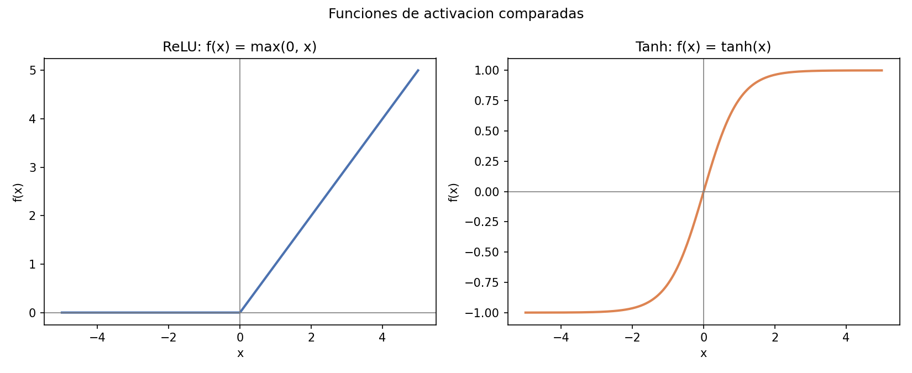

- **ReLU** (`f(x) = max(0, x)`) is the default choice for most modern dense
  networks: cheap to compute, avoids the vanishing-gradient problem of
  saturating functions for positive inputs, but is unbounded and can produce
  "dead" units that always output zero.
- **Tanh** (`f(x) = tanh(x)`) is zero-centered and bounded in `(-1, 1)`,
  which can help optimization when inputs are already standardized (as they
  are here, via `StandardScaler`), at the cost of saturating (near-zero
  gradient) for large `|x|`.

Both are tested under identical conditions (same architecture, data, and
training budget) rather than picking one by convention — §7 reports which
one actually won on this task.

## 3.2 Momentum injection and market-microstructure realism

Log-returns follow `r_t = φ·r_{t-1} + σ_t·ε_t`, an AR(1) process with
`φ = 0.30`, on top of a GARCH(1,1) conditional variance
`σ²_t = ω + α·r²_{t-1} + β·σ²_{t-1}` for volatility clustering (calm periods
followed by calm periods, volatile periods followed by volatile periods —
the same qualitative pattern real crypto markets show). `φ` gives short-term
trend persistence a classifier can, in principle, learn from lagged returns
and momentum features.

## 3.3 Chronological split, not a random shuffle

Financial features built from rolling windows (moving averages, RSI,
rolling volatility) make adjacent candles highly correlated. Randomly
shuffling rows into train/val/test — the sklearn default — would let
information from a candle three rows away in time leak across the split
boundary. All data here is split **chronologically**: the first 70% of
candles train, the next 15% validate, the final 15% test — the model is
always evaluated on candles strictly *after* anything it trained on.

## 3.4 3-class labeling with a volatility-scaled dead-zone

A binary bullish/bearish split forces every near-zero move into one class
or the other, which is economically misleading — a candle that moves
0.001% is not a meaningful "bullish" signal. `train_walkforward.py` labels
the forward log-return `fwd_log_ret = ln(close_{t+1}) − ln(close_t)`
against a **dead-zone proportional to recent volatility** rather than a
fixed threshold, so "Neutral" means the same thing in a calm regime as in
a volatile one:

```
label =  Bullish (2)  if fwd_log_ret >  0.3 · vol_20
         Bearish (0)  if fwd_log_ret < -0.3 · vol_20
         Neutral (1)  otherwise
```

`0.3` was chosen empirically (see §7.6) as the multiplier that yields a
roughly balanced 3-way split (34% / 30% / 36%) on the real BTCUSDT data —
a fixed threshold in absolute return terms would instead produce a class
balance that silently drifts with the market's volatility regime.

## 3.5 Conv1D + Multi-Head Attention

`model_conv_attention.py` replaces the single-row `DenseClassifier` with a
network that consumes a **rolling window of `WINDOW_LENGTH = 24` candles**
(24 hourly candles = 1 day of context) instead of one row of features:

1. **Two Conv1D layers** (`14 → 32 → 64` channels, kernel size 3) slide
   over the time axis, with the 14 technical features as input channels —
   extracting local, short-range patterns between consecutive candles, the
   learned analogue of a hand-coded 2–3-bar candlestick pattern.
2. A **learned positional embedding** is added to the convolutional
   output, because self-attention is permutation-invariant by construction
   — without it, the model has no way to tell "the most recent candle"
   apart from "the oldest candle in the window."
3. A **Multi-Head Self-Attention** block lets every position in the window
   attend to every other position with a learned weight, capturing
   longer-range dependencies (e.g. a wide-range candle 15 bars back that's
   still relevant now) that a 2-layer, kernel-3 CNN's limited receptive
   field cannot reach directly. For queries/keys/values `Q, K, V`
   (linear projections of the same sequence, since this is self-attention):

   ```
   Attention(Q, K, V) = softmax( Q Kᵀ / √d_k ) V
   ```

   Multi-Head Attention runs `h` of these in parallel over different
   learned projections and concatenates the result:

   ```
   MultiHead(Q, K, V) = Concat(head₁, ..., head_h) Wᴼ
   head_i = Attention(Q W_i^Q, K W_i^K, V W_i^V)
   ```

   The `1/√d_k` scaling keeps the dot product's magnitude from growing
   with the per-head dimension `d_k` and pushing the softmax into a
   near-zero-gradient region. The attention output is added back
   (residual connection) and layer-normalized, followed by a feed-forward
   block with its own residual + LayerNorm — the standard Transformer
   encoder-layer pattern.
4. The **last time step's** representation (the most recent candle,
   post-attention) is pooled and passed through a small classifier head to
   3 logits.

## 3.6 Walk-forward validation and transaction-cost-adjusted evaluation

A single chronological train/val/test split (§3.3) answers "does this
model work on this one held-out block of time." **Walk-Forward
(rolling-origin) Cross-Validation** asks the stricter question "does it
keep working across several different held-out blocks, each with a
progressively larger training history":

```
Fold 1: train [0 .. t1)   val [tail of train]   test [t1 .. t2)
Fold 2: train [0 .. t2)   val [tail of train]   test [t2 .. t3)
...
Fold K: train [0 .. tK)   val [tail of train]   test [tK .. N)
```

The training window **expands** on every fold (past history is never
discarded), each fold's test block is strictly *after* everything used to
train and validate that fold, and no test block is ever reused as training
data for an earlier fold — the model never sees the future relative to the
decision being evaluated, in any fold.

Accuracy and F1 say nothing about whether a classification edge is
economically usable once it costs money to act on. §7.6 translates each
fold's predictions into a trivial strategy (Bullish → long, Bearish →
short, Neutral → flat) and deducts a transaction cost every time the
position changes:

```
net_return_t = position_t · fwd_log_ret_t − |position_t − position_{t-1}| · (cost_bps / 10,000)
```

`cost_bps = 10` (5 bps Binance spot taker fee + 5 bps estimated slippage)
is applied per position change, not per candle — a strategy that changes
its mind every hour pays for it far more than one that holds a position
for days.

---

# 4. Explanation

## Pipeline architecture

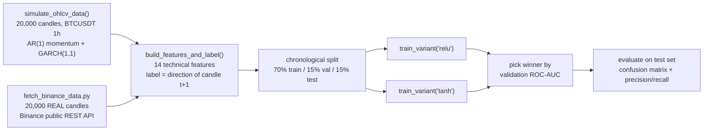

`train_classifier.py` runs the left (synthetic) path end to end;
`train_classifier_real.py` imports the same `build_features_and_label()`,
`DenseClassifier`, and `train_variant()` and runs the identical pipeline on
`fetch_binance_data.py`'s output instead — same features, same split logic,
same model code, different data source, so the §7.5 comparison isolates the
effect of real vs. synthetic data rather than any pipeline difference.
`train_walkforward.py` (§7.6) is a third, independent pipeline: same real
data and same 14 features, but a 3-class dead-zone label, a windowed
Conv1D + Attention architecture, and walk-forward evaluation instead of a
single split.

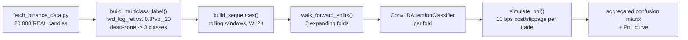

## Function responsibilities

| Function | Responsibility |
|---|---|
| `simulate_ohlcv_data()` | Generates the synthetic OHLCV series (AR(1) + GARCH(1,1)) and writes `data/ohlcv_simulated.csv`. |
| `fetch_binance_data.fetch_real_ohlcv()` | Pages through Binance's public `/api/v3/klines` REST endpoint (no API key required) to pull real BTCUSDT candles into the same schema as the simulator, writing `data/ohlcv_real_binance.csv`. |
| `build_features_and_label()` | Computes 14 look-ahead-safe technical features and the next-candle-direction label, using only `polars` rolling/shift expressions. Shared by all three pipelines. |
| `DenseClassifier` | The dense network: configurable `relu`/`tanh` activation, `64 → 32 → 16 → 1` hidden dims, dropout regularization. |
| `train_variant()` | Trains one activation variant with Adam + `BCEWithLogitsLoss`, early-stopping on validation loss, tracking val accuracy/AUC per epoch. |
| `plot_activation_functions()` | Renders the ReLU/Tanh mathematical comparison in §3.1. |
| `plot_training_comparison()` | Renders the val-loss/val-accuracy curves for both variants side by side. |
| `plot_confusion_matrix()` | Seaborn heatmap of the winning model's test-set confusion matrix. |
| `plot_precision_recall_table()` | Renders the precision/recall/F1/support table as a figure and returns the metrics dict. |
| `train_classifier_real.plot_real_candlestick()` | Renders a real `mplfinance` candlestick chart of the most recent 200 real BTCUSDT candles (§7.5). |
| `model_conv_attention.Conv1DAttentionClassifier` | The hybrid Conv1D + Multi-Head Attention architecture (§3.5). |
| `train_walkforward.build_multiclass_label()` | Adds the 3-class, volatility-scaled dead-zone label (§3.4) on top of `build_features_and_label()`. |
| `train_walkforward.build_sequences()` | Packs the feature matrix into rolling windows of `WINDOW_LENGTH` candles for the Conv1D input. |
| `train_walkforward.walk_forward_splits()` | Generates the 5 expanding-window rolling-origin folds (§3.6). |
| `train_walkforward.simulate_pnl()` | Turns predicted classes into a long/flat/short strategy and deducts transaction cost + slippage per position change (§3.6). |
| `train_baseline_ensemble.py` | Trains a Logistic Regression baseline and a LightGBM ensemble on the exact same features/split as `train_classifier.py`, and persists all three approaches' metrics to DuckDB (§7.7). |

---

# 5. Methodology

- **No look-ahead bias in features.** Every feature at row `t` uses only
  data available up to and including candle `t` (`.shift()`/`.rolling_*()`
  look backward only); the label uses `.shift(-1)` to reference candle
  `t+1`'s direction — the only place the pipeline looks forward, and only
  for the target, never for a feature.
- **Chronological, not random, splitting** — see §3.3.
- **Features scaled on train statistics only** (`StandardScaler` fit on the
  training split, applied unchanged to validation and test) to avoid
  leaking val/test distribution information into preprocessing.
- **Two activation functions trained under identical conditions** (same
  architecture, optimizer, batch size, early-stopping patience) so the
  comparison in §7 isolates the effect of the activation function itself.
- **Model selection by validation ROC-AUC**, not by peeking at test
  performance — the losing variant's test metrics are never computed at
  all, only the selected winner is scored on the held-out test set.
- **Walk-forward, not a single split, for the Conv1D + Attention model**
  (§3.6): 5 expanding-window folds, each with its own `StandardScaler`
  fit only on that fold's training data, so no fold ever leaks
  distribution information from its own test block, let alone another
  fold's.
- **The economic evaluation metric is net of realistic costs.** §7.6's
  headline result is the transaction-cost-and-slippage-adjusted PnL, not
  bare accuracy — a model can have positive accuracy edge over random and
  still be a losing strategy once trading costs are subtracted, and this
  project reports that outcome directly if it happens rather than stopping
  at the accuracy number.

---

# 6. Development

## Tech stack

| Library | Role |
|---|---|
| **PyTorch** | Dense classifier (`DenseClassifier`), `Conv1DAttentionClassifier` (`nn.Conv1d`, `nn.MultiheadAttention`), training loops. |
| **Polars** | OHLCV simulation and all feature engineering (rolling/EWM expressions), including the 3-class dead-zone label. |
| **scikit-learn** | `StandardScaler`, confusion matrix, precision/recall/F1, ROC-AUC. |
| **Seaborn** | Confusion-matrix heatmap styling. |
| **Matplotlib** | Every figure in `outputs/figures/`. |
| **mplfinance** | Real candlestick chart of live-fetched Binance data (§7.5). |
| **pyarrow** | Backs Polars' zero-copy conversion to pandas for `mplfinance`. |
| **Jupyter / nbconvert** | `02_Conv1D_Attention_WalkForward.ipynb`, executed end to end and committed with real outputs (§7.6). |
| **LightGBM** | Gradient-boosted tree ensemble baseline, trained on the same tabular features (§7.7). |
| **DuckDB** | Local, file-based persistence of the 3-way model comparison (`outputs/reports/model_db.duckdb`, table `model_comparison`), queryable with SQL (§7.7). |
| **pytest** | Unit tests for feature engineering, the chronological split, and the DuckDB persistence layer (`tests/`). |

## Installation and setup

```powershell
git clone https://github.com/Rxyxs/crypto-direction-deep-learning.git
cd crypto-direction-deep-learning
python -m venv venv
venv\Scripts\activate
pip install -r requirements.txt
```

## Running it

```powershell
python train_classifier.py
```

This simulates the dataset, trains both activation variants, and writes
every artifact described in §4 to `data/`, `outputs/figures/`,
`outputs/models/`, and `outputs/reports/`.

To reproduce the real-data companion analysis in §7.5:

```powershell
python fetch_binance_data.py    # pulls 20,000 real BTCUSDT candles (~20 API calls, no key needed)
python train_classifier_real.py # same pipeline, real data, writes *_real outputs
```

To reproduce the Conv1D + Attention walk-forward analysis in §7.6:

```powershell
python fetch_binance_data.py    # skipped automatically if data/ohlcv_real_binance.csv already exists
python train_walkforward.py     # 5-fold walk-forward, writes walkforward_* outputs
jupyter nbconvert --to notebook --execute --inplace 02_Conv1D_Attention_WalkForward.ipynb
```

To reproduce the interpretable-baseline + tree-ensemble comparison in §7.7:

```powershell
python train_classifier.py            # writes data/ohlcv_simulated.csv (if not already present)
python train_baseline_ensemble.py     # trains Logistic Regression + LightGBM, persists to DuckDB
```

To run the test suite:

```powershell
python -m pytest tests/ -v
```

## Project structure

```
crypto-direction-deep-learning/
├── train_classifier.py             # simulation, features, both models, training, evaluation
├── fetch_binance_data.py           # pulls real BTCUSDT candles from Binance's public API
├── train_classifier_real.py        # same pipeline as train_classifier.py, run on real data
├── model_conv_attention.py         # Conv1D + Multi-Head Attention architecture (§3.5)
├── train_walkforward.py            # 3-class label, walk-forward CV, cost-adjusted PnL (§3.6)
├── train_baseline_ensemble.py      # Logistic Regression + LightGBM, DuckDB persistence (§7.7)
├── 02_Conv1D_Attention_WalkForward.ipynb  # learning curves, confusion matrix, PnL curve
├── tests/
│   └── test_baseline_ensemble.py   # unit tests: features, split, metrics, DuckDB roundtrip
├── requirements.txt
├── data/                     # simulated + real OHLCV CSVs (version-controlled, ~4 MB total)
├── outputs/
│   ├── figures/               # result plots, incl. real candlestick + walk-forward + comparison figures (version-controlled)
│   ├── models/                 # classifier_{relu,tanh}[_real].pt, conv1d_attention_walkforward.pt (version-controlled)
│   └── reports/                 # metrics[_real].json, walkforward_*.json/csv, model_comparison.json, model_db.duckdb (version-controlled)
├── LICENSE
├── README.md
└── README.es.md
```

---

# 7. Results

Every number and figure below comes from an actual run of
`python train_classifier.py` (seed 42) — nothing here is estimated.

## 7.1 Dataset

| Metric | Value |
|---|---|
| Simulated candles (BTCUSDT, 1h) | 20,000 |
| Usable rows after feature engineering | 19,979 |
| Class balance (bullish / bearish next candle) | 50.0% / 50.0% |
| Train / Val / Test split (chronological) | 13,985 / 2,996 / 2,998 |

## 7.2 ReLU vs. Tanh — training comparison

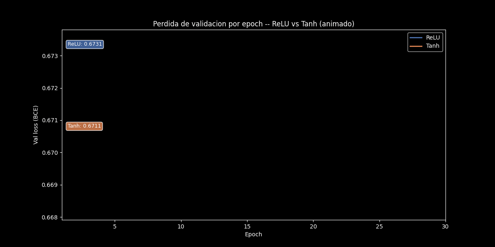
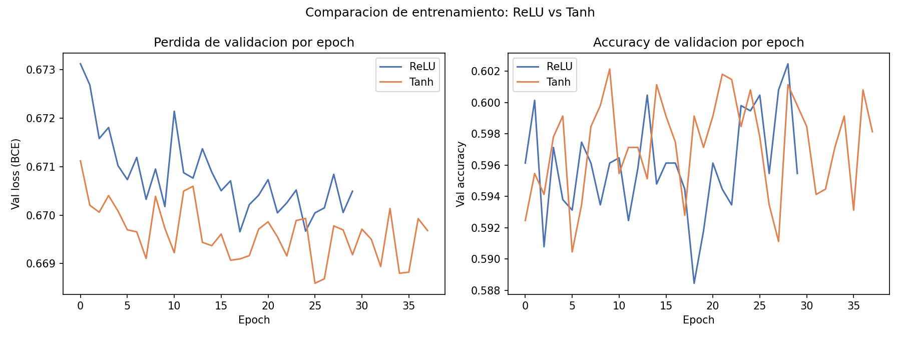

| Activation | Best validation ROC-AUC |
|---|---:|
| ReLU | 0.625 |
| **Tanh** | **0.627** |

The two activations perform almost identically on this task — Tanh wins by
a margin (0.002 AUC) well within run-to-run noise. On standardized tabular
features with a shallow (3-hidden-layer) network, neither ReLU's sparsity
nor Tanh's zero-centering gives a decisive edge; the honest reading is "not
meaningfully different here," not "Tanh is better."

## 7.3 Test-set evaluation (winning model: Tanh)

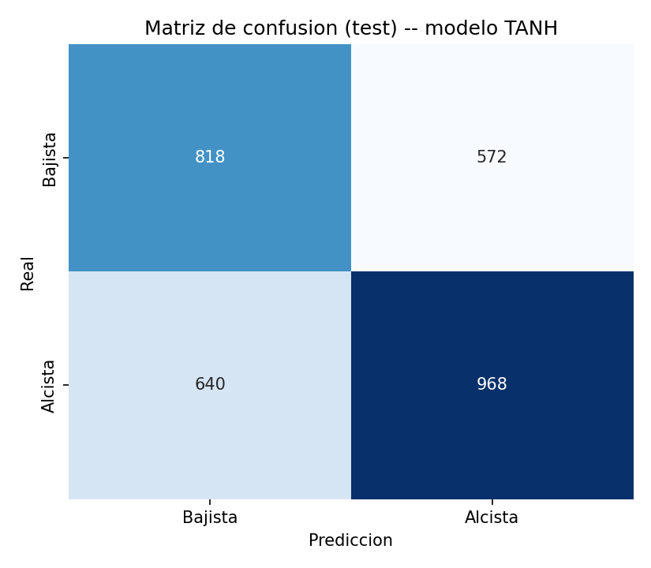

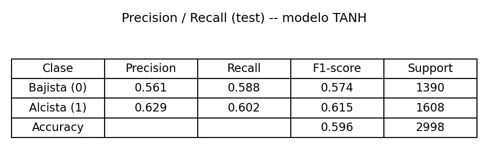

| Metric | Value |
|---|---:|
| Test accuracy | 0.596 |
| Test ROC-AUC | 0.629 |
| Precision (bullish) | 0.629 |
| Recall (bullish) | 0.602 |
| Precision (bearish) | 0.561 |
| Recall (bearish) | 0.588 |

A random classifier on this balanced (50/50) task would score 0.500
accuracy; 0.596 reflects the model picking up a real, if modest, share of
the injected AR(1) momentum (φ = 0.30) through the momentum/return features
— consistent with the ~0.60 accuracy ceiling implied by the sign-persistence
of a correlated Gaussian process at this φ, not an inflated or cherry-picked
number.

## 7.4 Honest finding

Accuracy is **not** near-perfect, on purpose: the momentum signal was
deliberately kept moderate (not so strong that any classifier trivially
saturates it) so the comparison between ReLU and Tanh, and between the model
and the random baseline, stays meaningful. A classifier claiming >90%
accuracy on next-candle direction — on real or synthetic data — should be
treated as a red flag for leakage before being treated as a discovery; this
project's own leakage checks (see §5) are what keep 0.596 credible instead
of suspicious.

## 7.5 Real data companion: does this hold up on actual BTCUSDT?

Everything below comes from an actual run of `fetch_binance_data.py` +
`train_classifier_real.py` — 20,000 **real** hourly BTCUSDT candles pulled
live from Binance's public REST API, spanning 2024-05-14 to 2026-08-25,
pushed through the identical feature engineering, chronological split, and
ReLU-vs-Tanh training used in §7.1–§7.3.

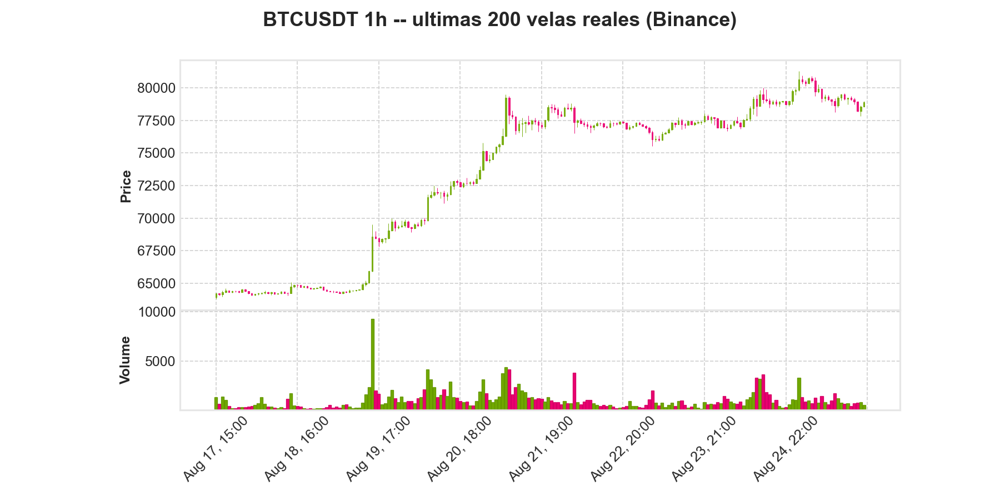

| Metric | Synthetic (§7.3) | **Real BTCUSDT** |
|---|---:|---:|
| Winning activation | Tanh | ReLU |
| Best validation ROC-AUC | 0.627 | 0.534 |
| Test accuracy | 0.596 | **0.519** |
| Test ROC-AUC | 0.629 | **0.536** |

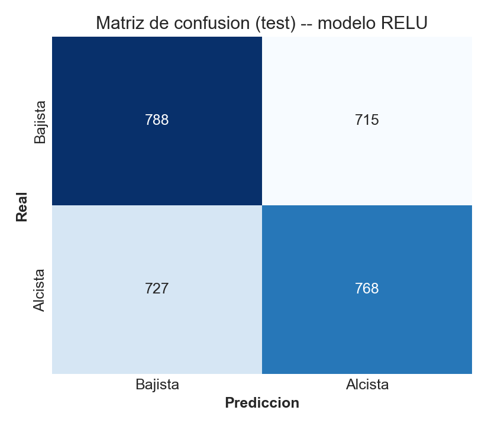

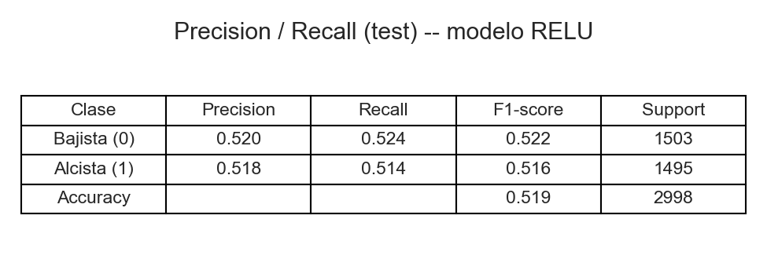

**This is the honest finding the disclaimer in §1–§2 was pointing at**: on
real BTCUSDT candles, the same 14 features and the same dense classifier
land at 51.9% accuracy and 0.536 AUC — barely above the 50% random baseline,
and far below the synthetic run's 59.6% / 0.629. The gap is not a pipeline
bug; it is the expected outcome of removing the disclosed φ = 0.30 AR(1)
momentum term that made the synthetic task learnable in the first place.
Real hourly BTC/USDT returns are close enough to a random walk that
1990s-style technical features (RSI, moving-average ratios, rolling
volatility) give this shallow classifier almost nothing to work with —
consistent with decades of market-efficiency literature, not a
counter-example to it.

## 7.6 Conv1D + Multi-Head Attention, 3 classes, walk-forward with costs

Everything below comes from an actual run of `train_walkforward.py` on the
same 20,000 real BTCUSDT candles as §7.5 — 5 walk-forward folds, `0.3 *
vol_20` dead-zone labeling, 24-candle windows, 10 bps cost + slippage per
position change. Full detail (per-fold learning curves, both confusion
matrix normalizations, and the PnL curve) is in
`02_Conv1D_Attention_WalkForward.ipynb`.

| Metric | Value |
|---|---:|
| Class balance (Bearish / Neutral / Bullish) | 34.5% / 29.8% / 35.8% |
| Out-of-sample test windows (5 folds, concatenated) | 9,978 |
| **Accuracy (aggregate, out-of-sample)** | **0.391** |
| Random baseline (3 classes) | 0.333 |
| F1 macro (aggregate) | 0.385 |
| Total position changes ("trades") | 3,707 |
| Gross PnL (no costs), cumulative log-return | +0.073 |
| Total cost paid (10 bps × trades) | 5.803 |
| **Net PnL (after cost + slippage), cumulative log-return** | **−5.730** |
| Annualized Sharpe-like ratio (net) | −13.24 |

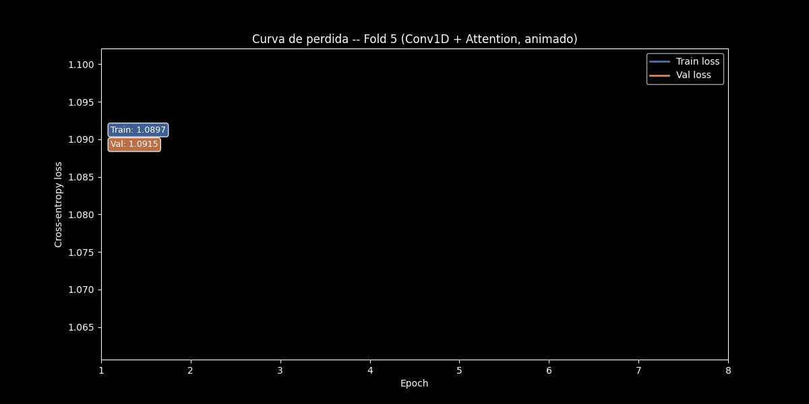

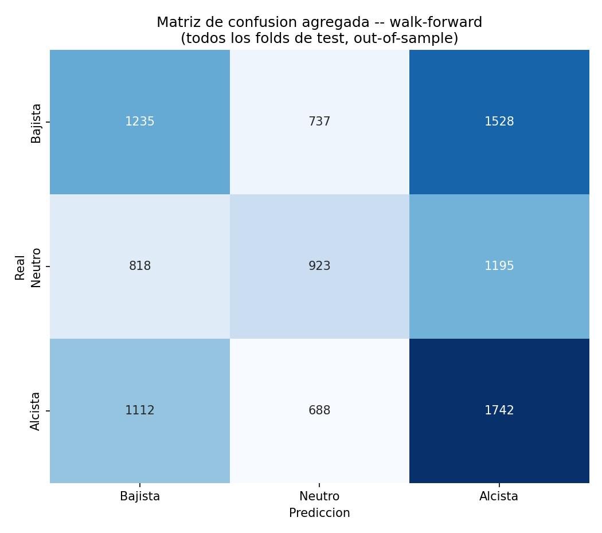

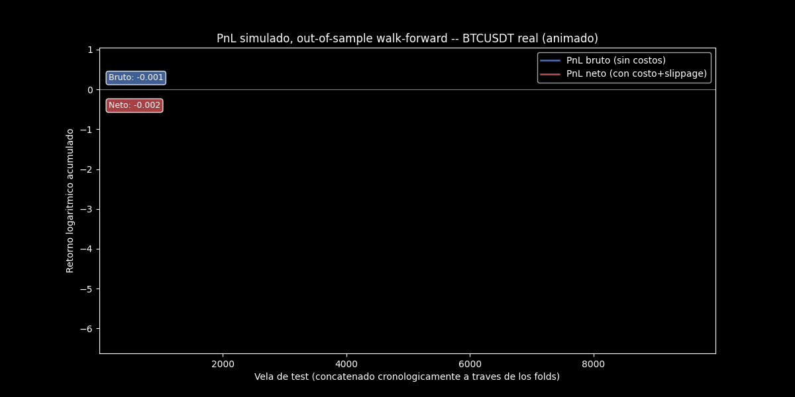

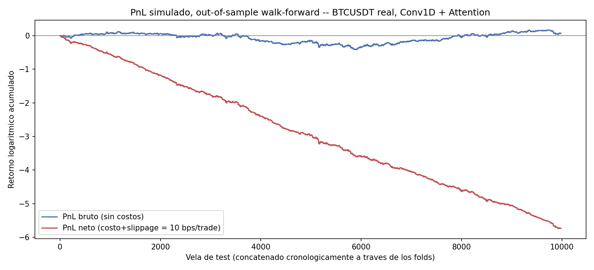

Two findings, both real and neither hidden:

1. **The richer architecture does recover a genuine, walk-forward-validated
   edge over random guessing** — 39.1% accuracy against a 33.3% baseline
   for 3 balanced classes, consistent across all 5 folds (37.6%–41.8%
   range per fold, see the notebook), not a lucky single split.
2. **That edge does not survive contact with realistic trading costs.**
   Gross PnL is close to flat (+0.073 cumulative log-return over ~10,000
   test candles — barely above breakeven even before paying anything to
   trade); net of 10 bps per position change across 3,707 trades, PnL is
   sharply negative (−5.730, annualized Sharpe-like ratio of −13.2). The
   model is changing its mind often enough, on a signal weak enough, that
   transaction costs alone are enough to turn a marginal statistical edge
   into a clear economic loss.

This is the same honest pattern as §7.5, one level deeper: a more
sophisticated architecture (Conv1D + Attention vs. a dense network) and a
stricter validation scheme (walk-forward vs. a single split) both help —
accuracy does rise, and it's confirmed stable across folds — but neither
is a substitute for asking the harder question this section was built to
answer: is the edge big enough to survive the cost of acting on it? Here,
it isn't.

## 7.7 Interpretable baseline & tree ensemble: does the dense NN actually need to be a neural net?

`train_baseline_ensemble.py` runs on the exact same simulated data, the
same 14 features, and the same chronological split as §7.1–§7.3, so the
comparison below isolates the effect of the model family, not the data.

| Approach | Accuracy | ROC-AUC |
|---|---:|---:|
| Logistic Regression (interpretable baseline) | 0.596 | 0.629 |
| LightGBM (tree ensemble) | 0.586 | 0.620 |
| **Dense NN — Tanh** (§7.3, winner) | **0.596** | **0.629** |

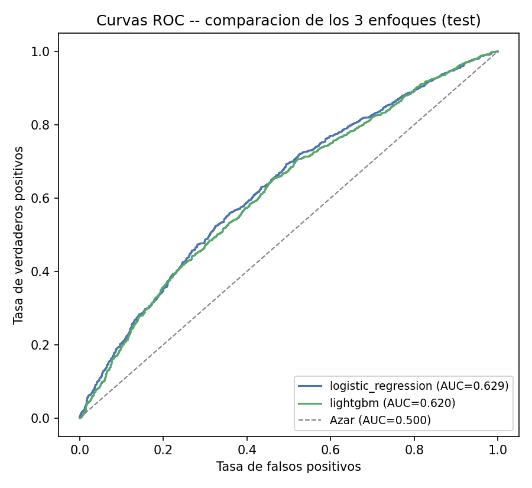

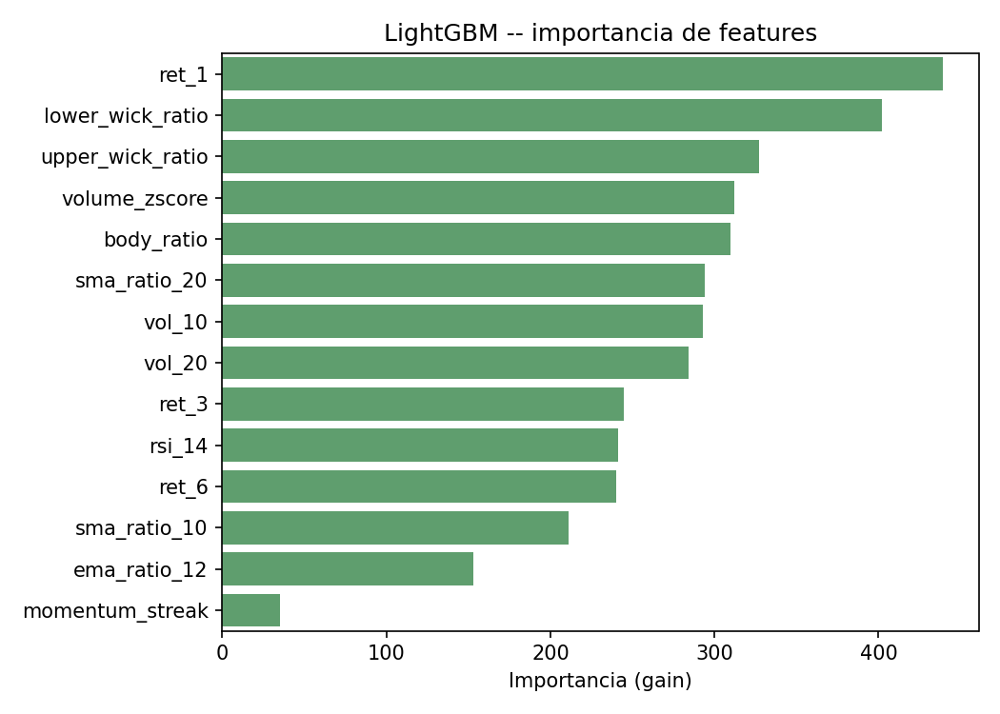

The honest finding here is that **the dense neural network does not
outperform a plain Logistic Regression** on this feature set — both land
at essentially the same accuracy/AUC, and the tree ensemble trails
slightly. That is expected, not a bug: with only 14 hand-engineered,
already-linearizable technical features (returns, ratios, RSI, z-scores)
and a momentum signal that is itself a linear AR(1) process, there is no
non-linear structure left for a more complex model family to exploit — the
extra capacity of a dense network or a boosted-tree ensemble buys nothing
once the feature engineering has already done the work. This is the same
kind of result Conv1D + Attention (§7.6) earns credit for: it only starts
to add real value once the raw windowed sequence (rather than 14
pre-aggregated features) gives it something a linear model cannot see.

All three approaches' metrics are persisted to a local DuckDB file
(`outputs/reports/model_db.duckdb`, table `model_comparison`) so they can
be queried directly, e.g.:

```sql
SELECT model, accuracy, roc_auc FROM model_comparison ORDER BY run_ts DESC;
```

---

# 8. Conclusion

- **ReLU and Tanh perform statistically indistinguishably** on this
  shallow dense classifier over standardized tabular features (0.625 vs.
  0.627 validation AUC) — the activation choice was not the bottleneck here.
- **The model recovers a real, moderate share of the injected momentum
  signal** (59.6% test accuracy against a 50% random baseline), which is
  the expected, non-inflated outcome given φ = 0.30 and the theoretical
  sign-persistence bound for a correlated Gaussian AR(1) process.
- **Chronological splitting and look-ahead-safe features were verified, not
  assumed** — the honest, moderate accuracy in §7.3 is itself evidence
  against leakage; a leaky pipeline on this kind of feature set would show
  far higher numbers.
- **On real BTCUSDT data, the same pipeline lands at 51.9% accuracy / 0.536
  AUC** (§7.5) — barely above the random baseline, confirming directly
  rather than just asserting that the synthetic run's 59.6% depends on the
  disclosed, injected momentum term and does not represent a real,
  exploitable edge on actual crypto markets.
- **A richer architecture (Conv1D + Multi-Head Attention) and a stricter
  validation scheme (walk-forward) do recover a small, stable, real edge**
  on real BTCUSDT — 39.1% accuracy on a balanced 3-class problem against a
  33.3% random baseline, consistent across all 5 walk-forward folds (§7.6)
  — but **that edge does not survive realistic transaction costs**: net
  PnL after 10 bps/trade is sharply negative (−5.730 cumulative
  log-return, Sharpe-like −13.2), even though gross PnL before costs is
  close to flat. Model architecture and validation rigor are necessary but
  not sufficient; the trading-cost question is a separate, harder bar that
  this project measures rather than assumes away.
- **Neither the dense NN nor a LightGBM ensemble beats a plain Logistic
  Regression** on the 14 hand-engineered synthetic features (§7.7,
  0.596/0.629 for both Logistic Regression and the dense NN vs.
  0.586/0.620 for LightGBM) — with the momentum signal itself linear and
  the features already pre-aggregated, extra model capacity has nothing
  left to exploit; it is the raw windowed sequence input in §7.6, not a
  bigger model on the same 14 features, that eventually earns a real edge.

## Future work

- Repeat §7.5 and §7.6 on additional real symbols (ETHUSDT, a lower-cap
  altcoin) and timeframes (15m, 4h) to see whether the near-random result
  and the cost-negative PnL are specific to BTCUSDT-1h or generalize.
- Add a cost-aware training objective (e.g. penalize the loss directly for
  predicted-class churn, or a trading-signal-specific loss) instead of
  plain cross-entropy, to see whether the model can be trained to change
  its mind less often without sacrificing the accuracy edge from §7.6.
- Extract and visualize the attention weights (`Conv1DAttentionClassifier`
  already exposes them via `return_attention=True`) to check which candles
  in the 24-bar window the model actually leans on — interpretability the
  dense baseline architecture cannot offer at all.
- A position-sizing layer on top of the 3-class signal (e.g. scale the
  trade by the model's softmax confidence, or by the volatility used for
  the dead-zone) instead of a fixed +1/0/-1 position, to see whether sizing
  can improve the net-of-cost result in §7.6.

---

# 9. Data source & license

Primary pipeline data: 100% simulated (AR(1) + GARCH(1,1) log-return
process, see §3.2). Real-data companion (§7.5): 20,000 real BTCUSDT hourly
candles fetched directly from
[Binance's public REST API](https://binance-docs.github.io/apidocs/spot/en/#kline-candlestick-data)
(`/api/v3/klines`, no API key required) via `fetch_binance_data.py` —
reproducible on demand, not redistributed as a static file beyond what this
repository's own commit history captures.

Code: MIT — see [LICENSE](LICENSE).

# 10. Author

**Pablo Reyes** — [github.com/Rxyxs](https://github.com/Rxyxs)
