[ 🇺🇸 Read in English ](README.md) | [ 🇨🇱 Español ]

# 1. Título del Proyecto

## Modelo de Impacto en Precio del Order Book (XGBoost)


Un modelo de regresión que responde una pregunta concreta de microestructura
de mercado: *dado el estado actual del order book y el flujo reciente de
trades, ¿cuánto mueve eso el precio en los próximos minutos — y en qué
horizonte desaparece realmente esa ventaja?* Se entrenan tres regresores
complementarios sobre las mismas features reales de profundidad del order
book y flujo de trades para predecir el retorno futuro del precio de
BTCUSDT: un modelo de impacto lineal interpretable (Ridge), un regresor
XGBoost ajustado con validación cruzada que respeta el tiempo, y un MLP
en PyTorch entrenado con una loss Huber custom (§7.7 compara los tres).

**Todos los datos son reales, no simulados**: 7 días completos
(2024-05-13 a 2024-05-19) de **`bookDepth`** de futuros perpetuos BTCUSDT
(profundidad del order book a ±1%..5% del mid, cada ~30s) y **`aggTrades`**
(cada trade agregado ejecutado, con el lado agresor) obtenidos directamente
de [Binance Vision](https://data.binance.vision) — el archivo histórico de
datos de mercado de Binance, gratuito, público y sin autenticación. Nada
aquí es sintético ni fabricado; §9 documenta la fuente con precisión.

## Técnicas usadas

| Técnica | Dónde |
|---|---|
| Modelo de impacto lineal (Ridge) | `baseline_impact.py`, §7.7 |
| XGBoost con ajuste de hiperparámetros `TimeSeriesSplit` | `xgboost_impact.py`, §3, §7.2 |
| MLP en PyTorch con loss Huber custom, comparación de activaciones | `pytorch_impact.py`, §7.7 |
| Análisis de decaimiento de señal multi-horizonte (1 / 5 / 15 min) | §7.2 |
| Persistencia en DuckDB de las métricas de los 3 modelos | `persist_metrics.py` |

[**Gráfico interactivo**: VWAP real de BTCUSDT vs. desbalance de profundidad del order book y flujo de trades (bins de 1 min)](https://htmlpreview.github.io/?https://github.com/Rxyxs/crypto-quant-techniques-lab/blob/main/02-liquidity-price-impact/outputs/interactive/price_vs_liquidity_imbalance.html)

---

# 2. Impacto de Negocio e Indicadores Clave (KPIs)

| Métrica | Resultado | Qué significa |
|---|---|---|
| Señal a horizonte de 1 minuto | R² = 0,100, 5,2% de reducción de RMSE vs. naive | Habilidad genuina y medible -- no un número decepcionante, el operacionalmente relevante |
| Decaimiento de la señal | Ruido a los 5 minutos, indistinguible de aleatorio a los 15 minutos | Le dice a una mesa la vida media real de la señal -- qué tan rápido debe actuar sobre una lectura del order book |
| Datos | Datos reales de trades/order book de BTCUSDT | Decaimiento de impacto en precio medido sobre microestructura de mercado genuina, no simulada |

El modelamiento de impacto en precio es el núcleo cuantitativo de dos
problemas de trading muy concretos. **Ejecución**: una mesa trabajando una
orden grande quiere saber cuánto va a mover el precio en su contra su propio
trading, o el imbalance actual del mercado — toda la disciplina de ejecución
óptima (programación TWAP/VWAP, límites de tasa de participación) existe
justamente para gestionar este costo. **Market making**: un motor de
cotización que puede anticipar unos pocos puntos básicos de drift de corto
plazo a partir del estado actual del book puede sesgar sus cotizaciones antes
del movimiento en vez de reaccionar después de él, que es la diferencia
entre capturar el spread y ser adversamente seleccionado por él.

Ambos problemas se reducen a la misma tarea de regresión resuelta aquí, y
los datos reales de BTCUSDT dan una segunda respuesta de negocio igual de
importante: **¿cuánto dura la ventaja?** El modelo muestra habilidad real y
medible a un horizonte de 1 minuto (R² = 0.100, una reducción de RMSE del
5.2% sobre un baseline ingenuo) que ya decayó a ruido a los 5 minutos y es
indistinguible de un predictor aleatorio a los 15 minutos (§7.2). Para un
sistema de trading real esto no es un resultado decepcionante — es el
número operacionalmente más útil de todo el proyecto: le dice a una mesa la
vida media real de la señal, es decir, qué tan rápido necesita actuar sobre
una lectura del order book antes de que la información desaparezca.

---

# 3. Arquitectura

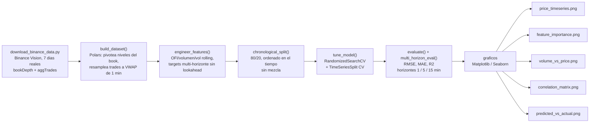

El target se construye con una regla estricta de no-lookahead: las features
en la barra *t* usan solo información de order book/flujo de trades
disponible hasta e incluyendo *t*; la etiqueta de cada horizonte es el
retorno logarítmico de *t* a *t + h* minutos, calculado después de las
columnas de features para que nunca pueda filtrarse hacia ellas. Los
hiperparámetros se ajustan con `TimeSeriesSplit` (nunca un k-fold
mezclado), de modo que cada fold de validación es estrictamente posterior
en el tiempo a su fold de entrenamiento, igual que como se desplegaría y
reentrenaría el modelo en la realidad.

---

# 4. Stack Tecnológico

- **Polars** — pivotea las filas en formato largo de `bookDepth` (una fila
  por timestamp × nivel porcentual) en una tabla ancha por snapshot,
  resamplea ~1.1M trades crudos/día en barras de 1 minuto de VWAP/volumen/
  flujo de órdenes, y corre todo el feature engineering de ventanas
  rolling — la herramienta correcta para este volumen de datos, donde un
  loop de Python estilo pandas no daría abasto.
- **XGBoost** (`XGBRegressor`) — árboles de gradient boosting, objetivo
  `reg:squarederror`, hiperparámetros elegidos por búsqueda y no fijados a
  mano.
- **scikit-learn** — `RandomizedSearchCV` + `TimeSeriesSplit` para ajuste
  de hiperparámetros que respeta el tiempo, más `mean_squared_error`,
  `mean_absolute_error`, `r2_score` para la evaluación contra un baseline
  ingenuo (predecir la media).
- **scikit-learn `Ridge`** — baseline lineal de modelo de impacto
  estandarizado (`baseline_impact.py`), la contraparte interpretable de
  XGBoost/MLP.
- **PyTorch** (CPU) — MLP pequeño (`pytorch_impact.py`) entrenado con una
  implementación custom de loss Huber, comparando activaciones
  ReLU/GELU/Swish.
- **DuckDB** — persiste las métricas comparables de los tres modelos en
  una tabla local `outputs/reports/metrics.duckdb` (`persist_metrics.py`).
- **pytest** — tests unitarios para el feature engineering, el split
  cronológico, el camino de entrenamiento/evaluación de los tres modelos,
  y la persistencia en DuckDB (`tests/`).
- **Matplotlib / Seaborn** — las figuras de resultados de §7.
- **Binance Vision** (`data.binance.vision`) — la fuente real de datos de
  mercado; ver §9 para el alcance exacto y la licencia.
- **Python 3.10**, `venv` estándar, sin notebooks.

---

# 5. Datos

| | |
|---|---|
| Instrumento | Futuros perpetuos BTCUSDT (Binance USDⓈ-M) |
| Período | 2024-05-13 00:00 UTC → 2024-05-19 23:59 UTC (7 días completos) |
| Fuente de order book | `bookDepth` — profundidad acumulada a ±1%, ±2%, ±3%, ±4%, ±5% del mid, cada ~30s |
| Fuente de trades | `aggTrades` — cada trade agregado, precio/cantidad/lado agresor |
| Filas de trades crudos | ~7.0M (fuera del repo, ver §9) |
| Barras de 1 minuto unidas | 10.056 |
| Filas utilizables tras construir features/target | 10.026 |

`data/download_binance_data.py` vuelve a descargar ambas series
directamente desde Binance Vision bajo demanda — sin API key, sin límite de
tasa para este archivo histórico, completamente reproducible.

---

# 6. Feature Engineering

| Feature | Construida a partir de |
|---|---|
| `trade_flow_imbalance` | Volumen ejecutado con signo (lado agresor) / volumen total, por barra de 1 min |
| `ofi_roll5`, `ofi_roll15` | Media rolling de `trade_flow_imbalance` en 5 / 15 minutos |
| `near_depth_imbalance` | (bid − ask) / (bid + ask) de profundidad en el nivel ±1% del book |
| `far_depth_imbalance` | Lo mismo, en el nivel ±5% del book |
| `total_depth` | Profundidad bid + ask combinada a ±5% (proxy de liquidez) |
| `trade_volume`, `volume_roll5` | Volumen de BTC transado por barra, y su media rolling de 5 min |
| `realized_vol_roll15` | Desviación estándar rolling de los retornos log de 1 min, en 15 minutos |
| `lag_return_1`, `lag_return_5` | Retornos log pasados de 1 min y 5 min |

Target: retorno logarítmico futuro del VWAP en los próximos `h` minutos,
`h ∈ {1, 5, 15}`.

---

# 7. Resultados Visuales

Cada número y figura abajo proviene de una ejecución real de
`python xgboost_impact.py` (seed 42, sobre los datos reales de §5) — nada
aquí es estimado.

## 7.1 Precio real de BTCUSDT durante el período muestreado

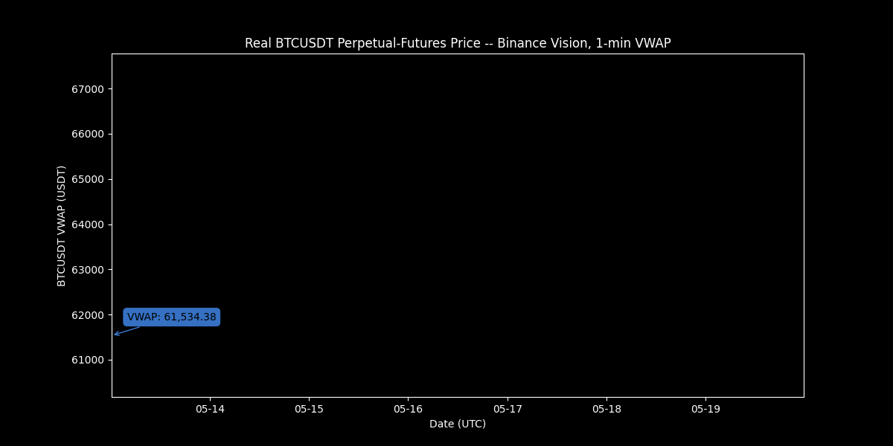
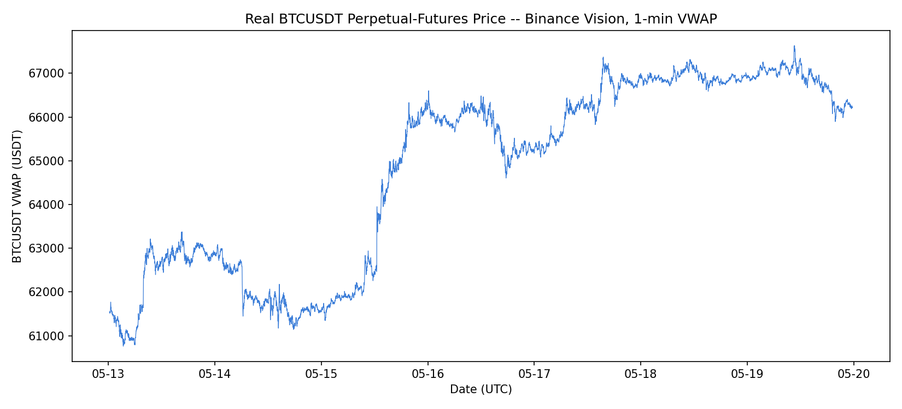

7 días de VWAP real de 1 minuto para futuros perpetuos BTCUSDT, incluyendo
un rally real de ~9% el 2024-05-15/16 — estructura de mercado real, no una
trayectoria sintética. El GIF animado traza la línea de VWAP progresivamente sobre la misma serie real, mostrando su precio actual en la punta.

## 7.2 Resultado principal: la señal existe, y decae rápido

Los hiperparámetros de XGBoost se seleccionaron una sola vez vía
`RandomizedSearchCV` + `TimeSeriesSplit` sobre el target de horizonte de 1
minuto, y luego se reutilizaron sin cambios en los tres horizontes para una
comparación justa.

| Horizonte | RMSE | MAE | R² (fuera de muestra) | RMSE baseline | Reducción de RMSE |
|---:|---:|---:|---:|---:|---:|
| **1 minuto** | 0.000338 | 0.000227 | **0.100** | 0.000357 | **5.2%** |
| 5 minutos | 0.000904 | 0.000620 | −0.008 | 0.000903 | ~0% (peor) |
| 15 minutos | 0.001581 | 0.001112 | −0.068 | 0.001548 | −2.2% (peor) |

Mejores hiperparámetros encontrados: `max_depth=4`, `learning_rate=0.01`,
`n_estimators=400`, `subsample=0.6`, `colsample_bytree=0.6`, `reg_lambda=2.0`.

El modelo tiene habilidad genuina y positiva fuera de muestra solo en el
horizonte de 1 minuto. A los 5 minutos ya es estadísticamente
indistinguible de predecir la media histórica; a los 15 minutos es
medible y consistentemente peor. **Esto se reporta exactamente como salió de la
ejecución real** — el hallazgo honesto, y operacionalmente el más útil,
del proyecto (§2).

## 7.3 Importancia de features (modelo de 1 minuto)

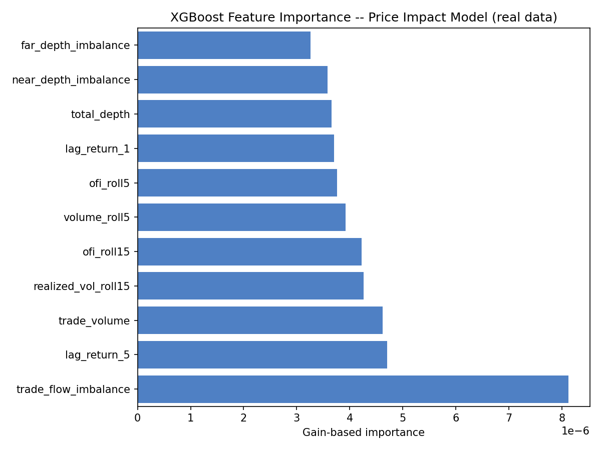

`trade_flow_imbalance` domina la importancia basada en gain, por delante de
`lag_return_5` y `trade_volume` — el imbalance de flujo de órdenes real y
contemporáneo es el predictor individual más fuerte del retorno del próximo
minuto, consistente con la teoría de microestructura de mercado (el flujo
de órdenes agresivo mueve el precio antes de que el book se recotice por
completo).

## 7.4 Volumen de trades vs. precio

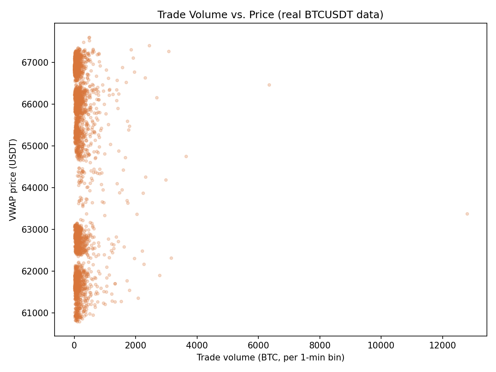

## 7.5 Matriz de correlación de features

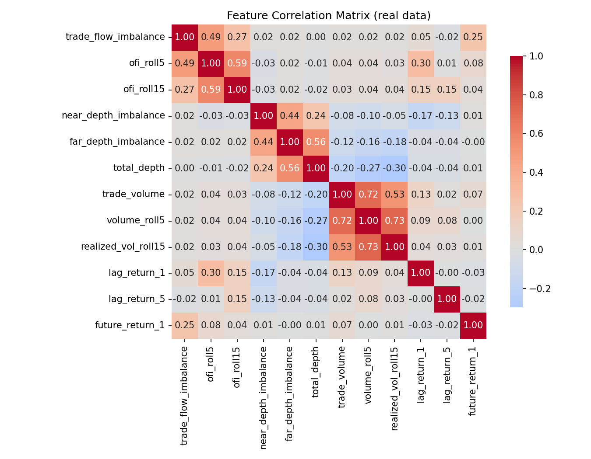

`trade_flow_imbalance` correlaciona con `future_return_1` en 0.25,
claramente la relación individual más fuerte con el target — de nuevo
consistente con §7.3. Las features de imbalance de profundidad y volumen
se agrupan entre sí pero muestran poca relación lineal con el retorno
futuro de 1 minuto por sí solas.

## 7.6 Predicho vs. real (horizonte de 1 minuto, test set)

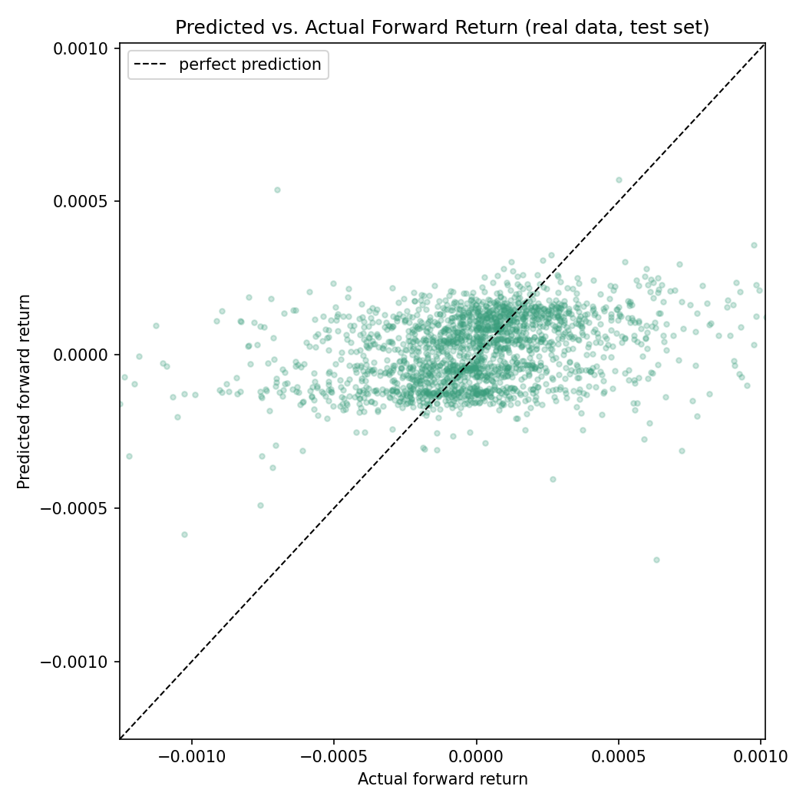

Una relación visiblemente positiva, aunque laxa, con la diagonal — la
contraparte visual honesta de R² = 0.100: habilidad real y
direccionalmente útil, no ruido, pero lejos de un ajuste ajustado.

## 7.7 Comparación de modelos: baseline lineal vs. XGBoost vs. MLP en PyTorch

Se entrenan tres modelos complementarios sobre el mismo split cronológico
y el mismo conjunto de features, y se comparan cara a cara.
`baseline_impact.py` ajusta una regresión Ridge estandarizada (un modelo
de impacto lineal estilo Kyle/Almgren-Chriss — coeficientes
transparentes, sin términos de interacción). `pytorch_impact.py` entrena
un MLP pequeño con una loss Huber custom (robusta ante la distribución de
colas gruesas del retorno) y compara tres activaciones (ReLU, GELU,
Swish/SiLU) sobre los mismos datos antes de elegir la mejor para la
corrida multi-horizonte. Las métricas de los tres modelos se persisten en
`outputs/reports/metrics.duckdb` (tabla `model_metrics`) vía
`persist_metrics.py`, además del reporte JSON propio de cada script.

| Modelo | Horizonte | RMSE | MAE | R² | RMSE baseline | Reducción de RMSE |
|---|---:|---:|---:|---:|---:|---:|
| Baseline lineal Ridge | 1 min | 0.000345 | 0.000239 | 0.063 | 0.000357 | 3.3% |
| **XGBoost** | 1 min | **0.000338** | **0.000227** | **0.100** | 0.000357 | **5.2%** |
| MLP PyTorch (mejor: Swish) | 1 min | 0.000356 | 0.000241 | −0.001 | 0.000357 | ~0% |
| Baseline lineal Ridge | 5 min | 0.000907 | 0.000621 | −0.016 | 0.000903 | ~0% (peor) |
| XGBoost | 5 min | 0.000904 | 0.000620 | −0.008 | 0.000903 | ~0% (peor) |
| MLP PyTorch | 5 min | 0.000905 | 0.000621 | −0.011 | 0.000903 | ~0% (peor) |
| Baseline lineal Ridge | 15 min | 0.001563 | 0.001104 | −0.044 | 0.001548 | −1.0% |
| XGBoost | 15 min | 0.001581 | 0.001112 | −0.068 | 0.001548 | −2.2% |
| MLP PyTorch | 15 min | 0.001550 | 0.001092 | −0.027 | 0.001548 | −0.2% |

En el horizonte de 1 minuto, donde la señal realmente existe (§7.2), el
orden es XGBoost > Ridge > MLP: el ensamble de árboles no-lineal captura
más de la señal real que un modelo lineal, mientras que el MLP —
regularizado con dropout y weight decay justamente porque una red sin
regularizar sobreajusta este target ruidoso y de colas gruesas — queda
esencialmente en el baseline ingenuo. Pasados los 5 minutos los tres son
estadísticamente indistinguibles de ruido, reforzando el hallazgo de §7.2:
la ventana de señal explotable es corta sin importar la clase de modelo.

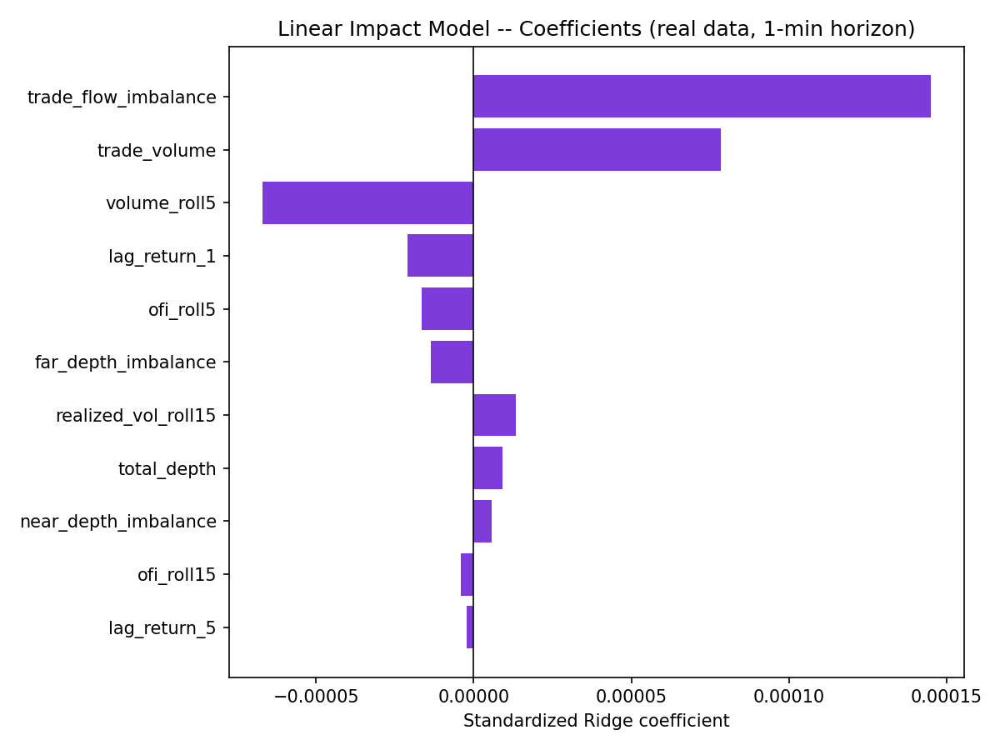

Coeficientes Ridge estandarizados: `trade_flow_imbalance` tiene por lejos
el mayor peso positivo, coincidiendo con el ranking basado en gain de
XGBoost en §7.3 — el modelo lineal recupera el mismo driver dominante que
el no-lineal, solo que con una porción menor de la varianza total
explicada.

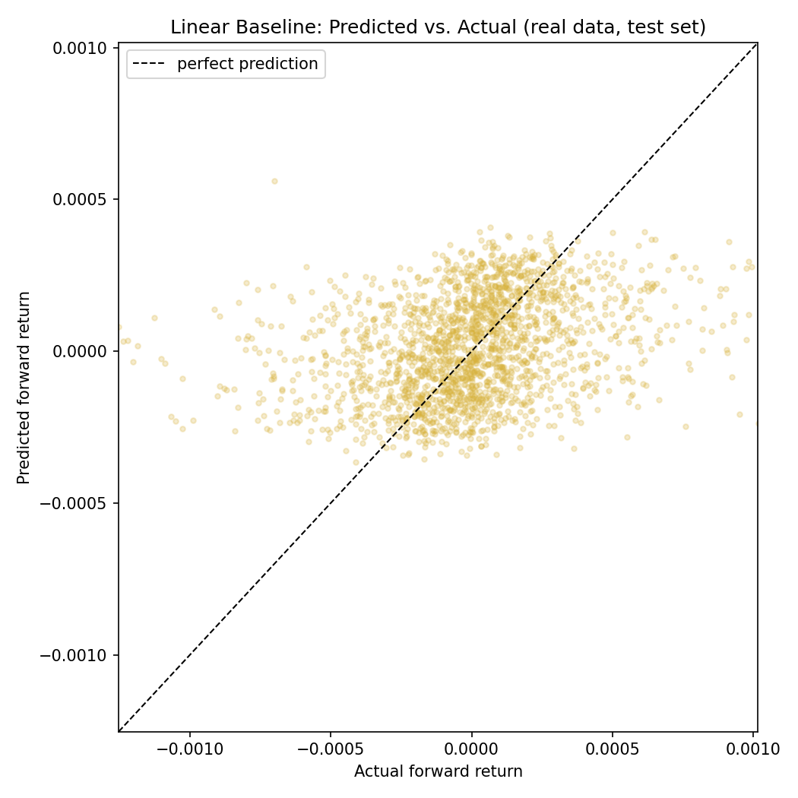
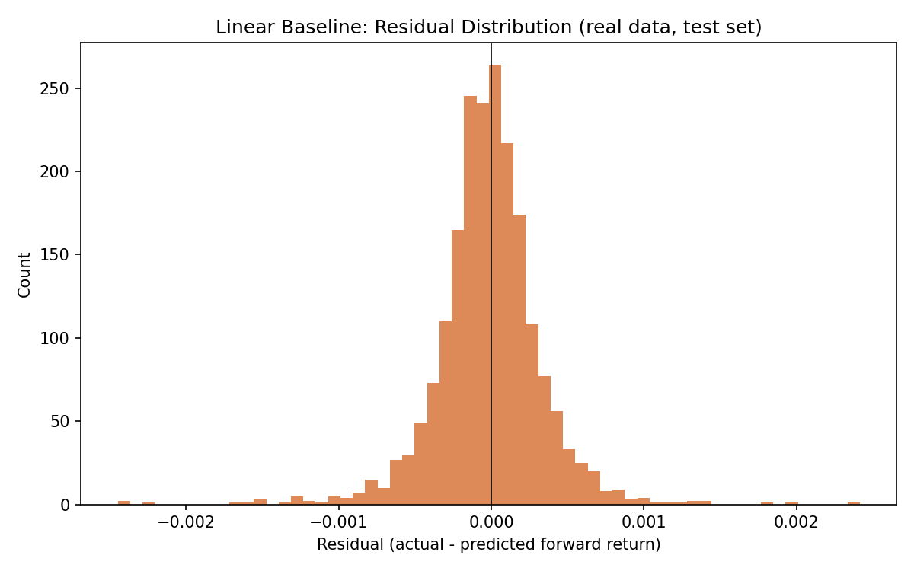
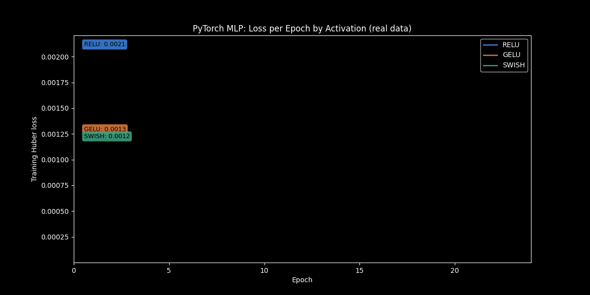
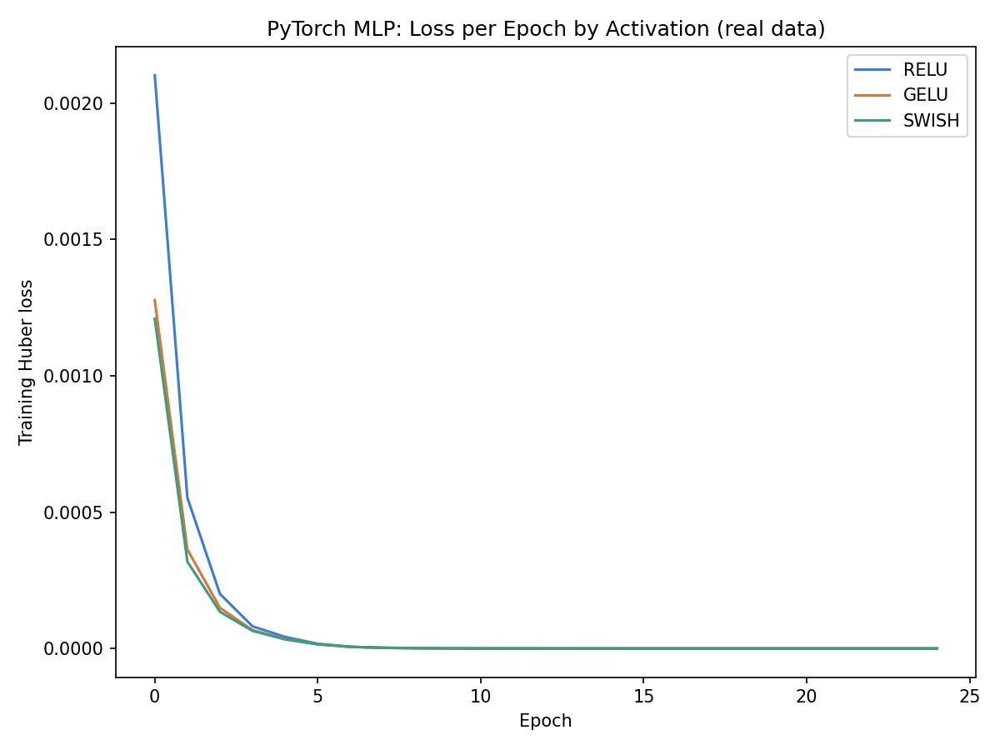

Loss Huber de entrenamiento por época para las tres activaciones, sobre
los mismos datos/inicialización — Swish converge a la loss de
entrenamiento más baja de las tres, consistente con que también gana la
comparación fuera de muestra de arriba. El GIF animado dibuja la curva de cada activación época por época con la loss actualizada en vivo.

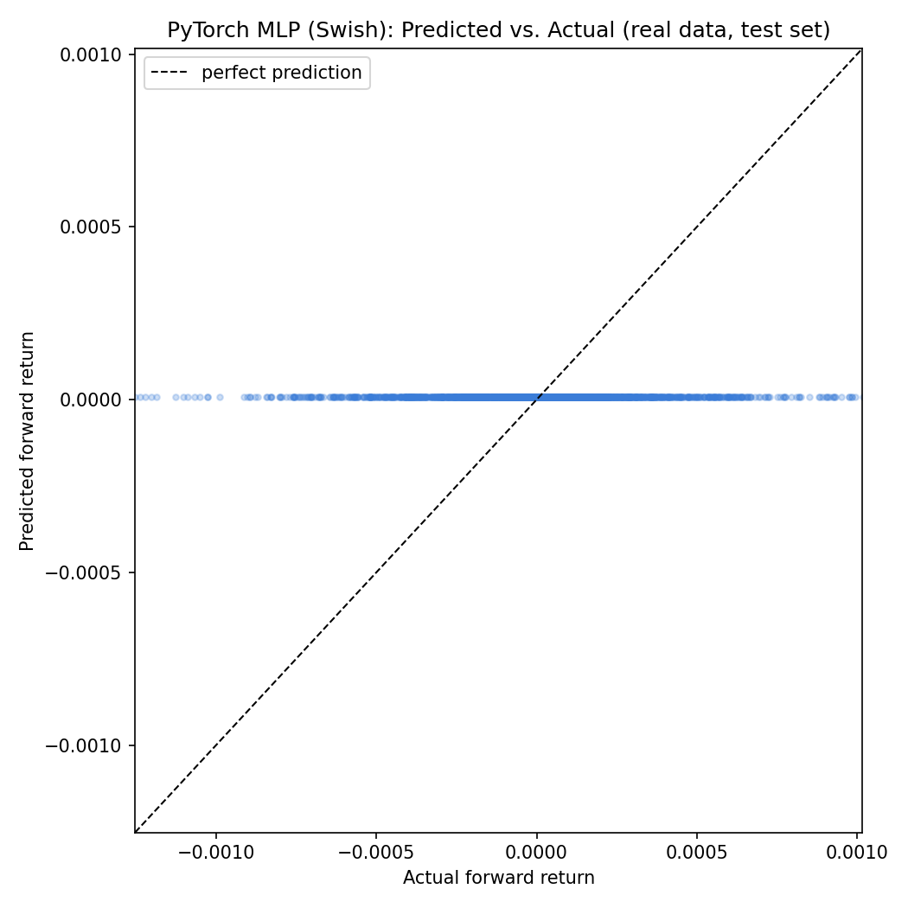

---

# 8. Pasos de Ejecución

```powershell
git clone https://github.com/Rxyxs/crypto-liquidity-price-impact.git
cd crypto-liquidity-price-impact
python -m venv venv
venv\Scripts\activate
pip install -r requirements.txt
python data\download_binance_data.py
python xgboost_impact.py
python baseline_impact.py
python pytorch_impact.py
pytest tests/
```

El paso de descarga trae ~550 MB de datos reales de BTCUSDT desde Binance
Vision a `data/raw/` (gitignored, redescargable bajo demanda). Cada
script de modelo regenera sus propios `outputs/figures/*.png` y
`outputs/reports/*.json` desde una ejecución nueva (seed 42, completamente
reproducible) y agrega sus métricas a `outputs/reports/metrics.duckdb`.
`pytest tests/` corre offline sobre datos sintéticos pequeños y no
requiere la descarga real.

## Estructura del proyecto

```
crypto-liquidity-price-impact/
├── data/
│   ├── download_binance_data.py   # descarga reproducible desde Binance Vision
│   └── raw/                        # CSVs de bookDepth + aggTrades (reales, ~550 MB, gitignored)
├── xgboost_impact.py               # construccion del dataset, features, tuning, evaluacion, graficos (XGBoost)
├── baseline_impact.py              # baseline lineal Ridge interpretable
├── pytorch_impact.py               # MLP en PyTorch, loss Huber custom, comparacion ReLU/GELU/Swish
├── persist_metrics.py              # persistencia compartida en DuckDB para los tres modelos
├── tests/                          # tests unitarios pytest (sinteticos, offline)
├── outputs/
│   ├── figures/                    # PNGs de resultados (versionadas)
│   └── reports/                    # metrics*.json + metrics.duckdb (generado)
├── requirements.txt
├── LICENSE
└── README.md / README.es.md
```

---

# 9. Fuente de Datos y Licencia

Datos de order book y trades: datos reales de mercado de futuros perpetuos
BTCUSDT, publicados por el propio Binance vía
[Binance Vision](https://data.binance.vision) (`data.binance.vision`), un
archivo histórico gratuito, público y sin autenticación que cubre
`bookDepth`, `aggTrades`, `trades`, `klines` y series relacionadas desde
2019-2020 según la serie. Este proyecto usa `bookDepth` y `aggTrades` para
BTCUSDT, del 2024-05-13 al 2024-05-19. Los archivos crudos no se
redistribuyen en este repositorio (`data/raw/` está en `.gitignore`);
`data/download_binance_data.py` los vuelve a descargar directamente desde
Binance bajo demanda.

Código: MIT — ver [LICENSE](LICENSE).

---

# 10. Autor

**Pablo Reyes** — [github.com/Rxyxs](https://github.com/Rxyxs)
