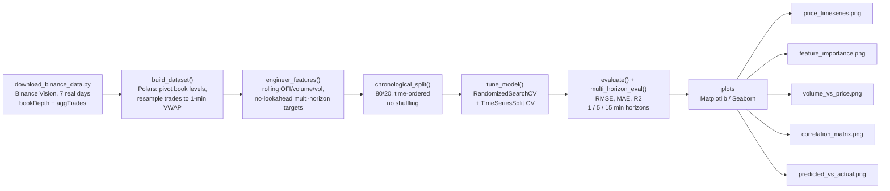

[ 🇺🇸 English ] | [ 🇨🇱 Leer en Español ](README.es.md)

# 1. Project Title

## Order-Book Price-Impact Model (XGBoost)


A regression model that answers a concrete market-microstructure question:
*given the current state of the order book and recent trade flow, how much
does that move the price over the next few minutes — and at what horizon
does that edge actually disappear?* Three complementary regressors are
trained on the same real order-book depth and trade-flow features to
predict the forward BTCUSDT price return: an interpretable linear
(Ridge) impact model, an XGBoost regressor tuned with time-respecting
cross-validation, and a PyTorch MLP trained with a custom Huber loss
(§7.7 compares all three).

**All data is real, not simulated**: 7 full days (2024-05-13 to 2024-05-19)
of BTCUSDT perpetual-futures **`bookDepth`** (order-book depth at ±1%..5%
from mid, snapshotted every ~30s) and **`aggTrades`** (every aggregated
executed trade, with the aggressor side) sourced directly from
[Binance Vision](https://data.binance.vision) — Binance's free,
public, no-authentication historical market-data archive. Nothing here is
synthetic or fabricated; §7 documents the source precisely.

---

# 2. Business Impact & Key Performance Indicators

| Metric | Result | What it means |
|---|---|---|
| 1-minute horizon signal | R² = 0.100, 5.2% RMSE reduction over naive | Genuine, measurable skill -- not a disappointing number, the operationally relevant one |
| Signal decay | Noise by 5 minutes, indistinguishable from random by 15 minutes | Tells a desk the actual signal half-life -- how fast it must act on an order-book read |
| Data | Real BTCUSDT trade/order-book data | Price-impact decay measured on genuine market microstructure, not simulated |

Price-impact modeling is the quantitative core of two very concrete trading
problems. **Execution**: a desk working a large order wants to know how much
its own trading, or the market's current imbalance, will move the price
against it — the entire discipline of optimal execution (TWAP/VWAP scheduling,
participation-rate limits) exists to manage exactly this cost. **Market
making**: a quoting engine that can anticipate a few basis points of
near-term drift from the current book state can skew its quotes ahead of the
move instead of reacting after it, which is the difference between
capturing spread and being adversely selected by it.

Both problems reduce to the same regression task solved here, and the real
BTCUSDT data gives a second, equally important business answer: **how long
does the edge last?** The model shows genuine, measurable skill at a 1-minute
horizon (R² = 0.100, a 5.2% RMSE reduction over a naive baseline) that has
already decayed to noise by 5 minutes and is indistinguishable from a random
predictor by 15 minutes (§7.2). For a real trading system this is not a
disappointing result — it is the single most operationally useful number in
the whole project: it tells a desk the actual signal half-life, i.e. how
fast it needs to act on an order-book read before the information is gone.

---

# 3. Architecture



The target is built with a strict no-lookahead rule: features at bin *t* use
only order-book/trade-flow information available up to and including *t*;
each horizon's label is the log-return from *t* to *t + h* minutes, computed
after the feature columns so it can never leak into them. Hyperparameters
are tuned with `TimeSeriesSplit` (never a shuffled K-fold) so every
validation fold is strictly later in time than its training fold, matching
how the model would actually be deployed and retrained.

---

# 4. Tech Stack

- **Polars** — pivots the long-format `bookDepth` rows (one row per
  timestamp × percentage level) into a wide per-snapshot table, resamples
  ~1.1M raw trades/day into 1-minute VWAP/volume/order-flow bars, and runs
  all rolling-window feature engineering — the right tool for this data
  volume, where a pandas-style Python loop would not keep up.
- **XGBoost** (`XGBRegressor`) — gradient-boosted trees, `reg:squarederror`
  objective, hyperparameters selected by search rather than fixed by hand.
- **scikit-learn** — `RandomizedSearchCV` + `TimeSeriesSplit` for
  time-respecting hyperparameter tuning, plus `mean_squared_error`,
  `mean_absolute_error`, `r2_score` for evaluation against a naive
  (predict-the-mean) baseline.
- **scikit-learn `Ridge`** — standardized linear impact-model baseline
  (`baseline_impact.py`), the interpretable counterpart to XGBoost/MLP.
- **PyTorch** (CPU) — small MLP (`pytorch_impact.py`) trained with a
  custom Huber-loss implementation, comparing ReLU/GELU/Swish activations.
- **DuckDB** — persists all three models' comparable metrics into one
  local `outputs/reports/metrics.duckdb` table (`persist_metrics.py`).
- **pytest** — unit tests for feature engineering, the chronological
  split, all three models' train/evaluate paths, and DuckDB persistence
  (`tests/`).
- **Matplotlib / Seaborn** — the result figures in §7.
- **Binance Vision** (`data.binance.vision`) — the real market-data source;
  see §8 for exact scope and license.
- **Python 3.10**, standard `venv`, no notebook.

---

# 5. Data

| | |
|---|---|
| Instrument | BTCUSDT perpetual futures (Binance USDⓈ-M) |
| Period | 2024-05-13 00:00 UTC → 2024-05-19 23:59 UTC (7 full days) |
| Order-book source | `bookDepth` — cumulative depth at ±1%, ±2%, ±3%, ±4%, ±5% from mid, ~every 30s |
| Trade source | `aggTrades` — every aggregated trade, price/quantity/aggressor side |
| Raw trade rows | ~7.0M (kept out of the repo, see §9) |
| Joined 1-minute bins | 10,056 |
| Usable rows after feature/target construction | 10,026 |

`data/download_binance_data.py` re-fetches both series directly from
Binance Vision on demand — no API key, no rate limit for this historical
archive, fully reproducible.

---

# 6. Feature Engineering

| Feature | Built from |
|---|---|
| `trade_flow_imbalance` | Signed executed volume (aggressor side) / total volume, per 1-min bin |
| `ofi_roll5`, `ofi_roll15` | Rolling mean of `trade_flow_imbalance` over 5 / 15 minutes |
| `near_depth_imbalance` | (bid − ask) / (bid + ask) depth at the ±1% book level |
| `far_depth_imbalance` | Same, at the ±5% book level |
| `total_depth` | Combined bid + ask depth at ±5% (liquidity proxy) |
| `trade_volume`, `volume_roll5` | Traded BTC volume per bin, and its 5-min rolling mean |
| `realized_vol_roll15` | Rolling std. of 1-min log-returns over 15 minutes |
| `lag_return_1`, `lag_return_5` | Past 1-min and 5-min log-returns |

Target: forward log-return of VWAP over the next `h` minutes, `h ∈ {1, 5, 15}`.

---

# 7. Visual Results

Every number and figure below comes from an actual run of
`python xgboost_impact.py` (seed 42, on the real data in §5) — nothing here
is estimated.

## 7.1 Real BTCUSDT price over the sample period


7 days of real, 1-minute VWAP for BTCUSDT perpetual futures, including a
genuine ~9% rally on 2024-05-15/16 — real market structure, not a
synthetic path. The animated GIF races the VWAP line across the same real series, tagging its current price at the advancing tip.

## 7.2 Headline result: signal exists, and decays fast

XGBoost hyperparameters were selected once via `RandomizedSearchCV` +
`TimeSeriesSplit` on the 1-minute-horizon target, then reused unchanged
across all three horizons for a fair comparison.

| Horizon | RMSE | MAE | R² (out-of-sample) | Baseline RMSE | RMSE reduction |
|---:|---:|---:|---:|---:|---:|
| **1 minute** | 0.000338 | 0.000227 | **0.100** | 0.000357 | **5.2%** |
| 5 minutes | 0.000904 | 0.000620 | −0.008 | 0.000903 | ~0% (worse) |
| 15 minutes | 0.001581 | 0.001112 | −0.068 | 0.001548 | −2.2% (worse) |

Best hyperparameters found: `max_depth=4`, `learning_rate=0.01`,
`n_estimators=400`, `subsample=0.6`, `colsample_bytree=0.6`, `reg_lambda=2.0`.

The model has genuine, positive out-of-sample skill only at the 1-minute
horizon. By 5 minutes it is statistically indistinguishable from predicting
the historical mean; by 15 minutes it is measurably worse. **This is
reported exactly as it came out of the real run** — the honest, and
operationally the most useful, finding of the project (§2).

## 7.3 Feature importance (1-minute model)


`trade_flow_imbalance` dominates gain-based importance, ahead of
`lag_return_5` and `trade_volume` — the contemporaneous, real order-flow
imbalance is the strongest single predictor of the next minute's return,
consistent with market-microstructure theory (aggressive order flow moves
price before the book fully re-quotes).

## 7.4 Trade volume vs. price


## 7.5 Feature correlation matrix


`trade_flow_imbalance` correlates with `future_return_1` at 0.25, clearly
the strongest single relationship with the target — again matching §7.3.
Depth-imbalance and volume features cluster with each other but carry
little linear relationship to the 1-minute-forward return on their own.

## 7.6 Predicted vs. actual (1-minute horizon, test set)


A visibly positive, if loose, relationship with the diagonal — the honest
visual counterpart of R² = 0.100: real, directionally useful skill, not
noise, but far from a tight fit.

## 7.7 Model comparison: linear baseline vs. XGBoost vs. PyTorch MLP

Three complementary models are trained on the identical chronological
split and feature set, then compared head-to-head. `baseline_impact.py`
fits a standardized Ridge regression (a Kyle/Almgren-Chriss-style linear
impact model — transparent coefficients, no interaction terms).
`pytorch_impact.py` trains a small MLP with a custom Huber loss (robust
to the fat-tailed return distribution) and compares three activations
(ReLU, GELU, Swish/SiLU) on identical data before picking the best one
for the multi-horizon run. All three models' metrics are persisted to
`outputs/reports/metrics.duckdb` (table `model_metrics`) via
`persist_metrics.py`, in addition to each script's own JSON report.

| Model | Horizon | RMSE | MAE | R² | Baseline RMSE | RMSE reduction |
|---|---:|---:|---:|---:|---:|---:|
| Ridge linear baseline | 1 min | 0.000345 | 0.000239 | 0.063 | 0.000357 | 3.3% |
| **XGBoost** | 1 min | **0.000338** | **0.000227** | **0.100** | 0.000357 | **5.2%** |
| PyTorch MLP (best: Swish) | 1 min | 0.000356 | 0.000241 | −0.001 | 0.000357 | ~0% |
| Ridge linear baseline | 5 min | 0.000907 | 0.000621 | −0.016 | 0.000903 | ~0% (worse) |
| XGBoost | 5 min | 0.000904 | 0.000620 | −0.008 | 0.000903 | ~0% (worse) |
| PyTorch MLP | 5 min | 0.000905 | 0.000621 | −0.011 | 0.000903 | ~0% (worse) |
| Ridge linear baseline | 15 min | 0.001563 | 0.001104 | −0.044 | 0.001548 | −1.0% |
| XGBoost | 15 min | 0.001581 | 0.001112 | −0.068 | 0.001548 | −2.2% |
| PyTorch MLP | 15 min | 0.001550 | 0.001092 | −0.027 | 0.001548 | −0.2% |

At the 1-minute horizon, where the signal actually exists (§7.2), the
ordering is XGBoost > Ridge > MLP: the non-linear tree ensemble captures
more of the real signal than a linear model can, while the MLP —
regularized with dropout and weight decay specifically because an
unregularized network overfits this noisy, fat-tailed target — lands
essentially at the naive baseline. Past 5 minutes all three are
statistically indistinguishable from noise, reinforcing §7.2's finding
that the exploitable signal window is short regardless of model class.


Standardized Ridge coefficients: `trade_flow_imbalance` carries by far
the largest positive weight, matching the XGBoost gain-based ranking in
§7.3 — the linear model recovers the same dominant driver as the
non-linear one, just with a smaller share of the total explained
variance.


Training Huber loss per epoch for all three activations on identical
data/initialization — Swish converges to the lowest training loss of
the three, consistent with it also winning the out-of-sample comparison
above. The animated GIF draws each activation's curve epoch by epoch with a live loss readout.


---

# 8. Execution Steps

```powershell
git clone https://github.com/Rxyxs/crypto-liquidity-price-impact.git
cd crypto-liquidity-price-impact
python -m venv venv
venv\Scripts\activate
pip install -r requirements.txt
python data\download_binance_data.py
python xgboost_impact.py
python baseline_impact.py
python pytorch_impact.py
pytest tests/
```

The download step fetches ~550 MB of real BTCUSDT data from Binance Vision
into `data/raw/` (gitignored, re-fetched on demand). Each model script
regenerates its own `outputs/figures/*.png` and `outputs/reports/*.json`
from a fresh run (seed 42, fully reproducible) and appends its metrics to
`outputs/reports/metrics.duckdb`. `pytest tests/` runs offline against
small synthetic data and does not require the real download.

## Project structure

```
crypto-liquidity-price-impact/
├── data/
│   ├── download_binance_data.py   # reproducible fetch from Binance Vision
│   └── raw/                        # bookDepth + aggTrades CSVs (real, ~550 MB, gitignored)
├── xgboost_impact.py               # dataset build, features, tuning, evaluation, plots (XGBoost)
├── baseline_impact.py              # interpretable Ridge linear impact-model baseline
├── pytorch_impact.py               # PyTorch MLP, custom Huber loss, ReLU/GELU/Swish comparison
├── persist_metrics.py              # shared DuckDB persistence for all three models
├── tests/                          # pytest unit tests (synthetic, offline)
├── outputs/
│   ├── figures/                    # result PNGs (version-controlled)
│   └── reports/                    # metrics*.json + metrics.duckdb (generated)
├── requirements.txt
├── LICENSE
└── README.md / README.es.md
```

---

# 9. Data Source & License

Order-book and trade data: real BTCUSDT perpetual-futures market data,
published by Binance itself via
[Binance Vision](https://data.binance.vision) (`data.binance.vision`), a
free, public, no-authentication historical archive covering `bookDepth`,
`aggTrades`, `trades`, `klines`, and related series back to 2019-2020
depending on the series. This project uses `bookDepth` and `aggTrades` for
BTCUSDT, 2024-05-13 to 2024-05-19. Raw files are not redistributed in this
repository (`data/raw/` is gitignored); `data/download_binance_data.py`
re-fetches them directly from Binance on demand.

Code: MIT — see [LICENSE](LICENSE).

---

# 10. Author

**Pablo Reyes** — [github.com/Rxyxs](https://github.com/Rxyxs)
