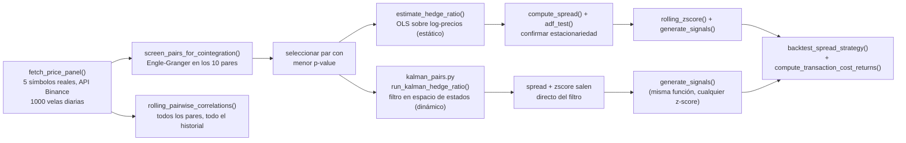
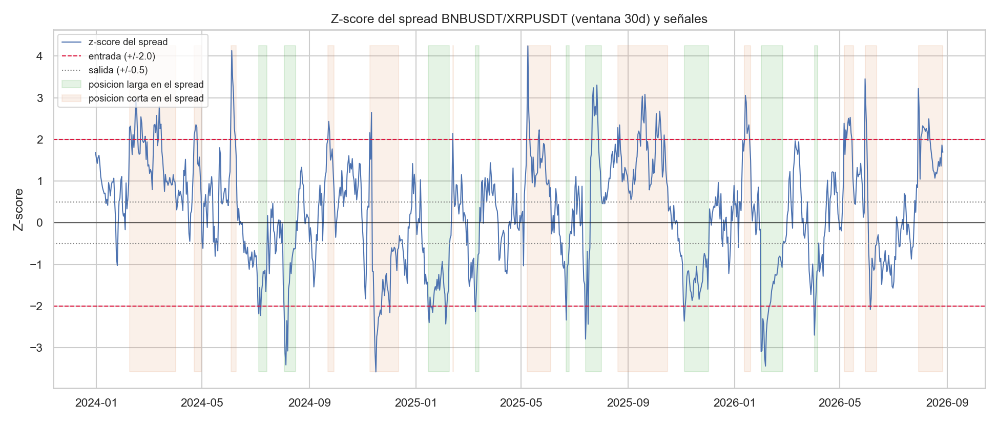
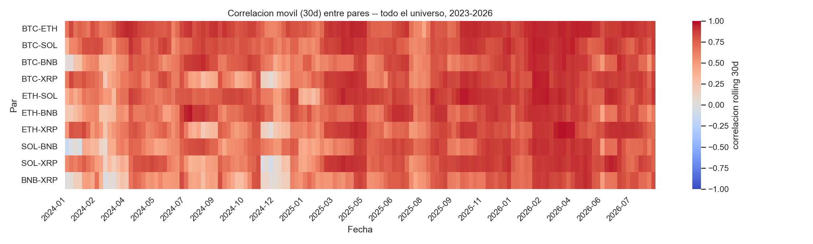
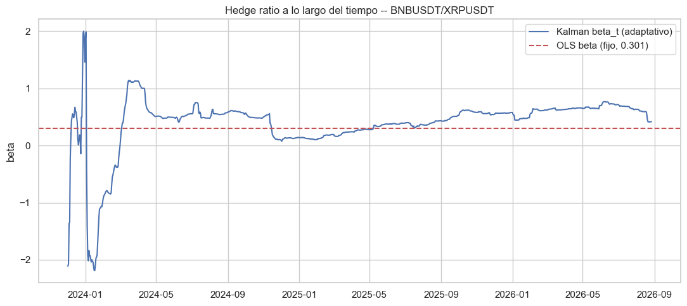
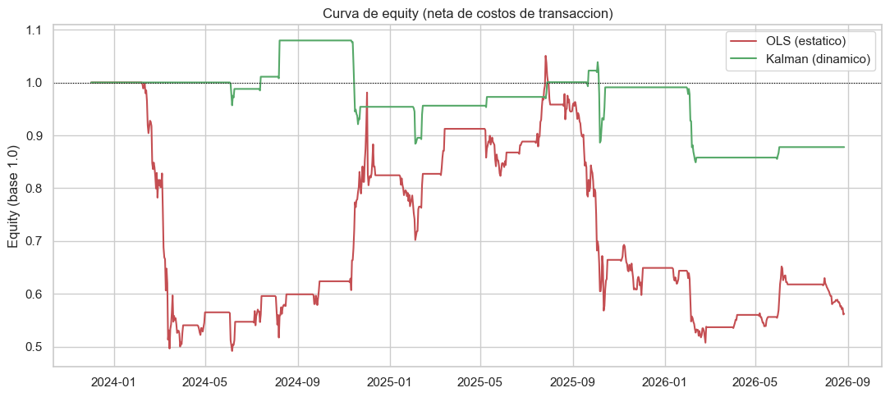
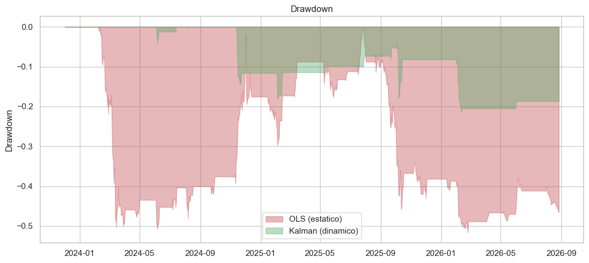
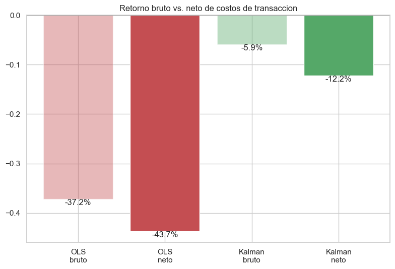
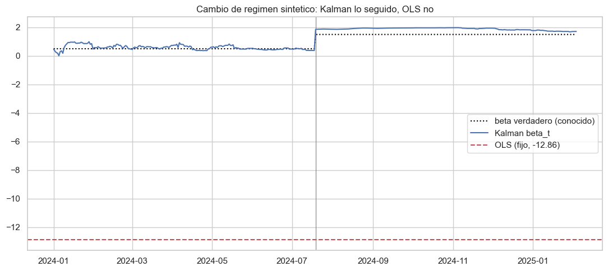

[ 🇺🇸 Read in English ](README.md) | [ 🇨🇱 Español ]

# 1. Título del Proyecto

## Crypto Pairs Trading: Un Motor de Screening por Cointegración


Un motor de screening de arbitraje estadístico que evalúa un universo de
criptomonedas en busca de cointegración genuina (Engle-Granger), construye el
spread de reversión a la media para el par que realmente la supera, y lo
backtestea — con una razón de cobertura (hedge ratio) **OLS estática** y,
como novedad de esta actualización, una **razón de cobertura dinámica vía
Filtro de Kalman** que permite al spread adaptarse a una relación
cambiante — neto de costos de transacción realistas y asimétricos, todo
sobre precios diarios reales obtenidos de la API pública de Binance.

> **Descargo de responsabilidad**: datos de mercado reales, tests
> estadísticos reales, backtest real — pero esto es una demostración de
> metodología, no una estrategia de trading en vivo, y no es asesoría
> financiera. La §7 reporta un backtest perdedor honestamente en lugar de
> ajustarlo hasta convertirlo en ganador.

## Técnicas usadas

| Técnica | Dónde |
|---|---|
| Screening de cointegración en todo el universo de pares (Engle-Granger) | `screen_pairs_for_cointegration()` |
| Hedge ratio OLS estático | `estimate_hedge_ratio()` |
| Hedge ratio dinámico con filtro de Kalman | `kalman_pairs.py`, `02_Kalman_Dynamic_Hedge_Ratio.ipynb` |
| Test de estacionariedad ADF sobre el spread | `adf_test()` |
| Señal de entrada/salida por z-score rodante | `rolling_zscore()`, `generate_signals()` |
| Backtest ajustado por costos de transacción | `backtest_spread_strategy()` |
| Persistencia en DuckDB | `db_persistence.py` |

[**Gráfico interactivo**: spread cointegrado BNBUSDT/XRPUSDT y z-score rodante con marcadores de entrada/salida](https://htmlpreview.github.io/?https://github.com/Rxyxs/crypto-quant-techniques-lab/blob/main/03-pairs-trading-cointegration/outputs/interactive/spread_zscore_interactive.html)

---

# 2. Motivación

## Impacto de negocio

El error más común en los análisis de pairs trading retail es elegir dos
activos porque *suenan* relacionados (mismo sector, misma narrativa, "ambos
son cripto") y asumir que eso implica una relación estadística operable.
Usualmente no lo es. Un proceso de pairs trading defendible tiene que
separar dos preguntas que suelen confundirse: (1) *¿existe una relación de
equilibrio estadísticamente significativa y comprobable entre estos dos
activos?*, y (2) *si la hay, ¿puede una regla de trading simple extraer
efectivamente una ganancia de ella después de fricciones realistas?*. Este
proyecto mantiene esas dos preguntas explícitamente separadas — primero
evalúa un universo real de pares buscando cointegración genuina, y solo
después pregunta si el spread resultante era operable, reportando la
respuesta honesta a ambas.

## Impacto de Negocio e Indicadores Clave (KPIs)

| Métrica | Resultado | Qué significa |
|---|---|---|
| Pares evaluados | 10 (todas las combinaciones de BTC/ETH/SOL/BNB/XRP) | Solo 1 supera la cointegración al 5% -- BTC/ETH, la elección "obvia", no lo hace |
| Par cointegrado encontrado | BNB/XRP, Engle-Granger p = 0,030 | Confirmado independientemente por un test ADF sobre el spread mismo (p = 0,007) |
| Kalman vs. OLS estático, retorno neto | -12,2% vs. -43,7% | El hedge ratio dinámico reduce la pérdida más de 3x en esta ventana |
| Kalman vs. OLS estático, drawdown máximo | -21,4% vs. -51,6% | Drawdown sustancialmente menor, menos operaciones (13 vs. 21), menor costo de transacción total |
| Resultado honesto principal | Ambos métodos con Sharpe neto negativo | Reportado directamente como "una reducción grande en cuánto pierde esto", no como una victoria fabricada |

## Por qué datos reales

La cointegración es una afirmación sobre la dinámica conjunta real de dos
series de precios; probarla sobre datos fabricados solo recuperaría
cualquier relación arbitrariamente codificada en el simulador, sin decir
nada sobre los mercados. Todos los precios aquí son cierres diarios reales
de BTC, ETH, SOL, BNB y XRP, obtenidos directamente de la API pública REST
de Binance.

---

# 3. Marco Teórico

## 3.1 Cointegración y el test de Engle-Granger

Dos series de precios no estacionarias están **cointegradas** si alguna
combinación lineal de ellas es estacionaria — es decir, aunque cada precio
se mueva por su cuenta como una caminata aleatoria, un spread ponderado
específico entre ambas revierte hacia una media estable. El test de dos
pasos de **Engle-Granger** (implementado aquí vía
`statsmodels.tsa.stattools.coint`) lo verifica directamente: regresiona un
log-precio sobre el otro, y luego prueba si los residuos de esa regresión
tienen raíz unitaria. Un p-value bajo rechaza la hipótesis nula de "no hay
cointegración".

## 3.2 Razón de cobertura vía OLS

El peso de la relación cointegrante — la **razón de cobertura** (β) —
proviene de una regresión OLS de `log(Y)` sobre `log(X)`. El spread es
entonces `log(Y) - (α + β·log(X))`. Este proyecto usa una única razón de
cobertura **estática**, ajustada sobre toda la muestra — el punto de
partida estándar de los libros de texto —, con su limitación (una relación
que se desplaza en el tiempo no queda capturada) hecha explícita en la §7.

## 3.3 El test ADF sobre el spread

Una vez construido el spread, el test **Augmented Dickey-Fuller**
(`statsmodels.tsa.stattools.adfuller`) confirma la estacionariedad de forma
independiente — una segunda verificación complementaria sobre
Engle-Granger, ya que el ADF sobre la serie de residuos es matemáticamente
lo que el segundo paso de Engle-Granger ya hace, por lo que la concordancia
entre ambos es un chequeo de consistencia útil, no redundante.

## 3.4 Señales de reversión a la media vía z-score

Un z-score móvil (30 días) del spread convierte "el spread está inusualmente
lejos de su media reciente" en una regla operable: entrar cuando `|z| > 2`
(apostando a la reversión), salir cuando `|z| < 0.5`. Esta es la versión más
simple posible de una señal de pairs trading, deliberadamente — ver la §7
para entender por qué incluso un spread estadísticamente sólido no garantiza
que esta regla simple sea rentable.

## 3.5 Razón de cobertura dinámica vía Filtro de Kalman

Una razón de cobertura OLS estática asume que el peso de la relación
cointegrante es constante durante toda la muestra — poco realista si la
relación real se desplaza (cambios de régimen de mercado, un activo
ganando/perdiendo liquidez o dominancia relativa al otro). `kalman_pairs.py`
modela la razón de cobertura como un **estado oculto que evoluciona en el
tiempo**, estimado mediante un Filtro de Kalman lineal-Gaussiano (la
formulación estándar en la práctica de pairs trading, p. ej. Chan,
*Algorithmic Trading*, cap. 3 — no una variante artesanal):

**Estado** (caminata aleatoria, sin término de deriva determinístico):

```
theta_t = [alpha_t, beta_t]'
theta_t = theta_{t-1} + w_t,      w_t ~ N(0, Q)
```

**Observación**:

```
y_t = F_t @ theta_t + v_t,        v_t ~ N(0, R_t)
F_t = [1, x_t]
```

**Recursión** (predicción y luego actualización, una vez por día):

```
theta_(t|t-1) = theta_(t-1|t-1)                 P_(t|t-1) = P_(t-1|t-1) + Q
e_t = y_t - F_t @ theta_(t|t-1)   <- esto ES el spread
S_t = F_t @ P_(t|t-1) @ F_t' + R_t
K_t = P_(t|t-1) @ F_t' / S_t
theta_(t|t) = theta_(t|t-1) + K_t * e_t          P_(t|t) = (I - K_t @ F_t) @ P_(t|t-1)
```

Dos propiedades que vale la pena señalar, no solo implementar
mecánicamente:

1. **La innovación *es* el spread.** `e_t = y_t - F_t @ theta_(t|t-1)` es el
   error de predicción a un paso del propio filtro, calculado usando el
   estado de *ayer* — no hay un paso separado de restar `alpha + beta*x` a
   posteriori, porque eso es exactamente lo que esto ya es.
2. **El z-score sale de la recursión gratis.** `S_t` (la varianza de la
   innovación) ya se calcula como parte del filtro, así que
   `z_t = e_t / sqrt(S_t)` no necesita, en principio, ninguna ventana móvil
   arbitraria. La §5 documenta un problema de calibración real que esto
   generó en la práctica y cómo se corrigió (una `R` fija descalibra
   gravemente este z-score en una muestra de varios años).

## 3.6 Costos de transacción y slippage asimétrico

Cada operación cruza el spread bid-ask y paga una comisión del exchange;
modelar un backtest a costo cero asume silenciosamente mercados
friccionless y de liquidez infinita. Este proyecto cobra una **comisión
taker** (10pb, representativa del esquema de comisiones de Binance para los
símbolos operados aquí) más **slippage deliberadamente asimétrico entre
entrada y salida**, no el mismo número aplicado dos veces:

- **Entrada** (5pb): se dispara cuando `|z|` recién cruzó el umbral de
  entrada — un evento de cola (un movimiento tipo 2-sigma), cuando el libro
  de órdenes suele estar más delgado y cualquier orden no trivial mueve más
  el precio.
- **Salida** (2pb): se dispara cerca de `|z| < 0.5`, es decir, una vez que
  el spread ya revirtió hacia un régimen más calmo — razonable esperar un
  libro más profundo y menos slippage.

El costo se cobra **en los dos días en que la posición realmente cambia**
(entrada, salida, o un flip directo = ambos), en las dos patas del par (el
factor de comisión/slippage se duplica), no en cada día en que la posición
simplemente se mantiene. Ver §7.6 para el arrastre de costo medido tanto en
la estrategia OLS como en la Kalman.

---

# 4. Explicación

## Arquitectura del pipeline



`pairs_trading_engine.py` contiene las funciones de datos/estadística/
backtest/costos (sin graficación); `kalman_pairs.py` contiene el Filtro de
Kalman como un módulo autocontenido que reutiliza `generate_signals` y
`backtest_spread_strategy` de `pairs_trading_engine.py` (misma lógica de
señal y backtest, distinta fuente de razón de cobertura/z-score, por lo que
la comparación OLS-vs-Kalman es manzanas con manzanas).
`01_Cointegration_Analysis.ipynb` recorre el pipeline OLS estático;
`02_Kalman_Dynamic_Hedge_Ratio.ipynb` recorre el dinámico y compara ambos
directamente.

## Responsabilidades de las funciones

| Función | Responsabilidad |
|---|---|
| `fetch_price_panel()` | Obtiene cierres diarios reales para el universo de 5 símbolos desde el `/api/v3/klines` público de Binance (sin API key). |
| `screen_pairs_for_cointegration()` | Ejecuta Engle-Granger en los 10 pares candidatos, ordenados por p-value — el paso de screening sistemático de §7.2. |
| `estimate_hedge_ratio()` | Regresión OLS que entrega la razón de cobertura *estática* (β), el intercepto (α) y el R² del spread. |
| `kalman_pairs.run_kalman_hedge_ratio()` | Ejecuta el Filtro de Kalman (§3.5) de principio a fin, devolviendo `alpha_t`/`beta_t` *dinámicos*, el spread (innovación) y su z-score natural. |
| `compute_spread()` / `adf_test()` | Construye el spread (estático) y confirma la estacionariedad de forma independiente. |
| `rolling_zscore()` / `generate_signals()` | Z-score móvil (ruta OLS) y la lógica de posiciones de entrada/salida (§3.4) — `generate_signals` es compartida por las rutas OLS y Kalman. |
| `compute_transaction_cost_returns()` | Comisión + slippage asimétrico de entrada/salida (§3.6), cobrado solo en los días en que la posición realmente cambia. |
| `backtest_spread_strategy()` | Backtest dólar-neutral: la posición de ayer captura el retorno del spread de hoy (sin look-ahead), neto de costos de transacción por defecto; `beta` acepta un float fijo (OLS) o una `pd.Series` (Kalman). |
| `rolling_pairwise_correlations()` | Correlación móvil de 30 días para cada par, a través de todo el historial — el heatmap de §7.5. |

---

# 5. Metodología

- **Evaluar el universo completo, nunca asumir el par "obvio".** Se prueban
  los 10 pares entre los 5 símbolos; el par operado es el que realmente
  supera Engle-Granger al 5%, no el que parecía intuitivo de entrada (§7.2
  reporta exactamente cuál resultó ser).
- **Dos verificaciones de estacionariedad independientes.** Se reportan
  tanto el propio estadístico de Engle-Granger como un llamado ADF separado
  sobre el spread resultante — deberían (y de hecho) concuerdan, lo cual es
  en sí mismo un chequeo de sanidad básico del pipeline.
- **Sin look-ahead en el backtest.** `positions.shift(1)` asegura que el
  P&L de cada día use la señal de ayer contra el retorno de hoy, nunca la
  señal de hoy contra el retorno de hoy.
- **El resultado del backtest se reporta tal cual**, gane o pierda — la §7.4
  no reajusta umbrales después de ver un resultado perdedor para fabricar un
  mejor número.
- **Una varianza de ruido de observación (R) fija descalibra gravemente el
  z-score de Kalman en una muestra de varios años.** La primera versión de
  `kalman_pairs.py` estimaba R una sola vez a partir de un burn-in de 60
  días y la mantenía fija — la desviación estándar realizada del z-score
  resultó ser ~0.46 en lugar de ~1, y la estrategia solo tomó 2 operaciones
  en ~1.000 días. Después se probó una R fija estimada sobre toda la
  muestra, y fue peor (0 operaciones). Ambas fallaron por la misma razón:
  la volatilidad residual del spread genuinamente no es constante a lo
  largo de ~3 años de precios cripto. La corrección — R actualizada en cada
  paso vía un EWMA del cuadrado de la innovación — está documentada en
  `kalman_pairs.py`, y su velocidad (`R_EWM_LAMBDA = 2/(30+1)`) se eligió
  para coincidir con la ventana de 30 días que ya usa el z-score OLS,
  **antes** de mirar el desempeño del backtest, específicamente para evitar
  elegir un hiperparámetro que resultara favorecer al Kalman.
- **La comparación Kalman-vs-OLS se valida en un caso sintético con
  respuesta conocida, no se afirma solo a partir de resultados con datos
  reales.** La §7.8 construye una serie con un cambio de régimen diseñado
  (β verdadero = 0.5, luego 1.5 a mitad de camino) y confirma que el filtro
  recupera ambos valores mientras que el OLS estático, ajustado una sola
  vez sobre toda la serie, no lo hace — los datos reales por sí solos no
  pueden probar que el mecanismo funciona, ya que la razón de cobertura
  verdadera nunca se conoce realmente.

---

# 6. Desarrollo

## Stack tecnológico

| Librería | Rol |
|---|---|
| **Pandas** | Construcción del panel de precios, retornos, ventanas móviles. |
| **NumPy** | La recursión del Filtro de Kalman (`kalman_pairs.py`) — operaciones vectoriales/matriciales explícitas, no una librería de espacio de estados de caja negra. |
| **Statsmodels** | `coint()` (Engle-Granger), `OLS` (razón de cobertura, tanto estática como el burn-in de Kalman), `adfuller()` (ADF). |
| **SciPy** | Rutinas numéricas subyacentes de las que depende Statsmodels. |
| **Seaborn** | Estilo del heatmap de correlación móvil. |
| **Matplotlib** | Cada figura. |
| **Jupyter** | `01_Cointegration_Analysis.ipynb` (OLS estático) y `02_Kalman_Dynamic_Hedge_Ratio.ipynb` (Kalman dinámico + comparación). |
| **DuckDB** | `db_persistence.py` — persiste `metrics.json` y la tabla de screening de cointegración en una base de datos local consultable, una fila por corrida del pipeline. |
| **pytest** | `tests/` — cobertura unitaria para la matemática de cointegración/hedge ratio/backtest, la recursión de Kalman, y la capa de persistencia en DuckDB. |

## Tests

```powershell
venv\Scripts\python.exe -m pytest tests/ -v
```

26 tests, todos sobre datos sintéticos (sin llamadas de red), por lo que
corren offline y de forma determinista:

| Archivo | Cubre |
|---|---|
| `tests/test_pairs_trading_engine.py` | Engle-Granger sobre un par cointegrado construido a propósito vs. dos random walks independientes, recuperación del hedge ratio OLS, estacionariedad del spread (ADF), ventana de z-score, lógica de entrada/salida de señales, contabilidad de costos de transacción asimétricos, el backtest con costos (incluyendo la interfaz dual `beta` float-vs-`Series` que usa el camino Kalman), y el screening/ranking por pares. |
| `tests/test_kalman_pairs.py` | Formas de salida y alineación de índice, convergencia de `beta_t` hacia el valor generador verdadero, positividad de la varianza de innovación, la identidad `zscore = spread / sqrt(innovation_variance)`, y validación de longitud de entrada. |
| `tests/test_db_persistence.py` | Round-trip de inserción/lectura para ambas tablas de DuckDB, usando una base de datos acotada a `tmp_path` para que los tests nunca toquen el `outputs/reports/pairs_trading.duckdb` real del repo. |

## Persistencia en DuckDB

`outputs/reports/metrics.json` y `cointegration_screening.csv` ya capturan
una sola corrida. `db_persistence.py` agrega un historial consultable encima,
de forma aditiva -- no reemplaza ninguno de los dos archivos:

```powershell
venv\Scripts\python.exe db_persistence.py   # carga desde el metrics.json/CSV ya existente
```

`run_full_pipeline()` en `pairs_trading_engine.py` también lo llama
automáticamente al final de cada corrida (el import está envuelto en un
`try/except ImportError`, asi el pipeline principal nunca depende
obligatoriamente de que DuckDB esté instalado). Dos tablas:

- `backtest_runs` — una fila por corrida del pipeline: par, p-values de
  cointegración/ADF, hedge ratio, y cada métrica del backtest (Sharpe,
  drawdown, cantidad de trades, win rate, costos de transacción).
- `cointegration_screening_runs` — una fila por par candidato por corrida,
  unible a `backtest_runs` por `run_id`.

```python
from db_persistence import load_backtest_runs, load_screening_runs
load_backtest_runs()          # historial completo de corridas, mas reciente primero
load_screening_runs(run_id)   # tabla de screening de una corrida especifica
```

## Instalación y configuración

```powershell
git clone https://github.com/Rxyxs/crypto-pairs-trading-cointegration.git
cd crypto-pairs-trading-cointegration
python -m venv venv
venv\Scripts\activate
pip install -r requirements.txt
```

## Ejecución

```powershell
python pairs_trading_engine.py
```

Descarga el panel de precios de 5 símbolos, evalúa los 10 pares en busca de
cointegración, ejecuta el análisis completo sobre el par ganador, y escribe
`outputs/reports/metrics.json` + `outputs/reports/cointegration_screening.csv`.

Para el recorrido completo paso a paso con cada figura (OLS estático):

```powershell
jupyter notebook 01_Cointegration_Analysis.ipynb
```

Para el filtro de Kalman dinámico y la comparación directa OLS-vs-Kalman:

```powershell
jupyter nbconvert --to notebook --execute --inplace 02_Kalman_Dynamic_Hedge_Ratio.ipynb
# o abrirlo interactivamente:
jupyter notebook 02_Kalman_Dynamic_Hedge_Ratio.ipynb
```

## Estructura del proyecto

```
crypto-pairs-trading-cointegration/
├── pairs_trading_engine.py              # obtención de datos, cointegración, hedge ratio, señales, backtest con costos
├── kalman_pairs.py                      # razón de cobertura dinámica vía Filtro de Kalman (espacio de estados)
├── db_persistence.py                    # persiste metrics.json/screening en un historial consultable en DuckDB
├── 01_Cointegration_Analysis.ipynb      # recorrido OLS estático con cada figura
├── 02_Kalman_Dynamic_Hedge_Ratio.ipynb  # recorrido Kalman dinámico + comparación OLS-vs-Kalman
├── tests/                               # tests unitarios pytest (motor, filtro de Kalman, persistencia DuckDB)
├── requirements.txt
├── data/                                # panel de precios real en CSV (versionado)
├── outputs/
│   ├── figures/                         # z-score, heatmap de correlación, comparaciones de equity/drawdown/beta (versionado)
│   └── reports/                         # metrics.json, cointegration_screening.csv, pairs_trading.duckdb (versionado)
├── LICENSE
├── README.md
└── README.es.md
```

---

# 7. Resultados

Cada número y figura a continuación proviene de una corrida real contra
datos reales de Binance (1.000 velas diarias, 2023-12-02 a 2026-08-27) —
nada aquí es estimado.

## 7.1 Dataset

| Métrica | Valor |
|---|---|
| Símbolos evaluados | BTC, ETH, SOL, BNB, XRP |
| Pares candidatos | 10 |
| Velas diarias por símbolo | 1.000 |
| Rango de fechas | 2023-12-02 → 2026-08-27 |

## 7.2 Screening de cointegración — la sorpresa honesta

| Par | p-value Engle-Granger | ¿Cointegrado (5%)? |
|---|---:|:---:|
| **BNB/XRP** | **0.030** | **Sí** |
| BTC/XRP | 0.154 | No |
| ETH/SOL | 0.195 | No |
| BTC/ETH | 0.376 | No |
| SOL/XRP | 0.392 | No |
| ETH/XRP | 0.489 | No |
| ETH/BNB | 0.569 | No |
| BTC/BNB | 0.630 | No |
| SOL/BNB | 0.669 | No |
| BTC/SOL | 0.768 | No |

**BTC/ETH — el par que cualquiera elegiría primero — no cointegra en esta
ventana** (p = 0.376). El único par de todo el universo que supera el
umbral convencional del 5% es **BNB/XRP**, dos activos sin una conexión
narrativa obvia. Este es exactamente el resultado que el screening
sistemático existe para detectar: la intuición sobre qué criptomonedas "se
mueven juntas" es un mal sustituto de probarlo efectivamente.

## 7.3 BNB/XRP: razón de cobertura y spread

- Razón de cobertura estática (OLS): β = 0.301, α = 6.361, R² = 0.443
  (sobre log-precios)
- Test ADF sobre el spread resultante: p = 0.007 (estacionario al 5%) —
  confirma Engle-Granger de forma independiente

## 7.4 Z-score del spread y señales de trading



El z-score móvil de 30 días oscila repetidamente a través de las bandas de
entrada ±2 y de vuelta por la banda de salida ±0.5 a lo largo de todo el
período — confirmando visualmente el comportamiento de reversión a la media
que predijo el test de cointegración.

## 7.5 Heatmap de correlación móvil — todo el universo, en el tiempo



La correlación móvil de 30 días de cada par es fuertemente positiva durante
la mayor parte del período (factor de riesgo común del mercado cripto), con
caídas visibles hacia cero en puntos específicos (p. ej., inicios de 2025)
— un recordatorio de que correlación y cointegración son cosas distintas:
alta correlación es visible para *todos* los pares aquí, pero solo uno de
ellos realmente cointegra (§7.2).

## 7.6 OLS estático vs. Kalman dinámico — backtest neto de costos de transacción

| Métrica | OLS (estático) | Kalman (dinámico) |
|---|---:|---:|
| Razón de cobertura (β) | 0.301 (fija) | 0.418 (al último día; variable en el tiempo) |
| Retorno total, neto de costos | **−43,7%** | **−12,2%** |
| Retorno total, bruto (sin costos) | −37,2% | −5,9% |
| Sharpe anualizado | −0,37 | −0,31 |
| Máximo drawdown | −51,6% | −21,4% |
| Operaciones | 21 | 13 |
| Costo de transacción total | 11,1% | 7,0% |





**Lectura honesta, no una victoria fabricada**: el Filtro de Kalman reduce
tanto la pérdida total (−12,2% vs. −43,7%) como el máximo drawdown (−21,4%
vs. −51,6%) sustancialmente, y opera con menos frecuencia (13 vs. 21, por lo
que también paga menos en costos de transacción totales). Pero **ningún
método es rentable en esta ventana** — ambos Sharpe anualizados son
negativos. Esto se reporta exactamente como salió; la conclusión honesta es
"una reducción importante en cuánto pierde esta estrategia en particular",
no "una estrategia ganadora".

## 7.7 Impacto de los costos de transacción



Los costos convierten un resultado OLS bruto de −37,2% en −43,7% neto (un
swing de 6,5 puntos) y un resultado Kalman bruto de −5,9% en −12,2% neto
(un swing de 6,3 puntos) — un arrastre no trivial y medido en ambos casos,
no una nota al pie de página.

## 7.8 Validación sintética: ¿realmente rastrea el Filtro de Kalman un cambio de régimen?

Los datos de mercado reales no tienen una razón de cobertura "verdadera"
conocida contra la cual comparar el filtro, así que esto valida el
mecanismo directamente sobre una serie sintética con un cambio de régimen
diseñado (β verdadero = 0.5 para la primera mitad, β = 1.5 para la segunda
mitad, ambos con ruido):



| | β verdadero | Recuperado |
|---|---:|---:|
| Kalman, últimos 50 días del régimen 1 | 0,5 | **0,463** |
| Kalman, últimos 50 días del régimen 2 | 1,5 | **1,766** |
| OLS estático (un único número para toda la serie) | — | **−12,860** |

El OLS estático, forzado a resumir ambos regímenes con un único número,
entrega un valor que no describe a ninguno de los dos y ni siquiera tiene el
signo u orden de magnitud correcto. El Filtro de Kalman recupera ambos
regímenes de forma razonablemente cercana tras su convergencia inicial —
evidencia directa y controlada para el mecanismo del que depende la §7.6, no
solo una afirmación.

---

# 8. Conclusión

- **El par intuitivo (BTC/ETH) falla el test de cointegración; un par no
  obvio (BNB/XRP) lo supera** — toda la razón para evaluar
  sistemáticamente en lugar de operar por narrativa.
- **Superar Engle-Granger y ADF es necesario, pero no suficiente, para una
  estrategia rentable.** El spread de BNB/XRP es genuina y
  estadísticamente reversivo a la media, y una regla de umbral ingenua
  sobre él aun así perdió dinero aquí — una distinción real y útil que
  este proyecto mide en lugar de asumir.
- **Alta correlación móvil en todo el universo (§7.5) no implica
  cointegración** — todos los pares están altamente correlacionados
  durante la mayor parte del período, pero solo uno cointegra; confundir
  ambos conceptos es un error común y evitable que la estructura de este
  proyecto dificulta cometer.
- **Una razón de cobertura dinámica reduce significativamente las
  pérdidas y el drawdown, pero no convierte una estrategia perdedora en
  ganadora.** Dejar que β se adapte vía un Filtro de Kalman redujo el
  máximo drawdown de −51,6% a −21,4% y la pérdida total de −43,7% a
  −12,2% neto de costos (§7.6) — una mejora real y medida en el riesgo,
  reportada junto con el hecho de que la estrategia sigue sin ser rentable
  en esta ventana.
- **Los costos de transacción no son una nota al pie aquí — son 6-11
  puntos de retorno** (§7.7), y tanto el slippage asimétrico de
  entrada/salida como un supuesto de varianza de observación estática en
  el Filtro de Kalman tuvieron que corregirse honestamente en lugar de
  ajustarse para desaparecer (ver la nota de calibración de R en §5).

## Trabajo futuro

- Re-screening walk-forward (repetir el test de cointegración sobre una
  ventana móvil en lugar de una sola vez sobre toda la muestra) para
  verificar si la cointegración de BNB/XRP es estable o un artefacto
  propio del período.
- Extender el universo evaluado más allá de 5 símbolos de gran
  capitalización para incluir altcoins de capitalización media, donde las
  relaciones de cointegración a veces son más fuertes y persistentes.
- Hacer que la escala de ruido de proceso del Filtro de Kalman (`delta`) y
  la vida media del EWMA de R sean adaptativas o validadas por
  cross-validation, en lugar de fijas en valores elegidos por criterios
  principistas-pero-arbitrarios (§5).
- Explorar un tamaño de posición proporcional a la magnitud del z-score o a
  la varianza de innovación de Kalman, en lugar del tamaño fijo actual de
  ±1 unidad.

---

# 9. Fuente de datos y licencia

Datos: OHLCV diario real para BTCUSDT, ETHUSDT, SOLUSDT, BNBUSDT y XRPUSDT,
obtenidos directamente de la
[API pública REST de Binance](https://binance-docs.github.io/apidocs/spot/en/#kline-candlestick-data)
(`/api/v3/klines`, sin necesidad de API key) vía `pairs_trading_engine.py` —
reproducible bajo demanda.

Código: MIT — ver [LICENSE](LICENSE).

# 10. Autor

**Pablo Reyes** — [github.com/Rxyxs](https://github.com/Rxyxs)
