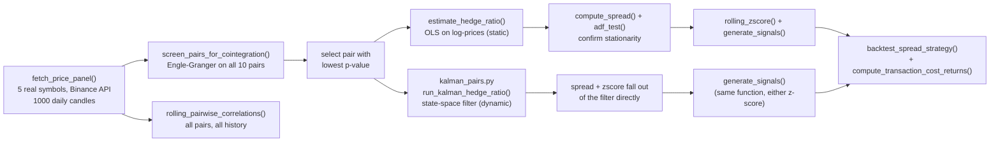

[ 🇺🇸 English ] | [ 🇨🇱 Leer en Español ](README.es.md)

# 1. Project Title

## Crypto Pairs Trading: A Cointegration Screening Engine


A statistical-arbitrage screening engine that tests a universe of
cryptocurrencies for genuine cointegration (Engle-Granger), builds the
mean-reverting spread for whichever pair actually passes, and backtests it —
with a **static OLS** hedge ratio and, as of this update, a **dynamic Kalman
filter** hedge ratio that lets the spread adapt to a changing relationship —
net of realistic, asymmetric transaction costs, all on real daily prices
pulled from Binance's public API.

> **Disclaimer**: real market data, real statistical tests, real backtest —
> but this is a methodology demonstration, not a live trading strategy, and
> not financial advice. §7 reports a losing backtest honestly rather than
> tuning it into a winning one.

---

# 2. Motivation

## Business impact

The single most common mistake in retail pairs-trading writeups is picking
two assets because they *sound* related (same sector, same narrative, "both
are crypto") and assuming that implies a tradeable statistical relationship.
It usually doesn't. A defensible pairs-trading process has to separate two
questions that are often conflated: (1) *is there a statistically
significant, testable equilibrium relationship between these two assets*,
and (2) *if so, can a simple trading rule actually extract profit from it
after realistic frictions*. This project keeps those two questions
explicitly separate — it screens a real universe of pairs for genuine
cointegration first, and only then asks whether the resulting spread was
tradeable, reporting the honest answer to both.

## Business Impact & Key Performance Indicators

| Metric | Result | What it means |
|---|---|---|
| Pairs screened | 10 (all combinations of BTC/ETH/SOL/BNB/XRP) | Only 1 clears cointegration at 5% -- BTC/ETH, the "obvious" pick, does not |
| Cointegrated pair found | BNB/XRP, Engle-Granger p = 0.030 | Confirmed independently by an ADF test on the spread itself (p = 0.007) |
| Kalman vs. static OLS, net return | -12.2% vs. -43.7% | Dynamic hedge ratio cuts the loss by more than 3x in this window |
| Kalman vs. static OLS, max drawdown | -21.4% vs. -51.6% | Substantially smaller drawdown, fewer trades (13 vs. 21), lower total transaction cost |
| Honest headline result | Both methods net-negative Sharpe | Reported plainly as "a large reduction in how badly this loses," not a manufactured win |

## Why real data

Cointegration is a statement about the actual joint dynamics of two price
series; testing it on fabricated data would only recover whatever
relationship was arbitrarily coded into the simulator, telling you nothing
about markets. All prices here are real daily closes for BTC, ETH, SOL, BNB,
and XRP, fetched directly from Binance's public REST API.

---

# 3. Theoretical Framework

## 3.1 Cointegration and the Engle-Granger test

Two non-stationary price series are **cointegrated** if some linear
combination of them is stationary — i.e., even though each price wanders
like a random walk on its own, a specific weighted spread between them
reverts to a stable mean. The **Engle-Granger** two-step test (implemented
here via `statsmodels.tsa.stattools.coint`) checks this directly: regress
one log-price on the other, then test the regression residuals for a unit
root. A low p-value rejects the null of "no cointegration."

## 3.2 Hedge ratio via OLS

The cointegrating relationship's weight — the **hedge ratio** (β) — comes
from an OLS regression of `log(Y)` on `log(X)`. The spread is then
`log(Y) - (α + β·log(X))`. This project uses a single **static** hedge
ratio fit over the whole sample, the standard textbook starting point,
with its limitation (a relationship that drifts over time isn't captured)
made explicit in §7.

## 3.3 The ADF test on the spread

Once the spread is built, the **Augmented Dickey-Fuller** test
(`statsmodels.tsa.stattools.adfuller`) independently confirms stationarity
— a second, complementary check on top of Engle-Granger, since ADF on the
residual series is mathematically what Engle-Granger's second step already
does, so agreement between the two is a useful consistency check rather
than a redundant one.

## 3.4 Z-score mean-reversion signals

A rolling (30-day) z-score of the spread turns "the spread is unusually
far from its recent mean" into a tradeable rule: enter when `|z| > 2`
(betting on reversion), exit when `|z| < 0.5`. This is the simplest
possible version of a pairs-trading signal, deliberately — see §7 for why
even a statistically sound spread doesn't guarantee this simple rule is
profitable.

## 3.5 Dynamic hedge ratio via Kalman filter

A static OLS hedge ratio assumes the cointegrating relationship's weight is
constant for the entire sample — unrealistic if the true relationship
drifts (changing market regimes, one asset's liquidity/dominance shifting
relative to the other). `kalman_pairs.py` models the hedge ratio as a
**hidden state that evolves over time**, estimated via a linear-Gaussian
Kalman filter (the standard formulation in pairs-trading practice, e.g.
Chan, *Algorithmic Trading*, ch. 3 — not a bespoke variant):

**State** (random walk, no deterministic drift term):

```
theta_t = [alpha_t, beta_t]'
theta_t = theta_{t-1} + w_t,      w_t ~ N(0, Q)
```

**Observation**:

```
y_t = F_t @ theta_t + v_t,        v_t ~ N(0, R_t)
F_t = [1, x_t]
```

**Recursion** (predict, then update, once per day):

```
theta_(t|t-1) = theta_(t-1|t-1)                 P_(t|t-1) = P_(t-1|t-1) + Q
e_t = y_t - F_t @ theta_(t|t-1)   <- this IS the spread
S_t = F_t @ P_(t|t-1) @ F_t' + R_t
K_t = P_(t|t-1) @ F_t' / S_t
theta_(t|t) = theta_(t|t-1) + K_t * e_t          P_(t|t) = (I - K_t @ F_t) @ P_(t|t-1)
```

Two properties worth calling out, not just mechanically implementing:

1. **The innovation *is* the spread.** `e_t = y_t - F_t @ theta_(t|t-1)` is
   the filter's own one-step-ahead prediction error, computed using
   *yesterday's* state — there's no separate step of subtracting
   `alpha + beta*x` after the fact, because that's exactly what this already
   is.
2. **The z-score falls out of the recursion for free.** `S_t` (the
   innovation variance) is already computed as part of the filter, so
   `z_t = e_t / sqrt(S_t)` needs no arbitrary rolling window — in principle.
   §5 documents a real calibration problem this raised in practice and how
   it was fixed (a fixed `R` badly miscalibrates this z-score over a
   multi-year sample).

## 3.6 Transaction costs and asymmetric slippage

Every trade crosses the bid-ask spread and pays an exchange fee; modeling a
backtest at zero cost silently assumes frictionless, infinite-liquidity
markets. This project charges a **taker fee** (10bps, representative of
Binance's fee schedule for the symbols traded here) plus **slippage that is
deliberately asymmetric between entry and exit**, not the same number
applied twice:

- **Entry** (5bps): triggered when `|z|` just crossed the entry threshold —
  a tail event (a 2-sigma-type move), when the order book is typically
  thinner and any non-trivial order moves the price more.
- **Exit** (2bps): triggered near `|z| < 0.5`, i.e. once the spread has
  already reverted toward a calmer regime — reasonable to expect a deeper
  book and less slippage.

Cost is charged **on the two days a position actually changes** (entry,
exit, or a direct flip = both), on both legs of the pair (the fee/slippage
factor is doubled), not on every day a position is merely held. See §7.6 for
the measured cost drag on both the OLS and Kalman strategies.

---

# 4. Explanation

## Pipeline architecture



`pairs_trading_engine.py` holds the data/statistics/backtest/cost functions
(no plotting); `kalman_pairs.py` holds the Kalman filter as a self-contained
module reusing `pairs_trading_engine.py`'s `generate_signals` and
`backtest_spread_strategy` (same signal and backtest logic, different
hedge-ratio/z-score source, so the OLS-vs-Kalman comparison is apples to
apples). `01_Cointegration_Analysis.ipynb` walks through the static OLS
pipeline; `02_Kalman_Dynamic_Hedge_Ratio.ipynb` walks through the dynamic
one and compares both directly.

## Function responsibilities

| Function | Responsibility |
|---|---|
| `fetch_price_panel()` | Pulls real daily closes for the 5-symbol universe from Binance's public `/api/v3/klines` (no API key). |
| `screen_pairs_for_cointegration()` | Runs Engle-Granger on all 10 candidate pairs, ranked by p-value — the systematic screening step in §7.2. |
| `estimate_hedge_ratio()` | OLS regression giving the spread's *static* hedge ratio (β), intercept (α), and R². |
| `kalman_pairs.run_kalman_hedge_ratio()` | Runs the Kalman filter (§3.5) end to end, returning the *dynamic* `alpha_t`/`beta_t`, the spread (innovation), and its natural z-score. |
| `compute_spread()` / `adf_test()` | Builds the (static) spread and independently confirms stationarity. |
| `rolling_zscore()` / `generate_signals()` | Rolling z-score (OLS path) and the entry/exit position logic (§3.4) — `generate_signals` is shared by both the OLS and Kalman paths. |
| `compute_transaction_cost_returns()` | Fee + asymmetric entry/exit slippage (§3.6), charged only on the days a position actually changes. |
| `backtest_spread_strategy()` | Dollar-neutral backtest: yesterday's position captures today's spread return (no look-ahead), net of transaction costs by default; `beta` accepts either a fixed float (OLS) or a `pd.Series` (Kalman). |
| `rolling_pairwise_correlations()` | Rolling 30-day correlation for every pair, across the full history — the heatmap in §7.5. |

---

# 5. Methodology

- **Screen the full universe, never assume the "obvious" pair.** All 10
  pairs among the 5 symbols are tested; the traded pair is whichever
  actually passes Engle-Granger at 5%, not whichever seemed intuitive
  going in (§7.2 reports exactly which one that turned out to be).
- **Two independent stationarity checks.** Engle-Granger's own test
  statistic and a separate ADF call on the resulting spread are both
  reported — they should (and do) agree, which is itself a basic sanity
  check on the pipeline.
- **No look-ahead in the backtest.** `positions.shift(1)` ensures each
  day's P&L uses yesterday's signal against today's return, never
  today's signal against today's return.
- **The backtest result is reported as-is**, win or lose — §7.4 does not
  retune thresholds after seeing a losing result to manufacture a better
  number.
- **A fixed observation-noise variance (R) badly miscalibrates the Kalman
  z-score over a multi-year sample.** The first version of `kalman_pairs.py`
  estimated R once from a 60-day burn-in and kept it fixed — the z-score's
  realized standard deviation came out to ~0.46 instead of ~1, and the
  strategy took only 2 trades in ~1,000 days. A *full-sample* static R was
  tried next and was worse (0 trades). Both failed for the same reason: the
  spread's residual volatility genuinely isn't constant across ~3 years of
  crypto prices. The fix — R updated each step via an EWMA of the squared
  innovation — is documented in `kalman_pairs.py`, and its speed
  (`R_EWM_LAMBDA = 2/(30+1)`) was chosen to match the existing 30-day window
  the OLS z-score already uses, **before** looking at backtest performance,
  specifically to avoid picking a hyperparameter that happens to make the
  Kalman result look best.
- **The Kalman-vs-OLS comparison is validated on a synthetic case with a
  known answer, not asserted from real-data results alone.** §7.7 builds a
  series with an engineered regime shift (true β = 0.5, then 1.5 partway
  through) and confirms the filter recovers both values while static OLS,
  fit once over the whole series, does not — real data alone can't prove
  the mechanism works, since the true hedge ratio is never actually known.

---

# 6. Development

## Tech stack

| Library | Role |
|---|---|
| **Pandas** | Price panel construction, returns, rolling windows. |
| **NumPy** | The Kalman filter recursion (`kalman_pairs.py`) — explicit vector/matrix operations, not a black-box state-space library. |
| **Statsmodels** | `coint()` (Engle-Granger), `OLS` (hedge ratio, both static and the Kalman burn-in), `adfuller()` (ADF). |
| **SciPy** | Underlying numerical routines Statsmodels depends on. |
| **Seaborn** | Rolling-correlation heatmap styling. |
| **Matplotlib** | Every figure. |
| **Jupyter** | `01_Cointegration_Analysis.ipynb` (static OLS) and `02_Kalman_Dynamic_Hedge_Ratio.ipynb` (dynamic Kalman + comparison). |
| **DuckDB** | `db_persistence.py` — persists `metrics.json` and the cointegration screening table into a queryable local database, one row per pipeline run. |
| **pytest** | `tests/` — unit coverage for the cointegration/hedge-ratio/backtest math, the Kalman recursion, and the DuckDB persistence layer. |

## Testing

```powershell
venv\Scripts\python.exe -m pytest tests/ -v
```

26 tests, all on synthetic data (no network calls) so they run offline and
deterministically:

| File | Covers |
|---|---|
| `tests/test_pairs_trading_engine.py` | Engle-Granger on a constructed cointegrated pair vs. two independent random walks, OLS hedge-ratio recovery, spread stationarity (ADF), z-score windowing, entry/exit signal logic, asymmetric transaction-cost accounting, the cost-aware backtest (including the `beta` float-vs-`Series` dual interface used by the Kalman path), and pairwise screening/ranking. |
| `tests/test_kalman_pairs.py` | Output shapes and index alignment, convergence of `beta_t` toward the true generating value, positivity of the innovation variance, the `zscore = spread / sqrt(innovation_variance)` identity, and input-length validation. |
| `tests/test_db_persistence.py` | Insert/read round-trip for both DuckDB tables, using a `tmp_path`-scoped database so tests never touch the repo's real `outputs/reports/pairs_trading.duckdb`. |

## DuckDB persistence

`outputs/reports/metrics.json` and `cointegration_screening.csv` already
capture a single run. `db_persistence.py` adds a queryable history on top,
additively — it does not replace either file:

```powershell
venv\Scripts\python.exe db_persistence.py   # backfills from the existing metrics.json/CSV
```

`run_full_pipeline()` in `pairs_trading_engine.py` also calls it automatically
at the end of every run (import is wrapped in a `try/except ImportError`, so
the core pipeline never hard-depends on DuckDB being installed). Two tables:

- `backtest_runs` — one row per pipeline run: pair, cointegration/ADF
  p-values, hedge ratio, and every backtest metric (Sharpe, drawdown, trade
  count, win rate, transaction costs).
- `cointegration_screening_runs` — one row per candidate pair per run,
  joinable to `backtest_runs` on `run_id`.

```python
from db_persistence import load_backtest_runs, load_screening_runs
load_backtest_runs()          # full run history, most recent first
load_screening_runs(run_id)   # screening table for one specific run
```

## Installation and setup

```powershell
git clone https://github.com/Rxyxs/crypto-pairs-trading-cointegration.git
cd crypto-pairs-trading-cointegration
python -m venv venv
venv\Scripts\activate
pip install -r requirements.txt
```

## Running it

```powershell
python pairs_trading_engine.py
```

Downloads the 5-symbol price panel, screens all 10 pairs for cointegration,
runs the full analysis on the winning pair, and writes
`outputs/reports/metrics.json` + `outputs/reports/cointegration_screening.csv`.

For the full step-by-step walkthrough with every figure (static OLS):

```powershell
jupyter notebook 01_Cointegration_Analysis.ipynb
```

For the dynamic Kalman filter and the direct OLS-vs-Kalman comparison:

```powershell
jupyter nbconvert --to notebook --execute --inplace 02_Kalman_Dynamic_Hedge_Ratio.ipynb
# or open it interactively:
jupyter notebook 02_Kalman_Dynamic_Hedge_Ratio.ipynb
```

## Project structure

```
crypto-pairs-trading-cointegration/
├── pairs_trading_engine.py              # data fetch, cointegration, hedge ratio, signals, cost-aware backtest
├── kalman_pairs.py                      # dynamic hedge ratio via Kalman filter (state-space)
├── db_persistence.py                    # persists metrics.json/screening into a queryable DuckDB history
├── 01_Cointegration_Analysis.ipynb      # static OLS walkthrough with every figure
├── 02_Kalman_Dynamic_Hedge_Ratio.ipynb  # dynamic Kalman walkthrough + OLS-vs-Kalman comparison
├── tests/                               # pytest unit tests (engine, Kalman filter, DuckDB persistence)
├── requirements.txt
├── data/                                # real price panel CSV (version-controlled)
├── outputs/
│   ├── figures/                         # z-score, correlation heatmap, equity/drawdown/beta comparisons (version-controlled)
│   └── reports/                         # metrics.json, cointegration_screening.csv, pairs_trading.duckdb (version-controlled)
├── LICENSE
├── README.md
└── README.es.md
```

---

# 7. Results

Every number and figure below comes from an actual run against real Binance
data (1,000 daily candles, 2023-12-02 to 2026-08-27) — nothing here is
estimated.

## 7.1 Dataset

| Metric | Value |
|---|---|
| Symbols screened | BTC, ETH, SOL, BNB, XRP |
| Candidate pairs | 10 |
| Daily candles per symbol | 1,000 |
| Date range | 2023-12-02 → 2026-08-27 |

## 7.2 Cointegration screening — the honest surprise

| Pair | Engle-Granger p-value | Cointegrated (5%)? |
|---|---:|:---:|
| **BNB/XRP** | **0.030** | **Yes** |
| BTC/XRP | 0.154 | No |
| ETH/SOL | 0.195 | No |
| BTC/ETH | 0.376 | No |
| SOL/XRP | 0.392 | No |
| ETH/XRP | 0.489 | No |
| ETH/BNB | 0.569 | No |
| BTC/BNB | 0.630 | No |
| SOL/BNB | 0.669 | No |
| BTC/SOL | 0.768 | No |

**BTC/ETH — the pair anyone would pick first — does not cointegrate in
this window** (p = 0.376). The only pair in the entire universe that
clears the conventional 5% bar is **BNB/XRP**, two assets with no obvious
narrative connection. This is exactly the outcome systematic screening
exists to catch: intuition about which cryptos "move together" is a poor
substitute for actually testing it.

## 7.3 BNB/XRP: hedge ratio and spread

- Static hedge ratio (OLS): β = 0.301, α = 6.361, R² = 0.443 (on log-prices)
- ADF test on the resulting spread: p = 0.007 (stationary at 5%) — confirms
  Engle-Granger independently

## 7.4 Z-score of the spread and trading signals


The rolling 30-day z-score oscillates repeatedly through the ±2 entry
bands and back through the ±0.5 exit band across the full period —
visually confirming the mean-reversion behavior the cointegration test
predicted.

## 7.5 Rolling correlation heatmap — the whole universe, over time


Every pair's 30-day rolling correlation is strongly positive for most of
the period (common crypto-market risk factor), with visible dips toward
zero at specific points (e.g., early 2025) — a reminder that correlation
and cointegration are different things: high correlation is visible for
*every* pair here, but only one of them actually cointegrates (§7.2).

## 7.6 Static OLS vs. dynamic Kalman — backtest, net of transaction costs

| Metric | OLS (static) | Kalman (dynamic) |
|---|---:|---:|
| Hedge ratio (β) | 0.301 (fixed) | 0.418 (as of the last day; time-varying) |
| Total return, net of costs | **−43.7%** | **−12.2%** |
| Total return, gross (no costs) | −37.2% | −5.9% |
| Annualized Sharpe | −0.37 | −0.31 |
| Max drawdown | −51.6% | −21.4% |
| Trades | 21 | 13 |
| Total transaction cost | 11.1% | 7.0% |


**Honest reading, not a manufactured win**: the Kalman filter cuts both the
total loss (−12.2% vs. −43.7%) and the max drawdown (−21.4% vs. −51.6%)
substantially, and trades less often (13 vs. 21, so it also pays less in
total transaction costs). But **neither method is profitable in this
window** — both annualized Sharpe ratios are negative. This is reported
exactly as it came out; the honest conclusion is "a large reduction in how
badly this particular strategy loses," not "a winning strategy."

## 7.7 Transaction cost impact


Costs turn a −37.2% gross OLS result into −43.7% net (a 6.5-point swing) and
a −5.9% gross Kalman result into −12.2% net (a 6.3-point swing) — a
non-trivial, measured drag in both cases, not a rounding footnote.

## 7.8 Synthetic validation: does the Kalman filter actually track a regime shift?

Real market data has no known "true" hedge ratio to check the filter
against, so this validates the mechanism directly on a synthetic series with
an engineered regime shift (true β = 0.5 for the first half, β = 1.5 for the
second half, both plus noise):


| | True β | Recovered |
|---|---:|---:|
| Kalman, last 50 days of regime 1 | 0.5 | **0.463** |
| Kalman, last 50 days of regime 2 | 1.5 | **1.766** |
| Static OLS (one number for the whole series) | — | **−12.860** |

The static OLS, forced to summarize both regimes with a single number, gives
a value that describes neither of them and isn't even the right sign or
order of magnitude. The Kalman filter recovers both regimes reasonably
closely after its initial convergence — direct, controlled evidence for the
mechanism §7.6 relies on, not just an assertion.

---

# 8. Conclusion

- **The intuitive pair (BTC/ETH) fails the cointegration test; a
  non-obvious pair (BNB/XRP) passes it** — the entire reason to screen
  systematically instead of trading on narrative.
- **Passing Engle-Granger and ADF is necessary, not sufficient, for a
  profitable strategy.** BNB/XRP's spread is genuinely, statistically
  mean-reverting, and a naive threshold rule on it still lost money here —
  a real, useful distinction this project measures rather than assumes.
- **High rolling correlation across the whole universe (§7.5) does not
  imply cointegration** — every pair is highly correlated for most of the
  period, but only one cointegrates; conflating the two is a common,
  avoidable mistake this project's structure makes hard to make.
- **A dynamic hedge ratio meaningfully reduces losses and drawdown, but
  does not turn a losing strategy into a winning one.** Letting β adapt via
  a Kalman filter cut the max drawdown from −51.6% to −21.4% and the total
  loss from −43.7% to −12.2% net of costs (§7.6) — a real, measured
  improvement in risk, reported alongside the fact that the strategy is
  still not profitable in this window.
- **Transaction costs are not a footnote here — they're 6-11 points of
  return** (§7.7), and asymmetric entry/exit slippage plus a static
  observation-noise assumption in the Kalman filter both had to be fixed
  honestly rather than tuned away (see the R-calibration note in §5).

## Future work

- Walk-forward re-screening (re-run cointegration testing on a rolling
  window instead of once over the full sample) to check whether BNB/XRP's
  cointegration is stable or itself a period-specific artifact.
- Extend the screened universe beyond 5 large-cap symbols to include
  mid-cap alts, where cointegration relationships are sometimes stronger
  and more persistent.
- Make the Kalman filter's process-noise scale (`delta`) and the R-EWMA
  half-life adaptive or cross-validated, instead of fixed at values chosen
  on principled-but-arbitrary grounds (§5).
- Explore position sizing proportional to z-score magnitude or Kalman
  innovation variance, instead of the current fixed ±1 unit sizing.

---

# 9. Data source & license

Data: real daily OHLCV for BTCUSDT, ETHUSDT, SOLUSDT, BNBUSDT, and XRPUSDT,
fetched directly from
[Binance's public REST API](https://binance-docs.github.io/apidocs/spot/en/#kline-candlestick-data)
(`/api/v3/klines`, no API key required) via `pairs_trading_engine.py` —
reproducible on demand.

Code: MIT — see [LICENSE](LICENSE).

# 10. Author

**Pablo Reyes** — [github.com/Rxyxs](https://github.com/Rxyxs)
