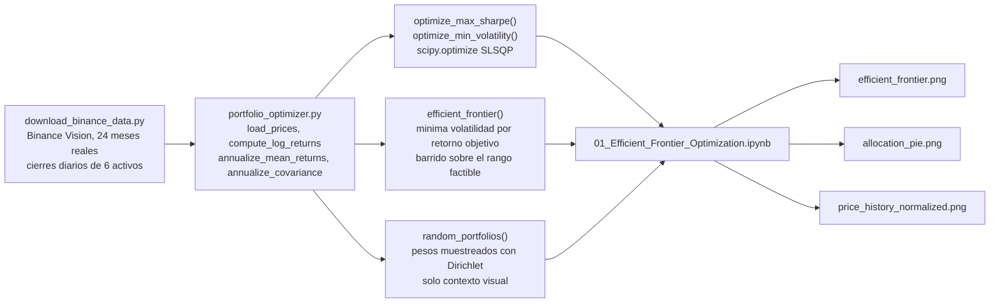
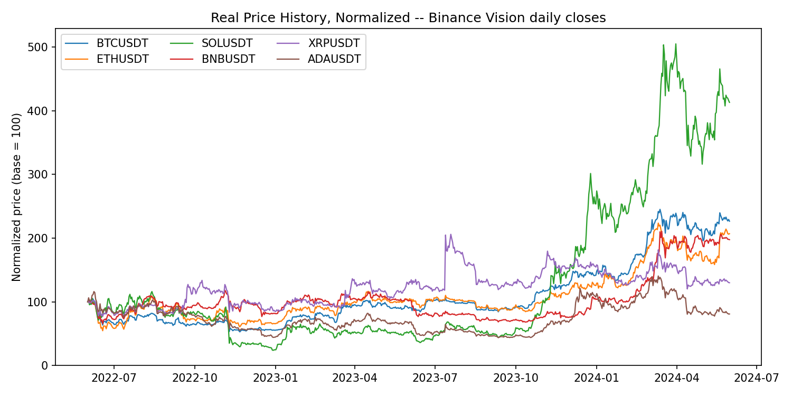
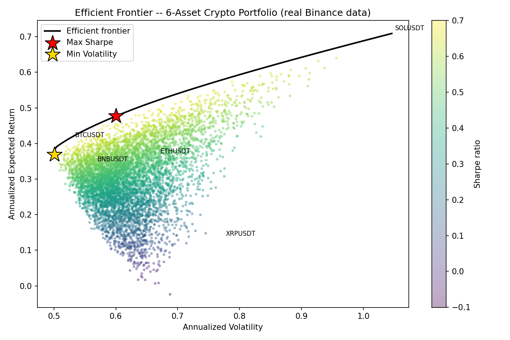
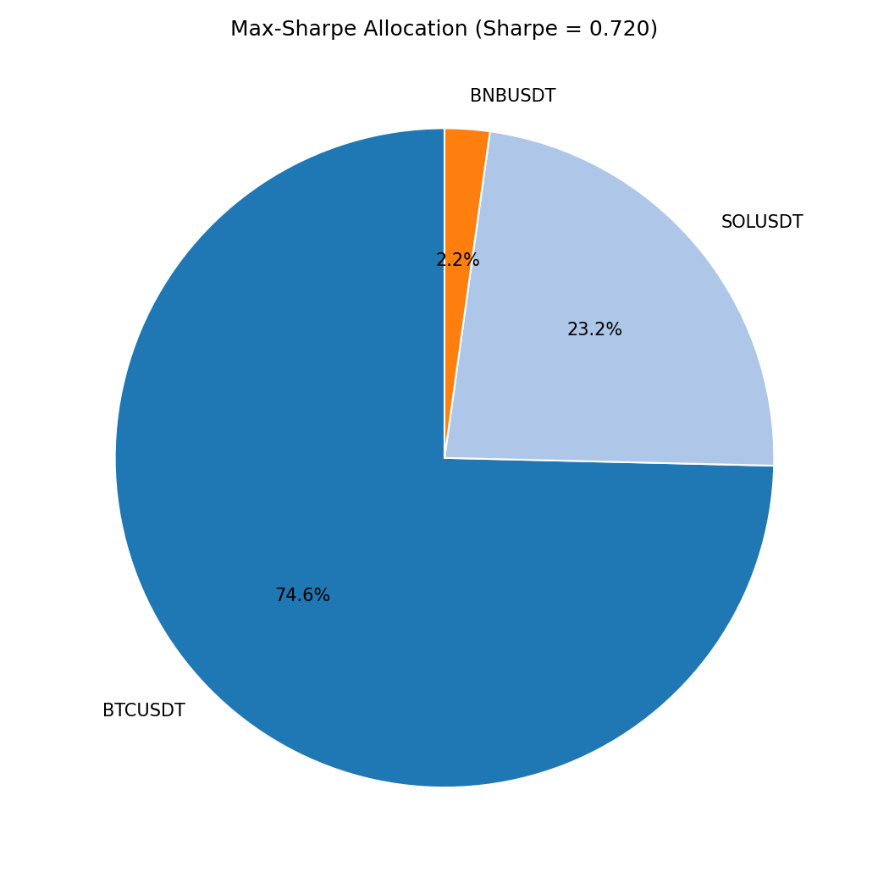

[ 🇺🇸 Read in English ](README.md) | [ 🇨🇱 Español ]

# 1. Título del Proyecto

## Optimizador de Portafolio Cripto -- Frontera Eficiente de Markowitz


Una implementación de la Teoría Moderna de Portafolios (Markowitz, 1952)
para una canasta de criptoactivos: la optimización media-varianza vía
optimización numérica restringida (SciPy SLSQP) calcula el portafolio de
máximo Sharpe, el portafolio de mínima volatilidad, y la frontera eficiente
completa entre ambos.

**Todos los datos son reales, no simulados**: 24 meses (2022-06-01 a
2024-05-31) de precios de cierre diarios reales para `BTCUSDT`, `ETHUSDT`,
`SOLUSDT`, `BNBUSDT`, `XRPUSDT` y `ADAUSDT`, obtenidos directamente de
[Binance Vision](https://data.binance.vision) — el archivo histórico de
datos de mercado de Binance, gratuito, público y sin autenticación. §9
documenta la fuente con precisión.

---

# 2. Impacto de Negocio e Indicadores Clave (KPIs)

| Métrica | Resultado | Qué significa |
|---|---|---|
| Asignación max-Sharpe | 74,6% BTC, 23,2% SOL, 2,2% BNB, 0% el resto | Una asignación real, no uniforme, a partir de 24 meses de historial real de precios de Binance, no un ejemplo elegido a mano |
| Activo excluido | ADAUSDT (retorno anualizado negativo en la ventana) | El optimizador lo excluye correctamente en vez de incluirlo por la apariencia de diversificación |
| Fuente de datos | Cierres diarios reales de Binance, 6 activos, 24 meses | La estructura de covarianza/correlación es comportamiento de mercado genuino, no simulado |

La optimización media-varianza responde la pregunta que todo asignador de
capital tiene que responder realmente: *dado un conjunto de activos que
podría tener, ¿qué combinación da el mejor retorno para el riesgo que estoy
asumiendo, o el menor riesgo para un retorno objetivo dado?* Ponderar en
partes iguales una canasta, o elegir activos por reconocimiento de nombre,
no es esa respuesta — ignora tanto el perfil propio de riesgo/retorno de
cada activo como la forma en que los activos se mueven en conjunto (su
covarianza), que es exactamente lo que determina si agregar un activo
realmente diversifica un portafolio o solo agrega riesgo correlacionado.

El resultado real en §7 hace esto concreto: el optimizador asigna **74.6% a
`BTCUSDT` y 23.2% a `SOLUSDT`, con solo un 2.2% en `BNBUSDT` y cero en
`ETHUSDT`, `XRPUSDT` o `ADAUSDT`** — no porque estos tres sean malos activos
en general, sino porque durante esta ventana real específica de 24 meses no
mejoraron el retorno ajustado por riesgo de un portafolio que ya tenía BTC
y SOL. `ADAUSDT` en particular tuvo un retorno anualizado **negativo**
durante el período, así que el modelo correctamente lo excluye en vez de
incluirlo por la apariencia de diversificación.

---

# 3. Arquitectura



`portfolio_optimizer.py` contiene toda la lógica de optimización y es
importado, no duplicado, por el notebook — cada número y figura del
notebook proviene de llamar directamente a estas funciones.

---

# 4. Stack Tecnológico

- **NumPy / Pandas** — carga de precios, cálculo de retornos logarítmicos,
  y las fórmulas de álgebra lineal de performance de portafolio
  (`w^T μ`, `w^T Σ w`).
- **SciPy** (`scipy.optimize.minimize`, SLSQP) — cada optimización
  (máximo Sharpe, mínima volatilidad, cada punto de la frontera eficiente)
  es una resolución numérica restringida real, no un atajo de forma
  cerrada, así que la restricción long-only (`w_i ≥ 0`) se cumple
  exactamente.
- **Matplotlib** — el scatter de la frontera eficiente, el pie chart de
  asignación, y el gráfico de historial de precios normalizado.
- **Jupyter** — `01_Efficient_Frontier_Optimization.ipynb` recorre las
  matemáticas, los datos y cada figura de principio a fin; ejecutado in
  place con `nbconvert --execute` para que los outputs del notebook
  publicado sean reales.
- **Binance Vision** (`data.binance.vision`) — la fuente real de datos de
  mercado; ver §9 para el alcance exacto y la licencia.
- **Python 3.10**, `venv` estándar.

---

# 5. Marco Matemático

Para un portafolio long-only con pesos $w$ ($\sum_i w_i = 1$, $w_i \geq 0$),
vector de retornos medios anualizado $\mu$, y matriz de covarianza
anualizada $\Sigma$:

$$E(R_p) = w^\top \mu \qquad \sigma_p = \sqrt{w^\top \Sigma \, w} \qquad S(w) = \frac{E(R_p) - R_f}{\sigma_p}$$

El portafolio de máximo Sharpe maximiza $S(w)$; el de mínima volatilidad
minimiza $\sigma_p^2$; la frontera eficiente minimiza $\sigma_p^2$ para
cada retorno objetivo $\mu^*$ alcanzable, uno por uno. La derivación
completa y el cálculo desarrollado están en el notebook (§7).

El cripto opera 365 días al año (sin cierre de fin de semana, a diferencia
de las acciones), así que este proyecto anualiza con **365** días de
trading, no los 252 habituales.

---

# 6. Datos

| | |
|---|---|
| Activos | `BTCUSDT`, `ETHUSDT`, `SOLUSDT`, `BNBUSDT`, `XRPUSDT`, `ADAUSDT` (Binance spot) |
| Período | 2022-06-01 → 2024-05-31 (24 meses completos) |
| Frecuencia | Cierre diario, 731 días de trading |
| Fuente | Archivos mensuales `klines` de Binance Vision, intervalo `1d` |

`data/download_binance_data.py` vuelve a descargar las seis series
directamente desde Binance Vision bajo demanda — sin API key, completamente
reproducible.

---

# 7. Resultados Visuales

Cada número y figura abajo proviene de una ejecución real de
`01_Efficient_Frontier_Optimization.ipynb` (`jupyter nbconvert --execute`,
sobre los datos reales de §6) — nada aquí es estimado.

## 7.1 Historial de precios real (normalizado)



`SOLUSDT` es el caso destacado: una recuperación real de ~5x desde su
mínimo de fines de 2022 hasta principios de 2024, visible directamente en
los datos crudos — esto es lo que impulsa su rol desproporcionado en el
portafolio óptimo de abajo.

## 7.2 Retorno / riesgo anualizado por activo

| Activo | Retorno Anualizado | Volatilidad Anualizada |
|---|---:|---:|
| BTCUSDT | 40.9% | 52.9% |
| ETHUSDT | 36.4% | 66.7% |
| SOLUSDT | 70.9% | 104.6% |
| BNBUSDT | 34.1% | 56.5% |
| XRPUSDT | 13.1% | 77.3% |
| ADAUSDT | **-10.5%** | 72.1% |

## 7.3 Frontera eficiente



La curva negra es la frontera eficiente (60 puntos resueltos con SLSQP); la
nube de colores son 6.000 portafolios long-only aleatorios, mostrados solo
como contexto visual — cada uno de ellos cae sobre o dentro de la frontera,
como predice la MPT. El extremo superior de la frontera coincide con
`SOLUSDT` solo: ninguna combinación diversificada le gana a tener 100% SOL
en *retorno* durante esta ventana, solo en retorno ajustado por riesgo, que
es lo que captura la estrella de máximo Sharpe en su lugar.

## 7.4 Portafolio de máximo Sharpe vs. mínima volatilidad

| Portafolio | BTC | ETH | SOL | BNB | XRP | ADA | Retorno | Volatilidad | Sharpe |
|---|---:|---:|---:|---:|---:|---:|---:|---:|---:|
| **Máximo Sharpe** | 74.6% | 0% | 23.2% | 2.2% | 0% | 0% | 47.7% | 60.0% | **0.720** |
| Mínima Volatilidad | 57.0% | 0% | 0% | 37.7% | 5.3% | 0% | 36.9% | 50.0% | 0.647 |

## 7.5 Asignación óptima (máximo Sharpe)



## 7.6 Persistencia de resultados (DuckDB)

Como este es un problema de optimización numérica y no un modelo
estadístico entrenado, no hay un modelo que persistir -- en su lugar,
`results_store.py` persiste las salidas de cada corrida (asignaciones de
máximo Sharpe y mínima volatilidad, su retorno/volatilidad/Sharpe, y cada
punto de la frontera eficiente de 60 puntos) en un archivo local de
DuckDB, `outputs/portfolio_results.duckdb` (ignorado por git, igual que
`data/raw/`, por ser un artefacto reproducible de ejecutar el notebook).
Esto permite consultar resultados con SQL simple entre corridas, sin
volver a resolver la optimización:

```python
import duckdb
con = duckdb.connect("outputs/portfolio_results.duckdb")
con.execute("SELECT * FROM performance ORDER BY run_ts DESC").df()
```

`tests/test_portfolio_optimizer.py` cubre las matemáticas de la
optimización (validez de pesos, monotonicidad de la frontera, volatilidad
mínima ≤ volatilidad de máximo Sharpe) y el round-trip con DuckDB, sobre
series de precios sintéticas pequeñas por velocidad; se ejecuta con
`pytest tests/`.

---

# 8. Pasos de Ejecución

```powershell
git clone https://github.com/Rxyxs/crypto-portfolio-markowitz-optimizer.git
cd crypto-portfolio-markowitz-optimizer
python -m venv venv
venv\Scripts\activate
pip install -r requirements.txt
python data\download_binance_data.py
jupyter nbconvert --to notebook --execute --inplace 01_Efficient_Frontier_Optimization.ipynb
pytest tests\
```

O abre `01_Efficient_Frontier_Optimization.ipynb` directamente en Jupyter y
ejecuta todas las celdas de forma interactiva.

## Estructura del proyecto

```
crypto-portfolio-markowitz-optimizer/
├── data/
│   ├── download_binance_data.py            # descarga reproducible desde Binance Vision
│   └── raw/                                 # daily_closes.csv (real, gitignored)
├── portfolio_optimizer.py                   # MPT: retornos, covarianza, optimizacion, frontera
├── results_store.py                          # persiste los resultados de cada corrida en DuckDB
├── tests/
│   └── test_portfolio_optimizer.py           # tests de la optimizacion + round-trip con DuckDB
├── 01_Efficient_Frontier_Optimization.ipynb  # matematicas, datos, figuras, ejecutado de principio a fin
├── outputs/
│   ├── figures/                               # las 3 figuras de resultados (versionadas)
│   └── portfolio_results.duckdb               # resultados de la corrida (gitignored, reproducible)
├── requirements.txt
├── LICENSE
└── README.md / README.es.md
```

---

# 9. Fuente de Datos y Licencia

Datos de precio: cierres diarios reales de BTCUSDT/ETHUSDT/SOLUSDT/
BNBUSDT/XRPUSDT/ADAUSDT en spot, publicados por el propio Binance vía
[Binance Vision](https://data.binance.vision) (`data.binance.vision`), un
archivo histórico de datos de mercado gratuito, público y sin
autenticación. Este proyecto usa los archivos mensuales `klines`
(intervalo de 1 día) de 2022-06 a 2024-05. Los archivos crudos no se
redistribuyen en este repositorio (`data/raw/` está en `.gitignore`);
`data/download_binance_data.py` los vuelve a descargar directamente desde
Binance bajo demanda.

Código: MIT — ver [LICENSE](LICENSE).

---

# 10. Autor

**Pablo Reyes** — [github.com/Rxyxs](https://github.com/Rxyxs)
