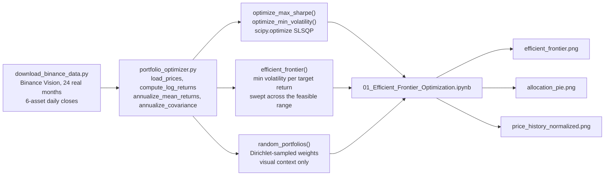

[ 🇺🇸 English ] | [ 🇨🇱 Leer en Español ](README.es.md)

# 1. Project Title

## Crypto Portfolio Optimizer -- Markowitz Efficient Frontier


An implementation of Modern Portfolio Theory (Markowitz, 1952) for a basket
of crypto assets: mean-variance optimization via constrained numerical
optimization (SciPy SLSQP) computes the maximum-Sharpe portfolio, the
minimum-volatility portfolio, and the full efficient frontier between them.

**All data is real, not simulated**: 24 months (2022-06-01 to 2024-05-31)
of real daily closing prices for `BTCUSDT`, `ETHUSDT`, `SOLUSDT`,
`BNBUSDT`, `XRPUSDT`, and `ADAUSDT`, sourced directly from
[Binance Vision](https://data.binance.vision) — Binance's free, public,
no-authentication historical market-data archive. §8 documents the source
precisely.

---

# 2. Business Impact & Key Performance Indicators

| Metric | Result | What it means |
|---|---|---|
| Max-Sharpe allocation | 74.6% BTC, 23.2% SOL, 2.2% BNB, 0% elsewhere | A real, non-uniform allocation from 24 months of actual Binance price history, not a hand-picked example |
| Excluded asset | ADAUSDT (negative annualized return over the window) | The optimizer correctly excludes it rather than including it for the appearance of diversification |
| Data source | Real Binance daily closes, 6 assets, 24 months | Covariance/correlation structure is genuine market behavior, not simulated |

Mean-variance optimization answers the question every allocator actually
has to answer: *given a set of assets I could hold, which combination gives
the best return for the risk I'm taking, or the least risk for a given
return target?* Equal-weighting a basket, or picking assets by name
recognition, is not that answer — it ignores both each asset's own
risk/return profile and how the assets move together (their covariance),
which is exactly what determines whether adding an asset actually
diversifies a portfolio or just adds correlated risk.

The real result in §7 makes this concrete: the optimizer allocates **74.6%
to `BTCUSDT` and 23.2% to `SOLUSDT`, with only a 2.2% stake in `BNBUSDT`
and zero in `ETHUSDT`, `XRPUSDT`, or `ADAUSDT`** — not because those three
are bad assets in general, but because over this specific real 24-month
window they did not improve the risk-adjusted return of a portfolio that
already held BTC and SOL. `ADAUSDT` in particular had a **negative**
annualized return over the period, so the model correctly excludes it
rather than including it for the appearance of diversification.

---

# 3. Architecture



`portfolio_optimizer.py` holds all of the optimization logic and is
imported, not duplicated, by the notebook — every number and figure in the
notebook comes from calling these functions directly.

---

# 4. Tech Stack

- **NumPy / Pandas** — price loading, log-return computation, and the
  linear-algebra portfolio-performance formulas (`w^T μ`, `w^T Σ w`).
- **SciPy** (`scipy.optimize.minimize`, SLSQP) — every optimization
  (max-Sharpe, min-volatility, each point on the efficient frontier) is a
  real constrained numerical solve, not a closed-form shortcut, so the
  long-only constraint (`w_i ≥ 0`) is enforced exactly.
- **Matplotlib** — the efficient frontier scatter, the allocation pie
  chart, and the normalized price-history chart.
- **Jupyter** — `01_Efficient_Frontier_Optimization.ipynb` walks through
  the math, the data, and every figure end to end; executed in place with
  `nbconvert --execute` so the committed notebook's outputs are real.
- **Binance Vision** (`data.binance.vision`) — the real market-data source;
  see §8 for exact scope and license.
- **Python 3.10**, standard `venv`.

---

# 5. Mathematical Framework

For a long-only portfolio with weights $w$ ($\sum_i w_i = 1$, $w_i \geq 0$),
annualized mean-return vector $\mu$, and annualized covariance matrix $\Sigma$:

$$E(R_p) = w^\top \mu \qquad \sigma_p = \sqrt{w^\top \Sigma \, w} \qquad S(w) = \frac{E(R_p) - R_f}{\sigma_p}$$

The max-Sharpe portfolio maximizes $S(w)$; the min-volatility portfolio
minimizes $\sigma_p^2$; the efficient frontier minimizes $\sigma_p^2$ for
each achievable target return $\mu^*$ in turn. Full derivation and the
worked computation are in the notebook (§7).

Crypto trades 365 days/year (no weekend close, unlike equities), so this
project annualizes with **365** trading days, not the usual 252.

---

# 6. Data

| | |
|---|---|
| Assets | `BTCUSDT`, `ETHUSDT`, `SOLUSDT`, `BNBUSDT`, `XRPUSDT`, `ADAUSDT` (Binance spot) |
| Period | 2022-06-01 → 2024-05-31 (24 full months) |
| Frequency | Daily close, 731 trading days |
| Source | Binance Vision monthly `klines` archives, `1d` interval |

`data/download_binance_data.py` re-fetches all six series directly from
Binance Vision on demand — no API key required, fully reproducible.

---

# 7. Visual Results

Every number and figure below comes from an actual execution of
`01_Efficient_Frontier_Optimization.ipynb` (`jupyter nbconvert --execute`,
on the real data in §6) — nothing here is estimated.

## 7.1 Real price history (normalized)


`SOLUSDT` is the standout: a real ~5x recovery from its late-2022 low
through early 2024, visible directly in the raw data — this is what drives
its outsized role in the optimal portfolio below.

## 7.2 Annualized return / risk per asset

| Asset | Annualized Return | Annualized Volatility |
|---|---:|---:|
| BTCUSDT | 40.9% | 52.9% |
| ETHUSDT | 36.4% | 66.7% |
| SOLUSDT | 70.9% | 104.6% |
| BNBUSDT | 34.1% | 56.5% |
| XRPUSDT | 13.1% | 77.3% |
| ADAUSDT | **-10.5%** | 72.1% |

## 7.3 Efficient frontier


The black curve is the efficient frontier (60 SLSQP-solved points); the
colored cloud is 6,000 random long-only portfolios, shown only for visual
context — every one of them falls on or inside the frontier, as MPT
predicts. The frontier's upper end coincides with `SOLUSDT` alone: no
diversified combination beats holding 100% SOL on *return* over this
window, only on risk-adjusted return, which is what the max-Sharpe star
captures instead.

## 7.4 Max-Sharpe vs. min-volatility portfolios

| Portfolio | BTC | ETH | SOL | BNB | XRP | ADA | Return | Volatility | Sharpe |
|---|---:|---:|---:|---:|---:|---:|---:|---:|---:|
| **Max Sharpe** | 74.6% | 0% | 23.2% | 2.2% | 0% | 0% | 47.7% | 60.0% | **0.720** |
| Min Volatility | 57.0% | 0% | 0% | 37.7% | 5.3% | 0% | 36.9% | 50.0% | 0.647 |

## 7.5 Optimal allocation (max-Sharpe)


## 7.6 Results persistence (DuckDB)

Since this is a numerical-optimization problem rather than a fitted
statistical model, there is no trained model to persist -- instead,
`results_store.py` persists each run's outputs (max-Sharpe and
min-volatility allocations, their return/volatility/Sharpe, and every
point on the 60-point efficient frontier) into a local DuckDB file,
`outputs/portfolio_results.duckdb` (gitignored, like `data/raw/`, since
it's a reproducible artifact of running the notebook). This makes results
queryable with plain SQL across runs, without re-solving the optimization:

```python
import duckdb
con = duckdb.connect("outputs/portfolio_results.duckdb")
con.execute("SELECT * FROM performance ORDER BY run_ts DESC").df()
```

`tests/test_portfolio_optimizer.py` covers the optimization math (weight
validity, frontier monotonicity, min-vol ≤ max-Sharpe volatility) and the
DuckDB round-trip, on small synthetic price series for speed; run with
`pytest tests/`.

---

# 8. Execution Steps

```powershell
git clone https://github.com/Rxyxs/crypto-portfolio-markowitz-optimizer.git
cd crypto-portfolio-markowitz-optimizer
python -m venv venv
venv\Scripts\activate
pip install -r requirements.txt
python data\download_binance_data.py
jupyter nbconvert --to notebook --execute --inplace 01_Efficient_Frontier_Optimization.ipynb
pytest tests\
```

Or open `01_Efficient_Frontier_Optimization.ipynb` directly in Jupyter and
run all cells interactively.

## Project structure

```
crypto-portfolio-markowitz-optimizer/
├── data/
│   ├── download_binance_data.py            # reproducible fetch from Binance Vision
│   └── raw/                                 # daily_closes.csv (real, gitignored)
├── portfolio_optimizer.py                   # MPT: returns, covariance, optimization, frontier
├── results_store.py                          # persists each run's results to DuckDB
├── tests/
│   └── test_portfolio_optimizer.py           # optimization math + DuckDB round-trip tests
├── 01_Efficient_Frontier_Optimization.ipynb  # math, data, figures, executed end to end
├── outputs/
│   ├── figures/                               # the 3 result PNGs (version-controlled)
│   └── portfolio_results.duckdb               # run results (gitignored, reproducible)
├── requirements.txt
├── LICENSE
└── README.md / README.es.md
```

---

# 9. Data Source & License

Price data: real BTCUSDT/ETHUSDT/SOLUSDT/BNBUSDT/XRPUSDT/ADAUSDT spot daily
closes, published by Binance itself via
[Binance Vision](https://data.binance.vision) (`data.binance.vision`), a
free, public, no-authentication historical market-data archive. This
project uses the monthly `klines` (1-day interval) archives for
2022-06 through 2024-05. Raw files are not redistributed in this repository
(`data/raw/` is gitignored); `data/download_binance_data.py` re-fetches
them directly from Binance on demand.

Code: MIT — see [LICENSE](LICENSE).

---

# 10. Author

**Pablo Reyes** — [github.com/Rxyxs](https://github.com/Rxyxs)
