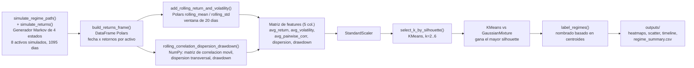

[ 🇺🇸 Read in English ](README.md) | [ 🇨🇱 Español ]

# 1. Título del Proyecto

## Detección de Regímenes de Mercado Cripto vía Clustering Sensible a la Correlación


Un pipeline no supervisado que convierte una cinta de precios multi-activo
de criptomonedas en un conjunto pequeño de **regímenes de mercado**
estadísticamente distintos — grupos de días que comparten un perfil de
volatilidad, correlación y tendencia — y cuantifica cómo esos regímenes
reconfiguran la estructura de correlación entre activos. Construido sobre
un panel simulado de 8 activos (BTC, ETH, SOL, ADA, XRP, DOT, AVAX, MATIC)
impulsado por un generador de cambio de régimen conocido, de modo que los
clusters descubiertos pueden contrastarse contra la verdad base, no solo
observarse a ojo.

## Técnicas usadas

| Técnica | Dónde |
|---|---|
| Simulación de retornos con cambio de régimen y verdad base conocida | `simulate_regime_path()`, `simulate_returns()` |
| Features de correlación / dispersión / drawdown rodantes | `rolling_correlation_dispersion_drawdown()` |
| Clustering KMeans + Gaussian Mixture, selección de k por silhouette | `select_k_by_silhouette()`, `main()` |
| Etiquetado de régimen a partir de los centroides del cluster | `label_regimes()` |
| Adjusted Rand Index vs. la verdad base del simulador | `main()`, §7 |
| Persistencia en DuckDB del resumen de régimen + etiquetas diarias | `save_results_to_duckdb()` |

[**Gráfico interactivo**: trayectoria de precio acumulada coloreada por régimen, según las asignaciones reales de KMeans](https://htmlpreview.github.io/?https://github.com/Rxyxs/crypto-quant-techniques-lab/blob/main/05-regime-detection-correlation/outputs/interactive/regime_colored_price.html)

---

# 2. Impacto de Negocio e Indicadores Clave (KPIs)

| Métrica | Resultado | Qué significa |
|---|---|---|
| Correlación promedio por pares, régimen calmo vs. turbulento | 0,29 vs. **0,56** | El beneficio de diversificación casi se reduce a la mitad exactamente cuando más se necesita -- oculto por una única matriz de correlación estática |
| Selección del número de regímenes | k=2 (elegido por silhouette), no los 4 regímenes "reales" del simulador | Hallazgo honesto: k=2 igual recupera claramente el hecho estilizado calmo-vs-turbulento, aunque no recupera cada régimen inyectado (Adjusted Rand Index 0,158) |
| Formato de salida | `outputs/regime_summary.csv` legible por máquina | Alimenta directamente una regla de position-sizing o cobertura, no solo un gráfico |

El riesgo de un portafolio cripto no es estático: la misma canasta de
activos que diversifica bien en un mercado calmo puede moverse casi como
uno solo durante un evento de estrés, borrando silenciosamente la
diversificación que un modelo de riesgo asumía que existía. Este proyecto
da una forma concreta de actuar sobre eso:

- **Riesgo condicionado al régimen, no un número estático único.** Una
  matriz de correlación calculada una sola vez, sobre todo el historial,
  esconde el hecho de que el beneficio de diversificación colapsa
  justo cuando más se necesita. Aquí, el régimen de alta volatilidad
  descubierto muestra una **correlación promedio par-a-par de 0,56**,
  contra **0,29** en el régimen calmo — un portafolio dimensionado para
  la correlación del régimen calmo carga un riesgo materialmente más
  concentrado del que su propio modelo de riesgo asume en el momento en
  que el mercado gira.
- **Una señal no supervisada y re-etiquetable.** No se requieren
  etiquetas históricas de "este día fue un crash" — el clustering
  descubre la estructura directamente desde estadísticas móviles de
  retorno, volatilidad, correlación, dispersión y drawdown, que es
  exactamente la situación en la que está un desk de trading o riesgo en
  vivo (las etiquetas del régimen *actual* todavía no existen).
- **Una decisión de selección de modelo tomada con honestidad, no
  asumida.** El clustering se corre en `k = 2..6` y el número de
  regímenes se elige por silhouette score en vez de fijarse de antemano
  — ver §6 para lo que los datos realmente respaldaron y por qué.
- **Salida accionable, no solo un gráfico.** El pipeline emite una tabla
  resumen por régimen legible por máquina
  (`outputs/regime_summary.csv`) apta para alimentar directamente una
  regla de sizing de posiciones o cobertura, además de los diagnósticos
  visuales.

---

# 3. Arquitectura



## Responsabilidad de cada función

| Función | Responsabilidad |
|---|---|
| `simulate_regime_path`, `simulate_returns` | Genera un camino de régimen Markov de 4 estados y un panel de retornos de 8 activos desde un modelo de retorno equicorrelacionado de un factor, de modo que existan regímenes de verdad base contra los cuales validar. |
| `build_returns_frame`, `add_rolling_return_and_volatility` | Arma el DataFrame de Polars y calcula la media/volatilidad móvil por activo, promediada a través del panel. |
| `rolling_correlation_dispersion_drawdown` | Paso en NumPy que calcula la matriz de correlación móvil par-a-par, la dispersión transversal, y el drawdown por día — estadísticas que las operaciones móviles columna-a-columna de Polars no expresan directamente. |
| `select_k_by_silhouette` | Ajusta KMeans para `k=2..6` y puntúa cada uno por silhouette, de modo que el número de regímenes es una elección medida, no un supuesto fijo. |
| `label_regimes` | Nombra cada cluster (`Bull Quiet`, `Bull Volatile`, `Bear Crash`, `Sideways / Consolidation`) según la posición retorno/volatilidad de su centroide relativa a los otros clusters, no un mapeo fijo índice-a-nombre. |
| `plot_correlation_heatmap_overall`, `plot_correlation_heatmap_by_regime`, `plot_cluster_scatter`, `plot_regime_timeline` | Renderiza las cuatro figuras de resultado directamente desde la salida del modelo ajustado. |

---

# 4. Stack Tecnológico

| Capa | Elección | Por qué |
|---|---|---|
| Ingeniería de datos | **Polars** | Estadísticas móviles basadas en expresiones (`rolling_mean`, `rolling_std`, `mean_horizontal`) y agregación `group_by` rápida para la tabla resumen por régimen |
| Núcleo numérico | NumPy | Matrices de correlación móvil par-a-par y el simulador de retornos con cambio de régimen, donde un loop simple sobre arrays es el ajuste natural |
| Clustering | **scikit-learn** | `KMeans` y `GaussianMixture` comparados directamente por silhouette score; `StandardScaler` y `PCA` para preprocesamiento y visualización en 2D |
| Visualización | **Seaborn** + **Matplotlib** | Heatmaps de correlación anotados, scatter de clusters, y una línea de tiempo de precio sombreada por régimen |
| Validación | `adjusted_rand_score` de scikit-learn | Como los regímenes subyacentes son simulados desde un generador conocido, los clusters descubiertos pueden puntuarse contra una verdad base real — algo no posible sobre datos de mercado reales sin etiquetar, y usado deliberadamente aquí por esa razón |
| Persistencia | **DuckDB** | Tablas `regime_summary` y `regime_days` (por día) escritas en `outputs/market_regimes.duckdb`, para consultar resultados con SQL directamente sin volver a correr el pipeline ni parsear el CSV |

---

# 5. Pasos de Ejecución

```powershell
git clone https://github.com/Rxyxs/crypto-regime-correlation-heatmap.git
cd crypto-regime-correlation-heatmap
python -m venv venv
venv\Scripts\activate
pip install -r requirements.txt

python market_analysis.py

# Suite de tests
python -m pytest tests/ -v
```

Ejecutarlo regenera cada tabla y figura en `outputs/` desde una seed fija
(42) — los números en la §6 de abajo no son estimados, son la salida por
consola de ese comando exacto.

## Estructura del proyecto

```
crypto-regime-correlation-heatmap/
├── market_analysis.py       # simulacion, feature engineering, clustering, graficos
├── tests/
│   └── test_market_analysis.py  # tests unitarios del pipeline de simulacion/features/clustering
├── outputs/
│   ├── correlation_heatmap_overall.png
│   ├── correlation_heatmap_by_regime.png
│   ├── cluster_scatter.png
│   ├── regime_timeline.png
│   ├── regime_summary.csv
│   └── market_regimes.duckdb    # tablas regime_summary + regime_days, consultables con SQL
├── requirements.txt
├── README.md
└── README.es.md
```

---

# 6. Resultados Visuales

Cada figura y número de abajo viene de una corrida real de
`python market_analysis.py` (seed 42) — nada acá es estimado.

## 6.1 Eligiendo el número de regímenes

| k | Silhouette (KMeans) |
|---:|---:|
| 2 | **0,4926** ← seleccionado |
| 3 | 0,4546 |
| 4 | 0,4014 |
| 5 | 0,4111 |
| 6 | 0,4250 |

KMeans (silhouette 0,4926) superó a un Gaussian Mixture Model ajustado
con el mismo k (silhouette 0,4380), así que KMeans es el modelo
reportado. **Hallazgo honesto, sin suavizar**: el generador de datos
detrás de esta simulación en realidad tiene 4 regímenes ocultos, pero el
silhouette score respalda con más fuerza **k = 2**. Contrastado contra las
etiquetas de régimen de verdad base del propio simulador, la solución de
2 clusters obtiene un Adjusted Rand Index de **0,158** contra el camino
real de 4 estados — una correspondencia débil, como se esperaba: en una
ventana móvil de 20 días, la diferencia de *tendencia* entre "Bull Quiet"
y "Sideways" (ambos regímenes de baja volatilidad) es pequeña respecto al
ruido del retorno diario, así que esos dos colapsan juntos, al igual que
"Bull Volatile" y "Bear Crash" del lado turbulento. Lo que el clustering
recupera de forma confiable en cambio es la división más gruesa, y
posiblemente más accionable, entre **calmo y turbulento**.

## 6.2 Regímenes detectados

| Régimen | Días | % | Retorno diario prom. | Volatilidad prom. | Correlación par-a-par prom. | Drawdown prom. |
|---|---:|---:|---:|---:|---:|---:|
| Bull Quiet | 687 | 63,8% | +0,189% | 1,91% | 0,294 | −3,65% |
| Bear Crash | 389 | 36,2% | −0,155% | 4,48% | 0,559 | −15,59% |

## 6.3 Estructura de correlación por régimen


Este es el hallazgo de negocio central: la correlación promedio par-a-par
casi se **duplica**, de 0,29 a 0,56, entre el régimen calmo y el
turbulento. La correlación de cada par de activos aumenta en el régimen
turbulento — el efecto de ruptura de correlación que el simulador fue
construido deliberadamente para reproducir, y el mecanismo detrás del
punto de colapso de diversificación de la §2.

## 6.4 Correlación de todo el período (lo que mostraría una matriz estática única)


Agrupado a lo largo de toda la corrida de 3 años, cada correlación
par-a-par cae alrededor de 0,50–0,57 — un único número mezclado que
esconde tanto el 0,29 del régimen calmo como el 0,56 del régimen
turbulento sobre los que está promediando.

## 6.5 Separación de clusters


Una proyección PCA de 2 componentes del espacio de 5 features
estandarizado (63,3% + 21,5% = 84,8% de varianza explicada) muestra los
dos regímenes como clusters visualmente distintos y bien separados,
consistente con el silhouette score.

## 6.6 Línea de tiempo de regímenes


La version animada dibuja progresivamente la linea del indice equiponderado a lo largo de todo el periodo simulado, con una etiqueta que muestra su nivel actual.

Las ventanas de régimen turbulento detectadas (sombreadas) coinciden con
los drawdowns y clusters de volatilidad visibles en el índice simulado
equiponderado — incluyendo el drawdown simulado más pronunciado,
alrededor del mes 20, que el detector ubica correctamente dentro de una
ventana de régimen turbulento.

---

# 7. Fuente de datos y licencia

Todos los datos de precios y retornos son **simulados sintéticamente**
por el propio `market_analysis.py`, desde un generador de cambio de
régimen Markov de 4 estados con seed fija (42) y un modelo de retorno
equicorrelacionado de un factor — no existe dependencia de datos
externos. Los parámetros de régimen (tendencia, volatilidad, correlación
objetivo) están documentados como constantes al inicio del script.

Código: MIT — ver [LICENSE](LICENSE).

# 8. Autor

**Pablo Reyes** — [github.com/Rxyxs](https://github.com/Rxyxs)
