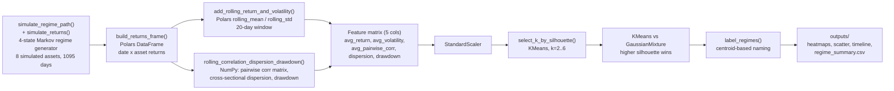
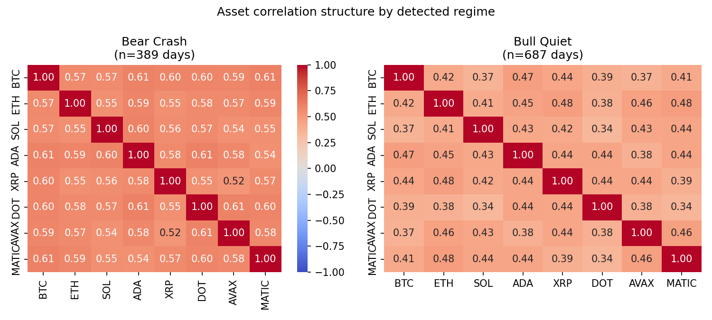
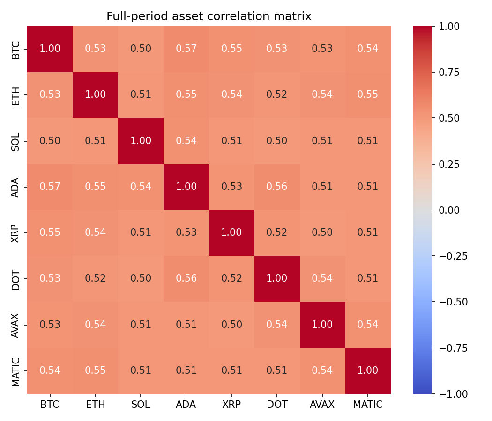
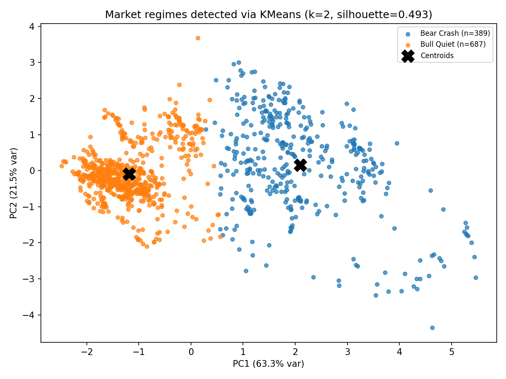
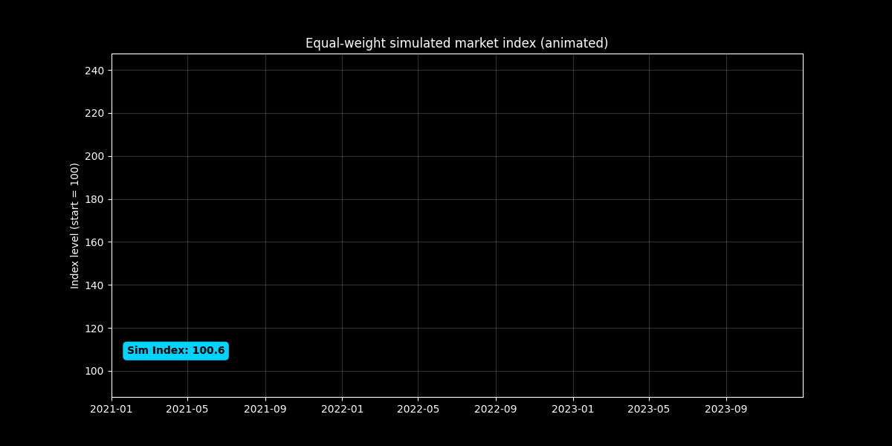
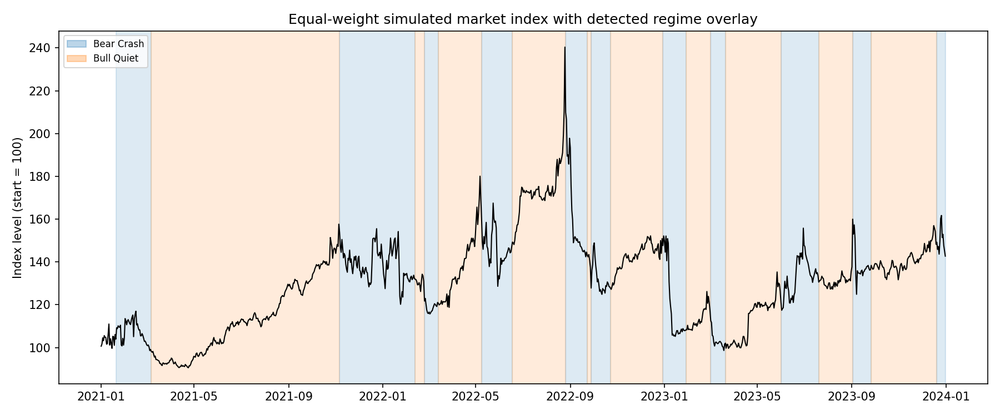

[ 🇺🇸 English ] | [ 🇨🇱 Leer en Español ](README.es.md)

# 1. Project Title

## Crypto Market Regime Detection via Correlation-Aware Clustering


An unsupervised pipeline that turns a multi-asset crypto price tape into a
small set of statistically distinct **market regimes** — clusters of days
that share a volatility, correlation, and drift profile — and quantifies how
those regimes reshape the correlation structure across assets. Built on a
simulated 8-asset panel (BTC, ETH, SOL, ADA, XRP, DOT, AVAX, MATIC) driven by
a known regime-switching generator, so the discovered clusters can be
checked against ground truth, not just eyeballed.

## Techniques used

| Technique | Where |
|---|---|
| Regime-switching return simulation with known ground truth | `simulate_regime_path()`, `simulate_returns()` |
| Rolling correlation / dispersion / drawdown features | `rolling_correlation_dispersion_drawdown()` |
| KMeans + Gaussian Mixture clustering, silhouette-based k selection | `select_k_by_silhouette()`, `main()` |
| Cluster-to-regime labeling from cluster centroids | `label_regimes()` |
| Adjusted Rand Index vs. simulator ground truth | `main()`, §7 |
| DuckDB persistence of regime summary + per-day labels | `save_results_to_duckdb()` |

[**Interactive chart**: regime-colored cumulative price path from the actual KMeans cluster assignments](https://htmlpreview.github.io/?https://github.com/Rxyxs/crypto-quant-techniques-lab/blob/main/05-regime-detection-correlation/outputs/interactive/regime_colored_price.html)

---

# 2. Business Impact & Key Performance Indicators

| Metric | Result | What it means |
|---|---|---|
| Avg. pairwise correlation, calm vs. turbulent regime | 0.29 vs. **0.56** | Diversification benefit nearly halves exactly when it's needed most -- hidden by a single static correlation matrix |
| Regime count selection | k=2 (silhouette-chosen), not the 4 "true" simulator regimes | Honest finding: k=2 still recovers the calm-vs-turbulent stylized fact clearly, even though it doesn't recover every injected regime (Adjusted Rand Index 0.158) |
| Output format | Machine-readable `outputs/regime_summary.csv` | Feeds directly into a position-sizing or hedging rule, not just a plot |

Portfolio risk in crypto is not static: the same basket of assets that
diversifies well in a calm market can move almost as one during a stress
event, silently erasing the diversification a risk model assumed was there.
This project gives a concrete way to act on that:

- **Regime-conditional risk, not a single static number.** A correlation
  matrix computed once, over the full history, hides the fact that
  diversification benefit collapses exactly when it is needed most. Here,
  the discovered high-volatility regime shows **average pairwise
  correlation of 0.56**, against **0.29** in the calm regime — a portfolio
  sized for the calm-regime correlation is carrying materially more
  concentrated risk than its own risk model assumes the moment the market
  turns.
- **An unsupervised, relabelable signal.** No historical "this day was a
  crash" labels are required — the clustering discovers the structure
  directly from rolling return, volatility, correlation, dispersion, and
  drawdown statistics, which is exactly the situation a live trading or
  risk desk is in (labels for the *current* regime don't exist yet).
- **A model-selection decision made honestly, not asserted.** The
  clustering is run across `k = 2..6` and the number of regimes is chosen
  by silhouette score rather than fixed in advance — see §7 for what the
  data actually supported and why.
- **Actionable output, not just a plot.** The pipeline emits a
  machine-readable per-regime summary table (`outputs/regime_summary.csv`)
  suitable for feeding a position-sizing or hedging rule directly, in
  addition to the visual diagnostics.

---

# 3. Architecture



## Module responsibilities

| Function | Responsibility |
|---|---|
| `simulate_regime_path`, `simulate_returns` | Generate a 4-state Markov regime path and an 8-asset return panel from a one-factor equicorrelation model, so ground-truth regimes exist to validate against. |
| `build_returns_frame`, `add_rolling_return_and_volatility` | Assemble the Polars DataFrame and compute rolling mean/volatility per asset, averaged across the panel. |
| `rolling_correlation_dispersion_drawdown` | NumPy pass computing the rolling pairwise correlation matrix, cross-sectional dispersion, and drawdown per day — the statistics Polars' column-wise rolling ops don't directly express. |
| `select_k_by_silhouette` | Fits KMeans for `k=2..6` and scores each by silhouette, so the number of regimes is a measured choice, not a hardcoded assumption. |
| `label_regimes` | Names each cluster (`Bull Quiet`, `Bull Volatile`, `Bear Crash`, `Sideways / Consolidation`) from its centroid's return/volatility position relative to the other clusters, not a fixed index-to-name mapping. |
| `plot_correlation_heatmap_overall`, `plot_correlation_heatmap_by_regime`, `plot_cluster_scatter`, `plot_regime_timeline` | Render the four result figures directly from the fitted model's output. |

---

# 4. Tech Stack

| Layer | Choice | Why |
|---|---|---|
| Data engineering | **Polars** | Expression-based rolling statistics (`rolling_mean`, `rolling_std`, `mean_horizontal`) and fast `group_by` aggregation for the per-regime summary table |
| Numerical core | NumPy | Rolling pairwise correlation matrices and the regime-switching return simulator, where a plain array loop is the natural fit |
| Clustering | **scikit-learn** | `KMeans` and `GaussianMixture` compared directly by silhouette score; `StandardScaler` and `PCA` for preprocessing and 2D visualization |
| Visualization | **Seaborn** + **Matplotlib** | Annotated correlation heatmaps, cluster scatter, and a regime-shaded price timeline |
| Validation | scikit-learn `adjusted_rand_score` | Because the underlying regimes are simulated from a known generator, the discovered clusters can be scored against real ground truth — not possible on unlabeled real market data, and used deliberately here for that reason |
| Persistence | **DuckDB** | `regime_summary` and per-day `regime_days` tables written to `outputs/market_regimes.duckdb`, so results can be queried with SQL directly instead of re-running the pipeline or parsing the CSV |

---

# 5. Execution Steps

```powershell
git clone https://github.com/Rxyxs/crypto-regime-correlation-heatmap.git
cd crypto-regime-correlation-heatmap
python -m venv venv
venv\Scripts\activate
pip install -r requirements.txt

python market_analysis.py

# Test suite
python -m pytest tests/ -v
```

Running it regenerates every table and figure in `outputs/` from a fixed
seed (42) — the numbers in §6 below are not estimated, they are the
console output of that exact command.

## Project structure

```
crypto-regime-correlation-heatmap/
├── market_analysis.py       # simulation, feature engineering, clustering, plots
├── tests/
│   └── test_market_analysis.py  # unit tests for the simulation/feature/clustering pipeline
├── outputs/
│   ├── correlation_heatmap_overall.png
│   ├── correlation_heatmap_by_regime.png
│   ├── cluster_scatter.png
│   ├── regime_timeline.png
│   ├── regime_summary.csv
│   └── market_regimes.duckdb    # regime_summary + regime_days tables, queryable via SQL
├── requirements.txt
├── README.md
└── README.es.md
```

---

# 6. Visual Results

Every figure and number below comes from an actual run of
`python market_analysis.py` (seed 42) — nothing here is estimated.

## 6.1 Choosing the number of regimes

| k | Silhouette (KMeans) |
|---:|---:|
| 2 | **0.4926** ← selected |
| 3 | 0.4546 |
| 4 | 0.4014 |
| 5 | 0.4111 |
| 6 | 0.4250 |

KMeans (silhouette 0.4926) beat a Gaussian Mixture Model fit at the same
k (silhouette 0.4380), so KMeans is the reported model. **Honest finding,
not smoothed over**: the data generator underneath this simulation actually
has 4 hidden regimes, but silhouette score most strongly supports **k = 2**.
Checked against the simulator's own ground-truth regime labels, the
2-cluster solution scores an Adjusted Rand Index of **0.158** against the
true 4-state path — a weak correspondence, as expected: at a 20-day rolling
window, the *drift* difference between "Bull Quiet" and "Sideways" (both
low-volatility regimes) is small relative to daily return noise, so those
two collapse together, as do "Bull Volatile" and "Bear Crash" on the
turbulent side. What the clustering reliably recovers instead is the
coarser, and arguably more actionable, **calm-vs-turbulent** split.

## 6.2 Detected regimes

| Regime | Days | % | Avg. daily return | Avg. volatility | Avg. pairwise corr. | Avg. drawdown |
|---|---:|---:|---:|---:|---:|---:|
| Bull Quiet | 687 | 63.8% | +0.189% | 1.91% | 0.294 | −3.65% |
| Bear Crash | 389 | 36.2% | −0.155% | 4.48% | 0.559 | −15.59% |

## 6.3 Correlation structure by regime



This is the central business finding: average pairwise correlation nearly
**doubles**, from 0.29 to 0.56, between the calm and turbulent regimes.
Every asset pair's correlation increases in the turbulent regime — the
correlation-breakdown effect the simulator was deliberately built to
reproduce, and the mechanism behind §2's diversification-collapse point.

## 6.4 Full-period correlation (what a single static matrix would show)



Pooled across the whole 3-year run, every pairwise correlation lands
around 0.50–0.57 — a single blended number that obscures both the calm
regime's 0.29 and the turbulent regime's 0.56 it is averaging over.

## 6.5 Cluster separation



A 2-component PCA projection of the standardized 5-feature space
(63.3% + 21.5% = 84.8% of variance explained) shows the two regimes as
visually distinct, well-separated clusters, consistent with the silhouette
score.

## 6.6 Regime timeline




The animated version races the equal-weight index line across the full simulated period, with a live label tracking its current level.

The detected turbulent-regime windows (shaded) line up with the visible
drawdowns and volatility clusters in the simulated equal-weight index —
including the sharpest simulated drawdown, around month 20, which the
detector correctly places inside a turbulent-regime window.

---

# 7. Data source & license

All price and return data is **synthetically simulated** by
`market_analysis.py` itself, from a fixed-seed (42), 4-state Markov
regime-switching generator with a one-factor equicorrelation return model —
there is no external data dependency. Regime parameters (drift, volatility,
target correlation) are documented as constants at the top of the script.

Code: MIT — see [LICENSE](LICENSE).

# 8. Author

**Pablo Reyes** — [github.com/Rxyxs](https://github.com/Rxyxs)
