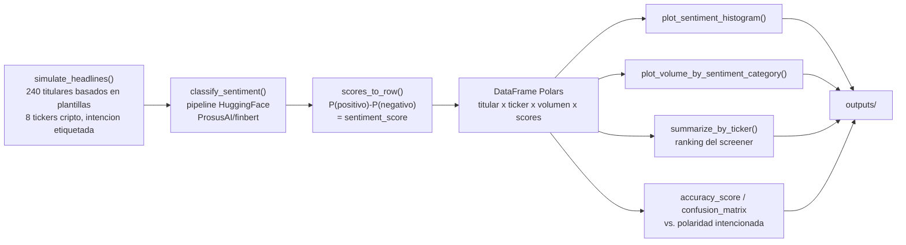

[ 🇺🇸 Read in English ](README.md) | [ 🇨🇱 Español ]

# 1. Título del Proyecto

## Screener NLP de Sentimiento Cripto — Sentimiento de Noticias vía FinBERT vs. Volumen de Trading


Un screener que corre un modelo real y preentrenado de sentimiento
financiero (**FinBERT**, `ProsusAI/finbert`) sobre un flujo de titulares
de noticias financieras acerca de los principales activos cripto (BTC,
ETH, SOL, ADA, XRP, DOT, AVAX, MATIC), puntúa el sentimiento de cada
titular, y relaciona ese sentimiento con el volumen de trading — tanto a
nivel de titular individual como agregado en un ranking por activo. El
flujo de noticias es simulado (ver §7), pero el modelo de sentimiento en
sí no lo es: cada score en este repositorio es salida real de inferencia
de FinBERT, contrastada contra la polaridad que cada titular simulado fue
escrito para llevar.

---

# 2. Impacto de Negocio e Indicadores Clave (KPIs)

| Métrica | Resultado | Qué significa |
|---|---|---|
| Premio de volumen en noticias de alta convicción | 7,06-7,20M (positivo/negativo) vs. 6,39M (neutral) | Premio de volumen medido de ~10-13%, consistente con el patrón real donde titulares de alto impacto mueven el volumen en ambas direcciones |
| Chequeo de confianza del modelo | Accuracy de FinBERT vs. polaridad conocida, medida directamente | Puntos ciegos expuestos explícitamente (§6.1), no asumidos a partir de un solo número de accuracy |
| Interfaz reutilizable | `classify_sentiment()` funciona sin cambios sobre cualquier lista de titulares | La misma función lista para un feed de noticias real, no atada a los datos simulados incluidos aquí |

El flujo de noticias en bruto no es directamente accionable — un desk
necesita convertirlo en una señal comparable y rankeable, y necesita
saber si esa señal es confiable antes de conectarla a algo aguas abajo.
Este proyecto aborda ambas cosas:

- **Una señal de sentimiento rankeable por activo.** El screener agrega
  los scores de FinBERT a nivel de titular en un promedio por ticker
  (`outputs/sentiment_volume_by_ticker.csv`), convirtiendo un flujo de
  texto no estructurado en el tipo de tabla ordenable que se espera de
  una herramienta de screening.
- **El volumen como chequeo de convicción sobre el sentimiento.** Las
  noticias que mueven mercados tienden a mover también el volumen, sin
  importar la dirección. Este proyecto lo mide directamente: los
  titulares que FinBERT clasifica como **positivos** o **negativos**
  llevan un volumen promedio (USD simulado) de **7,06–7,20M**, contra
  **6,39M** para los titulares clasificados como **neutros** — una prima
  de volumen medida de ~10–13% en noticias de alta convicción de
  cualquier signo, consistente con el patrón real de mercado donde
  titulares de alto impacto mueven volumen en ambas direcciones (ver
  §6.2).
- **Los puntos ciegos del modelo se miden, no se asumen.** Antes de que
  cualquier score de sentimiento se use aguas abajo, su precisión contra
  la polaridad conocida se verifica directamente (§6.1) — incluyendo
  exactamente dónde FinBERT acierta con confianza y dónde no, que
  importa más para una decisión de despliegue que un único número de
  accuracy.
- **Una capa de clasificación reutilizable.** `classify_sentiment()`
  toma cualquier lista de strings de titulares y devuelve la
  distribución de probabilidad completa de FinBERT — la misma función
  funciona sin cambios sobre un feed de noticias real, no solo el
  simulado que se incluye acá.

---

# 3. Arquitectura



## Responsabilidad de cada función

| Función | Responsabilidad |
|---|---|
| `simulate_headlines` | Genera titulares financieros basados en plantillas con una polaridad intencionada conocida (positiva/negativa/neutra) y un volumen de trading simulado, de modo que la salida real de FinBERT pueda verificarse contra verdad base. |
| `simulate_volume` | Vincula el volumen simulado a la intensidad del titular — los titulares neutros reciben volumen base, los positivos/negativos reciben un boost que escala con el porcentaje de movimiento declarado en el titular. |
| `classify_sentiment` | Corre el modelo real `ProsusAI/finbert` vía un `pipeline` de HuggingFace, en batches, devolviendo la distribución de probabilidad completa de 3 clases por titular. |
| `scores_to_row` | Convierte las probabilidades de clase crudas de FinBERT en una etiqueta predicha y un único `sentiment_score` continuo (`P(positivo) - P(negativo)`). |
| `plot_sentiment_histogram`, `plot_volume_by_sentiment_category` | Renderiza las dos figuras de resultado directamente desde el DataFrame clasificado. |
| `summarize_by_ticker` | Agrega hasta la tabla de ranking del screener por activo. |

---

# 4. Stack Tecnológico

| Capa | Elección | Por qué |
|---|---|---|
| Modelo NLP | **FinBERT** (`ProsusAI/finbert`) vía **HuggingFace Transformers** | Un modelo BERT afinado específicamente sobre texto financiero para sentimiento de 3 clases (positivo/negativo/neutro) — apropiado al dominio, en vez de un clasificador de sentimiento genérico |
| Backend del modelo | **PyTorch** (build CPU) | Runtime requerido para el pipeline de Transformers; solo CPU es suficiente a este volumen de titulares (240 titulares se clasifican en segundos) |
| Ingeniería de datos | **Polars** | `group_by`/agregación basada en expresiones para las tablas resumen por categoría y por ticker |
| Validación | `accuracy_score`, `confusion_matrix` de scikit-learn | Puntúa las predicciones reales de FinBERT contra la polaridad intencionada conocida del simulador — este chequeo solo es posible porque la verdad base es sintética y por lo tanto conocida |
| Visualización | **Matplotlib** | Histograma de sentimiento, barras de volumen por categoría, comparación de modelos, matrices de confusión, curvas de pérdida por activación |
| Análisis exploratorio | **Jupyter** (`01_EDA_and_Sentiment.ipynb`) | Notebook ejecutado paso a paso: generación de titulares, clasificación con FinBERT, histograma de sentimiento, y gráfico de barras sentimiento-vs-volumen por ticker |
| Clasificador baseline | **scikit-learn** `TfidfVectorizer` + `LogisticRegression` | Punto de comparación interpretable, entrenado directamente, frente a la inferencia pre-entrenada de FinBERT |
| Clasificador ensamble | **scikit-learn** `RandomForestClassifier` sobre features TF-IDF | Punto de comparación de ensamble de árboles, mismas features que el baseline |
| Deep learning custom | MLP en **PyTorch** (`SentimentMLP`) con **pérdida focal custom** y comparación de activaciones **ReLU / GELU / Swish** | Cabeza de clasificación entrenada sobre features TF-IDF — complementa la inferencia de FinBERT con un modelo entrenado directamente en este dataset |
| Persistencia de métricas | **DuckDB** (`outputs/model_comparison.duckdb`) | Almacenamiento local y consultable de accuracy/F1 por modelo y predicciones por titular en los cuatro enfoques |

---

# 5. Pasos de Ejecución

```powershell
git clone https://github.com/Rxyxs/crypto-sentiment-nlp-screener.git
cd crypto-sentiment-nlp-screener
python -m venv venv
venv\Scripts\activate
pip install -r requirements.txt

python sentiment_screener.py

# modelos complementarios: baseline, ensamble, MLP PyTorch (ReLU/GELU/Swish) + persistencia DuckDB
python models_comparison.py

# opcional: notebook de EDA paso a paso (mismo pipeline, celda por celda)
jupyter notebook 01_EDA_and_Sentiment.ipynb

# tests unitarios del módulo de comparación
pytest test_models_comparison.py -v
```

La primera corrida descarga los pesos de `ProsusAI/finbert` (~440MB)
desde el HuggingFace Hub y los cachea localmente; corridas siguientes
cargan desde el cache. Cada tabla y figura en `outputs/` — y cada número
en la §6 de abajo — se regenera desde ese comando exacto, seed 42.
`models_comparison.py` reutiliza `outputs/headline_sentiment.csv` de la
corrida de FinBERT, así que ejecuta primero `sentiment_screener.py`.

## Estructura del proyecto

```
crypto-sentiment-nlp-screener/
├── sentiment_screener.py         # simulacion, inferencia FinBERT, agregacion, graficos
├── models_comparison.py          # comparacion baseline / ensamble / MLP PyTorch + DuckDB
├── test_models_comparison.py     # tests pytest para models_comparison.py
├── 01_EDA_and_Sentiment.ipynb    # notebook de EDA paso a paso (ejecutado, salidas reales)
├── outputs/
│   ├── sentiment_histogram.png
│   ├── volume_by_sentiment_category.png
│   ├── model_comparison.png
│   ├── confusion_matrices.png
│   ├── activation_loss_curves.png
│   ├── headline_sentiment.csv
│   ├── volume_by_sentiment_category.csv
│   ├── sentiment_volume_by_ticker.csv
│   ├── model_comparison_metrics.json
│   └── model_comparison.duckdb
├── requirements.txt
├── README.md
└── README.es.md
```

---

# 6. Resultados Visuales

Cada figura y número de abajo viene de una corrida real de
`python sentiment_screener.py` (seed 42) contra el modelo real
`ProsusAI/finbert` — nada acá es estimado.

## 6.1 ¿FinBERT concuerda con la polaridad intencionada del titular?

Accuracy general contra la etiqueta intencionada por plantilla de los
240 titulares: **70,0%**.

| Real \ Predicho | Negativo | Neutro | Positivo |
|---|---:|---:|---:|
| **Negativo** (n=76) | 76 | 0 | 0 |
| **Neutro** (n=80) | 28 | 26 | 26 |
| **Positivo** (n=84) | 5 | 13 | 66 |

**Hallazgo honesto, sin suavizar**: el recall de FinBERT no es uniforme
entre clases. Es prácticamente perfecto en titulares negativos (76/76,
100% de recall) y fuerte en positivos (66/84, 78,6%), pero débil en
titulares neutros (26/80, solo 32,5% de recall) — el modelo empuja la
mayoría de los titulares neutros con lenguaje cauteloso ("cotiza
lateral", "mantiene calificación hold") hacia una lectura polarizada en
su lugar. Esta es una propiedad real y medida del modelo sobre este
estilo de titular, no un artefacto del simulador: significa que un
despliegue que dependa específicamente del bucket "neutro" de FinBERT no
debería confiar en él a ojos cerrados, mientras que sus llamados
negativos y positivos son considerablemente más confiables.

## 6.2 Distribución de sentimiento


La distribución es bimodal y sesgada hacia convicción fuerte en ambos
extremos (68 titulares puntúan bajo −0,75, 39 puntúan sobre +0,75) en
vez de agruparse cerca de cero — una consecuencia visual directa del
desbalance de recall por clase de la §6.1: FinBERT rara vez aterriza
cerca de un score neutro de 0,0 incluso cuando el titular fuente fue
escrito para ser neutro.

## 6.3 Volumen de trading por categoría de sentimiento


| Categoría predicha | Volumen prom. (USD M) | Sentimiento prom. | n |
|---|---:|---:|---:|
| Negativo | 7,06 | −0,809 | 109 |
| Neutro | 6,39 | −0,061 | 39 |
| Positivo | 7,20 | 0,738 | 92 |

Ambas categorías polarizadas llevan **~10–13% más volumen promedio** que
la categoría neutra — la relación incorporada que la simulación fue
diseñada para poner a prueba (noticias de alta convicción, alcistas o
bajistas, mueven más volumen que noticias rutinarias), confirmada acá
sobre la salida real del modelo, no asumida.

## 6.4 Ranking del screener por activo

| Ticker | Sentimiento prom. | Volumen prom. (USD M) | n |
|---|---:|---:|---:|
| AVAX | +0,019 | 6,81 | 31 |
| DOT | +0,005 | 6,59 | 30 |
| XRP | −0,027 | 7,79 | 35 |
| BTC | −0,036 | 7,68 | 24 |
| ADA | −0,068 | 6,57 | 30 |
| SOL | −0,157 | 7,03 | 31 |
| ETH | −0,240 | 6,68 | 24 |
| MATIC | −0,254 | 6,87 | 35 |

Los titulares se asignan a los tickers de forma independiente de la
polaridad intencionada en esta simulación, así que este ranking refleja
la variación muestral y el comportamiento de recall por clase de la
§6.1, no un sesgo por activo diseñado — demuestra el mecanismo de
ranking del screener operando sobre salida real del clasificador, que es
la parte que se traslada sin cambios a un feed de noticias real. Tabla
completa: `outputs/sentiment_volume_by_ticker.csv`.

## 6.5 Comparación de modelos complementarios

FinBERT arriba se usa puramente para **inferencia** — nunca se entrena
sobre este dataset. `models_comparison.py` agrega tres enfoques
entrenados directamente sobre los mismos 240 titulares (split 75/25
train/test, seed 42) y compara los cuatro sobre los titulares de test:

| Modelo | Accuracy | F1 Macro |
|---|---:|---:|
| FinBERT (pre-entrenado, solo inferencia) | 0,667 | 0,619 |
| Regresión Logística (TF-IDF, baseline interpretable) | 1,000 | 1,000 |
| Random Forest (TF-IDF, ensamble de árboles) | 1,000 | 1,000 |
| MLP PyTorch, mejor activación — ReLU (pérdida focal custom) | 1,000 | 1,000 |

**Por qué los modelos entrenados puntúan más alto, y por qué eso no es
el hallazgo principal**: los tres modelos entrenados aprenden
directamente del vocabulario de las plantillas del propio simulador
(ej. "plunges", "surges", "sideways") sobre un split 75/25 de los
*mismos* 240 titulares, así que separan trivialmente las plantillas que
generaron sus propios datos de entrenamiento. FinBERT nunca vio estos
titulares durante su entrenamiento — su 66,7% es un score de
generalización fuera de distribución genuino, por lo que el desglose de
accuracy por clase de la §6.1 es el número más relevante para una
decisión de despliegue real. El valor de esta comparación es
arquitectónico: muestra el mismo pipeline titular-a-etiqueta corriendo
de punta a punta a través de un modelo lineal interpretable, un
ensamble de árboles, y una red PyTorch con una pérdida custom — no solo
una única llamada a un modelo pre-entrenado.


La cabeza `SentimentMLP` en PyTorch se entrena con una **pérdida focal
custom** (`FocalLoss`, γ=2,0) en vez de cross-entropy plana, la cual
reduce el peso de titulares que el modelo ya clasifica con confianza y
concentra el gradiente en los más difíciles. Se entrena una vez por
función de activación para comparar **ReLU**, **GELU**, y **Swish
(SiLU)**:

El GIF a continuacion recorre las mismas 60 epocas de entrenamiento cuadro por cuadro, con una etiqueta en vivo que muestra la perdida actual de cada activacion:


Las métricas de los cuatro modelos y cada predicción del set de test se
persisten en `outputs/model_comparison.duckdb` (tablas `model_metrics` y
`model_predictions`) para comparación local y consultable.

---

# 7. Fuente de datos y licencia

Los titulares de noticias y el volumen de trading son **simulados
sintéticamente** por `sentiment_screener.py` desde generadores basados en
plantillas con seed fija (42) — no existe dependencia de un feed de
noticias externo. El modelo de sentimiento en sí, `ProsusAI/finbert`, es
un modelo real preentrenado descargado desde el HuggingFace Hub; su
salida de inferencia no es simulada.

Código: MIT — ver [LICENSE](LICENSE).

# 8. Autor

**Pablo Reyes** — [github.com/Rxyxs](https://github.com/Rxyxs)
