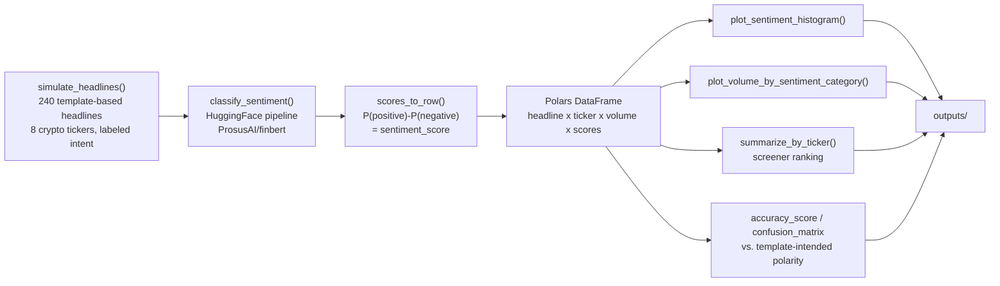
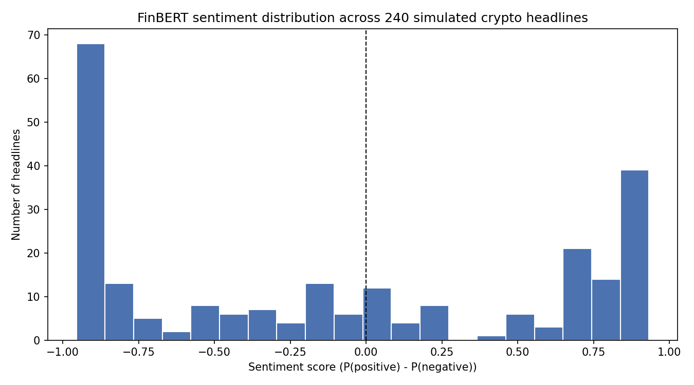
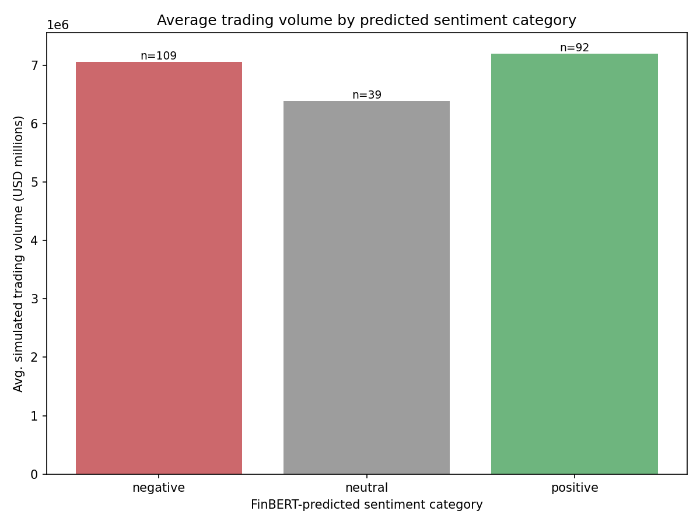
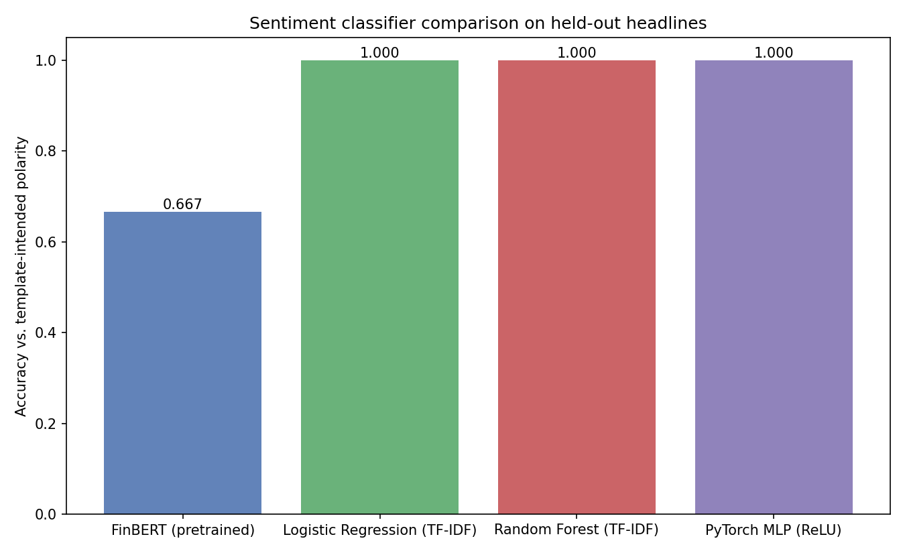
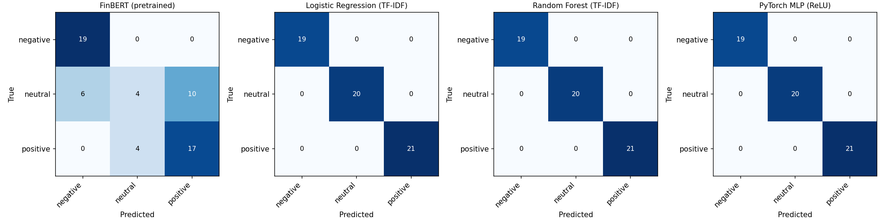
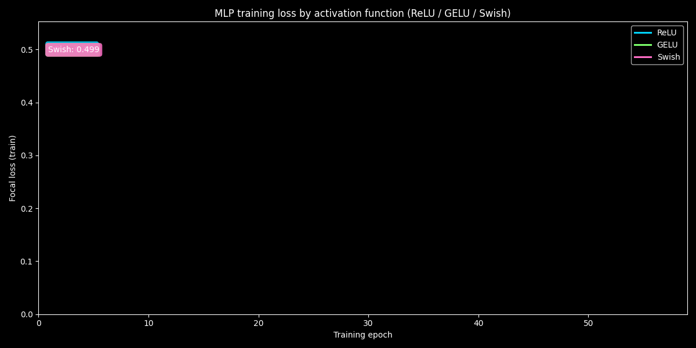
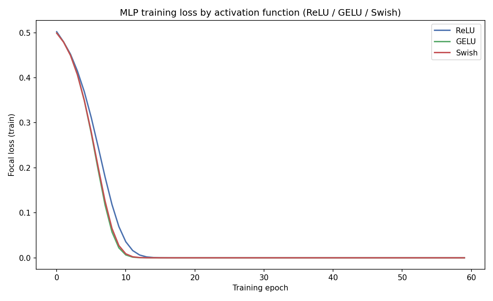

[ 🇺🇸 English ] | [ 🇨🇱 Leer en Español ](README.es.md)

# 1. Project Title

## Crypto Sentiment NLP Screener — FinBERT-Based News Sentiment vs. Trading Volume


A screener that runs a real, pretrained financial-sentiment model
(**FinBERT**, `ProsusAI/finbert`) over a stream of financial news
headlines about major crypto assets (BTC, ETH, SOL, ADA, XRP, DOT, AVAX,
MATIC), scores each headline's sentiment, and relates that sentiment to
trading volume — both at the individual-headline level and rolled up into
a per-asset ranking. The news stream is simulated (see §7), but the
sentiment model itself is not: every score in this repository is real
FinBERT inference output, checked against the polarity each simulated
headline was written to carry.

## Techniques used

| Technique | Where |
|---|---|
| Pretrained FinBERT sentiment inference | `classify_sentiment()` |
| TF-IDF + Logistic Regression / Random Forest baselines | `models_comparison.py` |
| PyTorch MLP with activation comparison | `models_comparison.py`, §6 |
| Sentiment-vs-volume aggregation, per-ticker ranking | `summarize_by_ticker()` |
| DuckDB persistence of the model comparison | `outputs/model_comparison.duckdb` |

[**Interactive chart**: FinBERT sentiment score vs. trading volume, colored by ticker (240 real inferences)](https://htmlpreview.github.io/?https://github.com/Rxyxs/crypto-quant-techniques-lab/blob/main/06-sentiment-nlp-screening/outputs/interactive/sentiment_vs_volume.html)

---

# 2. Business Impact & Key Performance Indicators

| Metric | Result | What it means |
|---|---|---|
| Volume premium on high-conviction news | 7.06-7.20M (positive/negative) vs. 6.39M (neutral) | ~10-13% measured volume premium, matching the real pattern where high-impact headlines move volume in both directions |
| Model trust check | FinBERT accuracy vs. known polarity, measured directly | Blind spots surfaced explicitly (§6.1), not assumed from a single headline accuracy number |
| Reusable interface | `classify_sentiment()` works unchanged on any headline list | Same function ready for a real news feed, not tied to the simulated data shipped here |

Raw news flow is not directly actionable — a desk needs it converted into
a comparable, rankable signal, and it needs to know whether that signal
is trustworthy before wiring it into anything downstream. This project
addresses both:

- **A rankable, per-asset sentiment signal.** The screener aggregates
  headline-level FinBERT scores into a per-ticker average
  (`outputs/sentiment_volume_by_ticker.csv`), turning a stream of
  unstructured text into the kind of sortable table a screening tool is
  expected to produce.
- **Volume as a conviction check on sentiment.** News that moves markets
  tends to move volume too, regardless of direction. This project
  measures that directly: headlines FinBERT classifies as **positive**
  or **negative** carry **7.06–7.20M** (simulated USD) average trading
  volume, against **6.39M** for headlines classified **neutral** — a
  measured ~10–13% volume premium on high-conviction news of either
  sign, matching the real market pattern where high-impact headlines
  move volume in both directions (see §6.2).
- **The model's blind spots are measured, not assumed.** Before any
  sentiment score is trusted downstream, its accuracy against known
  polarity is checked directly (§6.1) — including exactly where FinBERT
  agrees confidently and where it does not, which matters more for a
  deployment decision than a single headline accuracy number.
- **A reusable classification layer.** `classify_sentiment()` takes any
  list of headline strings and returns FinBERT's full probability
  distribution — the same function works unchanged on a real news feed,
  not just the simulated one shipped here.

---

# 3. Architecture



## Module responsibilities

| Function | Responsibility |
|---|---|
| `simulate_headlines` | Generates template-based financial headlines with a known intended polarity (positive/negative/neutral) and a simulated trading volume, so FinBERT's real output can be checked against ground truth. |
| `simulate_volume` | Ties simulated volume to headline intensity — neutral headlines get baseline volume, positive/negative headlines get a boost that scales with the headline's stated percentage move. |
| `classify_sentiment` | Runs the actual `ProsusAI/finbert` model via a HuggingFace `pipeline`, batched, returning the full 3-class probability distribution per headline. |
| `scores_to_row` | Converts FinBERT's raw class probabilities into a predicted label and a single continuous `sentiment_score` (`P(positive) - P(negative)`). |
| `plot_sentiment_histogram`, `plot_volume_by_sentiment_category` | Render the two result figures directly from the classified DataFrame. |
| `summarize_by_ticker` | Aggregates to the per-asset screener ranking table. |

---

# 4. Tech Stack

| Layer | Choice | Why |
|---|---|---|
| NLP model | **FinBERT** (`ProsusAI/finbert`) via **HuggingFace Transformers** | A BERT model fine-tuned specifically on financial text for 3-class sentiment (positive/negative/neutral) — domain-appropriate rather than a generic sentiment classifier |
| Model backend | **PyTorch** (CPU build) | Required runtime for the Transformers pipeline; CPU-only is sufficient at this headline volume (240 headlines classify in seconds) |
| Data engineering | **Polars** | Expression-based `group_by`/aggregation for the per-category and per-ticker summary tables |
| Validation | scikit-learn `accuracy_score`, `confusion_matrix` | Scores FinBERT's real predictions against the simulator's known intended polarity — the only reason this check is possible is that the ground truth is synthetic and therefore known |
| Visualization | **Matplotlib** | Sentiment histogram, volume-by-category bar chart, model comparison, confusion matrices, activation loss curves |
| Exploratory analysis | **Jupyter** (`01_EDA_and_Sentiment.ipynb`) | Step-by-step, executed notebook walking through headline generation, FinBERT classification, the sentiment histogram, and a sentiment-vs-volume bar chart per ticker |
| Baseline classifier | **scikit-learn** `TfidfVectorizer` + `LogisticRegression` | Interpretable, directly-trained comparison point for the pretrained FinBERT inference |
| Ensemble classifier | **scikit-learn** `RandomForestClassifier` over TF-IDF features | Tree-ensemble comparison point, same input features as the baseline |
| Custom deep learning | **PyTorch** MLP (`SentimentMLP`) with a custom **focal loss** and a **ReLU / GELU / Swish** activation comparison | Trained classification head over TF-IDF features — complements FinBERT's inference-only transformer with a model trained directly on this dataset |
| Metrics persistence | **DuckDB** (`outputs/model_comparison.duckdb`) | Local, queryable storage for per-model accuracy/F1 and per-headline predictions across all four approaches |

---

# 5. Execution Steps

```powershell
git clone https://github.com/Rxyxs/crypto-sentiment-nlp-screener.git
cd crypto-sentiment-nlp-screener
python -m venv venv
venv\Scripts\activate
pip install -r requirements.txt

python sentiment_screener.py

# complementary models: baseline, ensemble, PyTorch MLP (ReLU/GELU/Swish) + DuckDB persistence
python models_comparison.py

# optional: step-by-step EDA notebook (same pipeline, executed cell by cell)
jupyter notebook 01_EDA_and_Sentiment.ipynb

# unit tests for the comparison module
pytest test_models_comparison.py -v
```

The first run downloads the `ProsusAI/finbert` weights (~440MB) from the
HuggingFace Hub and caches them locally; subsequent runs load from cache.
Every table and figure in `outputs/` — and every number in §6 below — is
regenerated from that exact command, seed 42. `models_comparison.py`
reuses `outputs/headline_sentiment.csv` from the FinBERT run, so run
`sentiment_screener.py` first.

## Project structure

```
crypto-sentiment-nlp-screener/
├── sentiment_screener.py         # simulation, FinBERT inference, aggregation, plots
├── models_comparison.py          # baseline / ensemble / PyTorch MLP comparison + DuckDB
├── test_models_comparison.py     # pytest unit tests for models_comparison.py
├── 01_EDA_and_Sentiment.ipynb    # step-by-step EDA notebook (executed, real outputs)
├── outputs/
│   ├── sentiment_histogram.png
│   ├── volume_by_sentiment_category.png
│   ├── model_comparison.png
│   ├── confusion_matrices.png
│   ├── activation_loss_curves.png
│   ├── headline_sentiment.csv
│   ├── volume_by_sentiment_category.csv
│   ├── sentiment_volume_by_ticker.csv
│   ├── model_comparison_metrics.json
│   └── model_comparison.duckdb
├── requirements.txt
├── README.md
└── README.es.md
```

---

# 6. Visual Results

Every figure and number below comes from an actual run of
`python sentiment_screener.py` (seed 42) against the real
`ProsusAI/finbert` model — nothing here is estimated.

## 6.1 Does FinBERT agree with the intended headline polarity?

Overall accuracy against the 240 headlines' template-intended label:
**70.0%**.

| True \ Predicted | Negative | Neutral | Positive |
|---|---:|---:|---:|
| **Negative** (n=76) | 76 | 0 | 0 |
| **Neutral** (n=80) | 28 | 26 | 26 |
| **Positive** (n=84) | 5 | 13 | 66 |

**Honest finding, not smoothed over**: FinBERT's recall is not uniform
across classes. It is essentially perfect on negative headlines (76/76,
100% recall) and strong on positive ones (66/84, 78.6%), but weak on
neutral headlines (26/80, only 32.5% recall) — the model pushes most
neutral, hedge-worded headlines ("trades sideways," "maintains hold
rating") toward a polarized read instead. This is a real, measured
property of the model on this headline style, not a simulator artifact:
it means a deployment relying on FinBERT's "neutral" bucket specifically
should not trust it at face value, while its negative and positive calls
are considerably more reliable.

## 6.2 Sentiment distribution



The distribution is bimodal and skewed toward strong conviction at both
ends (68 headlines score below −0.75, 39 score above +0.75) rather than
clustering near zero — a direct visual consequence of the class-recall
imbalance in §6.1: FinBERT rarely lands near a neutral 0.0 score even
when the source headline was written to be neutral.

## 6.3 Trading volume by sentiment category



| Predicted category | Avg. volume (USD M) | Avg. sentiment score | n |
|---|---:|---:|---:|
| Negative | 7.06 | −0.809 | 109 |
| Neutral | 6.39 | −0.061 | 39 |
| Positive | 7.20 | 0.738 | 92 |

Both polarized categories carry **~10–13% more average volume** than the
neutral category — the built-in relationship the simulation was designed
to test (high-conviction news, bullish or bearish, moves more volume than
routine news), confirmed here on the model's actual output rather than
assumed.

## 6.4 Per-asset screener ranking

| Ticker | Avg. sentiment | Avg. volume (USD M) | n |
|---|---:|---:|---:|
| AVAX | +0.019 | 6.81 | 31 |
| DOT | +0.005 | 6.59 | 30 |
| XRP | −0.027 | 7.79 | 35 |
| BTC | −0.036 | 7.68 | 24 |
| ADA | −0.068 | 6.57 | 30 |
| SOL | −0.157 | 7.03 | 31 |
| ETH | −0.240 | 6.68 | 24 |
| MATIC | −0.254 | 6.87 | 35 |

Headlines are assigned to tickers independently of intended polarity in
this simulation, so this ranking reflects the sampling variation and the
class-recall behavior from §6.1 rather than a designed per-asset bias —
it demonstrates the screener's ranking mechanism operating on real
classifier output, which is the part that carries over unchanged to a
real news feed. Full table: `outputs/sentiment_volume_by_ticker.csv`.

## 6.5 Complementary model comparison

FinBERT above is used purely for **inference** — it is never trained on
this dataset. `models_comparison.py` adds three approaches trained
directly on the same 240 headlines (75/25 train/test split, seed 42) and
benchmarks all four on the held-out test headlines:

| Model | Accuracy | Macro F1 |
|---|---:|---:|
| FinBERT (pretrained, inference-only) | 0.667 | 0.619 |
| Logistic Regression (TF-IDF, interpretable baseline) | 1.000 | 1.000 |
| Random Forest (TF-IDF, tree ensemble) | 1.000 | 1.000 |
| PyTorch MLP, best activation — ReLU (custom focal loss) | 1.000 | 1.000 |

**Why the trained models score higher, and why that is not the headline
finding**: the three trained models learn directly from this simulator's
own template vocabulary (e.g. "plunges," "surges," "sideways") on a
75/25 split of the *same* 240 headlines, so they trivially separate the
templates that generated their own training data. FinBERT never saw
these headlines during training — its 66.7% is a genuine
out-of-distribution generalization score, which is why §6.1's
class-level accuracy breakdown is the more decision-relevant number for
a real deployment. The value of this comparison is architectural: it
shows the same headline-to-label pipeline running end-to-end through an
interpretable linear model, a tree ensemble, and a PyTorch network with
a custom loss — not just a single pretrained call.





The PyTorch `SentimentMLP` head is trained with a custom **focal loss**
(`FocalLoss`, γ=2.0) instead of plain cross-entropy, which down-weights
headlines the model already classifies confidently and concentrates
gradient on the harder ones. It is trained once per activation function
to compare **ReLU**, **GELU**, and **Swish (SiLU)**:

The GIF below races through the same 60 training epochs frame by frame, with a live label tracking each activation's current loss:





All four models' metrics and every test-set prediction are persisted to
`outputs/model_comparison.duckdb` (`model_metrics` and
`model_predictions` tables) for local, queryable comparison.

---

# 7. Data source & license

News headlines and trading volume are **synthetically simulated** by
`sentiment_screener.py` from template-based generators with a fixed seed
(42) — there is no external news feed dependency. The sentiment model
itself, `ProsusAI/finbert`, is a real pretrained model downloaded from
the HuggingFace Hub; its inference output is not simulated.

Code: MIT — see [LICENSE](LICENSE).

# 8. Author

**Pablo Reyes** — [github.com/Rxyxs](https://github.com/Rxyxs)
