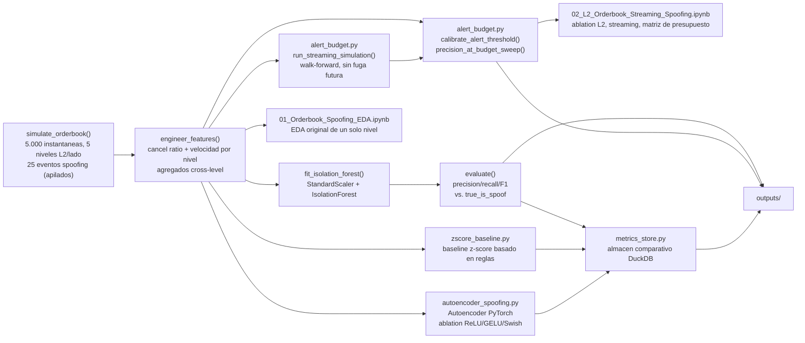

[ 🇺🇸 Read in English ](README.md) | [ 🇨🇱 Español ]

# 1. Título del Proyecto

## Detección de Spoofing en el Order Book con Isolation Forest


Un pipeline no supervisado de **Isolation Forest** que detecta spoofing en
el order book — órdenes grandes colocadas sin intención de ejecutarse,
usadas para sesgar la lectura de oferta y demanda de otros participantes
antes de cancelarse — a partir de features de flujo de órdenes calculadas
sobre la **profundidad completa del order book L2**, puntuadas mediante una
**simulación en streaming** walk-forward sin fuga de información futura,
con alertas calibradas a un **presupuesto de revisión** estricto en vez de
un supuesto fijo de contaminación. Validado contra un order book simulado
con **eventos de spoofing inyectados y conocidos**, de modo que el recall y
la precisión reales del modelo se puedan medir en vez de asumirse.

## Técnicas usadas

| Técnica | Dónde |
|---|---|
| Detección de anomalías con Isolation Forest sobre features de flujo L2 | `detect_spoofing.py` |
| Baseline de z-score para comparación | `zscore_baseline.py` |
| Puntuación por error de reconstrucción de autoencoder (PyTorch) | `autoencoder_spoofing.py` |
| Puntuación en streaming walk-forward (sin fuga de información futura) | `02_L2_Orderbook_Streaming_Spoofing.ipynb` |
| Calibración por presupuesto de alertas (vs. supuesto fijo de contaminación) | `alert_budget.py` |
| Persistencia de métricas en DuckDB | `metrics_store.py` |

[**Gráfico interactivo**: línea de tiempo de alertas de spoofing — score de anomalía por snapshot, eventos reales vs. alertas marcadas](https://htmlpreview.github.io/?https://github.com/Rxyxs/crypto-quant-techniques-lab/blob/main/07-orderbook-spoofing-detection/outputs/interactive/spoofing_alert_timeline.html)

---

# 2. Motivación

El spoofing no es un riesgo teórico — es una forma de manipulación de
mercado efectivamente perseguida. La Dodd-Frank Act de EE.UU. lo
criminalizó explícitamente en 2010, y los casos de aplicación desde
entonces (el más famoso, el rol de Navinder Sarao en el "Flash Crash" de
2010) muestran que el patrón es real, repetible, y económicamente dañino
para los demás participantes que reaccionan ante una profundidad de libro
que nunca fue genuina. Los mercados cripto cargan la misma exposición con
infraestructura de vigilancia menos madura que las bolsas tradicionales.

La dificultad central para un sistema de detección es que **las
etiquetas confirmadas de spoofing prácticamente no existen al momento del
despliegue** — los reguladores arman casos etiquetados después de los
hechos, a veces años más tarde, pero un sistema de vigilancia en vivo
tiene que marcar flujo de órdenes sospechoso *antes* de que exista tal
determinación. Eso descarta un clasificador supervisado estándar y
motiva un **detector de anomalías no supervisado**: uno que aprende cómo
se ve el comportamiento normal del flujo de órdenes y marca las
instantáneas que se desvían de eso, sin que nunca se le muestre un
ejemplo etiquetado de spoofing.

## 2.1 Impacto de Negocio e Indicadores Clave (KPIs)

| Métrica | Resultado | Qué significa |
|---|---|---|
| Precisión a un presupuesto de alertas de 0,5% | **0,92** | Un tope de 25 alertas/día que un analista puede revisar de verdad, vs. 0,64 de precisión al 2% de contaminación por defecto |
| La precisión más que se duplica al ajustar el presupuesto | 0,64 → 0,92 | La tabla de presupuesto de alertas, no un número fijo de contaminación, es la respuesta accionable para una mesa de vigilancia |
| Precisión streaming (walk-forward) vs. batch | Dentro de 1-3 puntos en cada presupuesto | Valida que la arquitectura walk-forward es viable para despliegue en vivo, no solo un ejercicio teórico |
| Ablación de columnas L2 crudas completas | Empeora la detección (maldición de la dimensionalidad) | Los agregados cross-level le ganan a alimentar las 20 columnas crudas por nivel directamente |
| Señal de verdadero positivo | `order_book_imbalance` mediana 0,722 (spoofs) vs. 0,002 (normal) | La señal individual más fuerte por instantánea, aunque por sí sola no explica ninguna de las dos clases de error |

---

# 3. Marco Teórico

## 3.1 Isolation Forest

A diferencia de los detectores de anomalías basados en densidad o
distancia, Isolation Forest funciona por **aislamiento**: construye un
ensamble de árboles aleatorios, cada uno dividiendo los datos en una
feature elegida al azar con un umbral elegido al azar. Los puntos
anómalos — los pocos y diferentes — quedan aislados en su propia hoja en
muchas menos divisiones que los puntos normales, simplemente porque hay
menos datos "típicos" alrededor para seguir particionando. El score de
anomalía se deriva de la longitud de camino promedio de cada punto a
través del bosque: caminos cortos significan aislamiento fácil, lo que
significa anómalo. El parámetro `contamination` fija la fracción
esperada de anomalías, lo que a su vez fija el umbral de score usado
para convertir los scores continuos en una marca binaria.

## 3.2 Incorporando la firma de spoofing en las features

Cinco features por instantánea del order book se diseñan
específicamente para capturar cómo una orden de spoofing *se comporta
distinto* a una genuina, no solo qué tan grande es:

| Feature | Qué captura |
|---|---|
| `order_book_imbalance` | `(bid_size - ask_size) / total_size` — una orden de spoofing vuelca tamaño en un lado, empujando esto hacia ±1 |
| `top_level_size_ratio` | Tamaño desplegado en el tope del libro relativo a su propio promedio móvil de 50 instantáneas — detecta una orden anormalmente grande sin importar el nivel de liquidez base del activo |
| `cancel_to_trade_ratio` | Órdenes canceladas vs. ejecutadas en la ventana de la instantánea — una orden de spoofing se coloca específicamente para retirarse, no para llenarse |
| `order_lifetime_ms` | Cuánto tiempo estuvieron las órdenes de la ventana antes de cancelarse — el tamaño genuino toma tiempo en trabajarse; un spoof se retira casi de inmediato |
| `price_impact` | Movimiento realizado del precio medio asociado a ese flujo de órdenes — una orden de spoofing muestra gran tamaño *desplegado* pero poco o ningún impacto realizado, porque nunca estuvo pensada para operar |

Ninguna feature por sí sola es una señal confiable de spoofing (órdenes
grandes, cancelaciones, y vidas cortas ocurren todas legítimamente) — la
firma que Isolation Forest aprende a aislar es la combinación
**conjunta**: tamaño desplegado grande, alta cancelación, vida corta, e
impacto de precio realizado desproporcionadamente pequeño, ocurriendo
todos juntos.

## 3.3 Por qué la validación necesita una verdad base sintética

La salida de un modelo no supervisado es tan confiable como los
supuestos detrás de ella (elección de features, tasa de
`contamination`). La única forma de verificar esos supuestos acá es
contra eventos de spoofing **conocidos**, lo que requiere una verdad
base que no existe en el flujo de órdenes real — por eso el order book
de este proyecto se simula con un cronograma de spoofing explícito y
registrado: convierte "¿esto siquiera funciona?" de una suposición en un
número medido de precisión/recall (§7).

## 3.4 Profundidad completa del L2: por qué features por nivel, y por qué no se alimentan crudas

El spoofing real a menudo apila órdenes **varios niveles de precio
adentro**, no solo en el tope — una sola feature de tope de libro puede
pasarlo por alto por completo. El simulador (`simulate_orderbook`) ahora
modela un libro L2 completo de **5 niveles por lado**, y una ráfaga de
spoofing apunta a una banda contigua de 1-3 niveles en un lado, dejando el
resto del libro — incluido el lado *opuesto* completo — estadísticamente
normal. `engineer_features` calcula dos señales genuinamente por nivel a
través de los 10 slots nivel-lado (`RAW_L2_LEVEL_COLS`):

| Feature | Qué captura |
|---|---|
| `{side}_cancel_ratio_l{level}` | Órdenes canceladas vs. ejecutadas **en ese nivel especifico**, esa instantánea |
| `{side}_size_velocity_l{level}` | El cambio de tamaño de ese nivel de una instantánea a la siguiente, estandarizado (z-score) contra su propia volatilidad rezagada — "qué tan rápido aparece/desaparece tamaño acá, relativo a cómo se mueve normalmente este nivel" |

Alimentar las 20 columnas crudas directamente a Isolation Forest, sin
embargo, **empeora** medible la detección (§5, §7.5): una ráfaga solo
toca 1-3 de 10 slots nivel-lado, así que ~17 columnas son ruido puro para
cualquier fila anómala dada, y el muestreo aleatorio de splits de
Isolation Forest pierde eficiencia de aislamiento cuantas más columnas
irrelevantes tiene que atravesar. `L2_FEATURE_COLS` en cambio usa dos
**agregados cross-level** — `max_cancel_ratio_across_levels` y
`max_size_velocity_across_levels`, la lectura del peor nivel en cada
métrica — que colapsan la profundidad completa en la señal que realmente
importa sin diluirla. Las columnas crudas por nivel siguen disponibles
(`RAW_L2_LEVEL_COLS`) para diagnóstico — p. ej. identificar *qué* nivel
disparó una alerta dada — solo que no como input directo del modelo.

## 3.5 La calibración de presupuesto de alertas reemplaza un supuesto fijo de contaminación

`IsolationForest(contamination=0.02)` hornea un único supuesto de tasa de
anomalía en el propio ajuste del modelo. En la práctica, la restricción
real de una mesa de vigilancia no es "qué fracción del libro está
manipulada" — es "cuántas alertas puede revisar un analista hoy".
`alert_budget.py` desacopla estas dos cosas: el modelo todavía necesita
*algún* `contamination` para ajustarse, pero la decisión de alerta se toma
después, eligiendo el **percentil** del score que marca exactamente el
número de instantáneas que permite un presupuesto de revisión declarado
(`calibrate_alert_threshold`), y luego midiendo precisión/recall a ese
presupuesto (`precision_at_budget_sweep`) a través de todo un rango de
presupuestos — mientras más ajustado el presupuesto, mayor la precisión
esperada, un trade-off que un analista puede leer directamente de una
tabla en vez de adivinar una tasa de contaminación (§7.6).

## 3.6a Tres enfoques complementarios de detección

Además de Isolation Forest, se implementan dos enfoques más sobre el mismo
libro simulado y el mismo conjunto de features (`L2_FEATURE_COLS`), para
poder compararlos de forma justa en vez de sobre problemas distintos:

| Enfoque | Módulo | Cómo marca anomalías |
|---|---|---|
| **Baseline z-score** | `zscore_baseline.py` | Basado en reglas: marca cualquier instantánea donde `order_book_imbalance` esté a más de 3 desviaciones estándar de su propia media. Sin aprendizaje — el piso que un modelo aprendido tiene que superar para justificar su complejidad. |
| **Isolation Forest** | `detect_spoofing.py` | Ensamble no supervisado; aísla anomalías por longitud de camino de splits aleatorios (§3.1). |
| **Autoencoder (PyTorch)** | `autoencoder_spoofing.py` | Una pequeña red simétrica (entrada → 8 → 3 → 8 → entrada) entrenada para reconstruir instantáneas normales de flujo de órdenes; una instantánea de spoofing se reconstruye mal, y ese error de reconstrucción por instantánea es el score de anomalía. |

`autoencoder_spoofing.py` también corre un ablation controlado de
activación — arquitectura, split y seed idénticos, solo cambia la
activación de la capa oculta — entre **ReLU**, **GELU**, y **Swish
(SiLU)**, reportado en la §7.7.

## 3.6 Simulación en streaming: sin fuga futura, sin un único ajuste omnisciente

El pipeline original ajusta un único `IsolationForest` sobre *todo* el
dataset a la vez — está bien para validación offline, pero no es cómo
funciona un sistema de vigilancia en vivo: nunca tiene las instantáneas de
mañana al decidir las alertas de hoy. `run_streaming_simulation` ajusta
sobre una ventana rolling rezagada, puntúa solo las instantáneas
estrictamente posteriores a ella, y luego reajusta sobre la siguiente
ventana rezagada antes de continuar — un proceso genuinamente walk-forward
donde cada score usa solo información que un despliegue en vivo realmente
habría tenido disponible en ese momento (la §7.6 compara su rendimiento
directamente contra el ajuste batch).

---

# 4. Explicación

## Arquitectura del pipeline



## Responsabilidad de cada función

| Función | Responsabilidad |
|---|---|
| `simulate_orderbook` (`detect_spoofing.py`) | Genera un libro L2 completo de **5 niveles por lado**, con precio medio de camino aleatorio y flujo de órdenes base por nivel, inyectando 25 ráfagas cortas de spoofing (2-5 instantáneas cada una, lado aleatorio, apiladas en 1-3 niveles contiguos) con la etiqueta real registrada para validación posterior. |
| `engineer_features` (`detect_spoofing.py`) | Calcula `order_book_imbalance` (ahora sobre profundidad L2 completa), `top_level_size_ratio`, `{side}_cancel_ratio_l{level}` y `{side}_size_velocity_l{level}` por nivel para los 10 slots, más los agregados cross-level `max_*_across_levels`. |
| `fit_isolation_forest` (`detect_spoofing.py`) | Escala las features diseñadas y ajusta `sklearn.ensemble.IsolationForest`, devolviendo marcas de anomalía por instantánea y scores continuos. |
| `evaluate` (`detect_spoofing.py`) | Puntúa las marcas contra `true_is_spoof` — precisión, recall, F1, matriz de confusión. |
| `calibrate_alert_threshold`, `precision_at_budget_sweep` (`alert_budget.py`) | Convierte un presupuesto de revisión de alertas declarado en un umbral de percentil de score, y lo barre a través de un rango de presupuestos para construir la tabla de precisión a presupuesto. |
| `run_streaming_simulation` (`alert_budget.py`) | Scoring walk-forward de Isolation Forest: ajusta sobre una ventana rolling rezagada, puntúa solo lo que viene después, reajusta, repite — ninguna instantánea se puntúa jamás con un modelo que vio el futuro. |
| `plot_anomaly_scatter`, `plot_imbalance_histogram` | Renderiza las dos figuras de resultado directamente desde el DataFrame puntuado. |
| `run_pipeline` | Función end-to-end (simular → features → ajustar) reutilizada sin cambios tanto por `main()` como por los notebooks, así que no hay lógica duplicada. |
| `zscore_flag`, `evaluate_baseline` (`zscore_baseline.py`) | Baseline z-score basado en reglas sobre `order_book_imbalance` solo (§3.6a). |
| `SpoofAutoencoder`, `train_autoencoder`, `fit_predict_autoencoder` (`autoencoder_spoofing.py`) | Autoencoder de PyTorch: construye, entrena y puntúa el detector de anomalías por error de reconstrucción (§3.6a). |
| `compare_activations` (`autoencoder_spoofing.py`) | Corre la misma arquitectura/split/seed del autoencoder con activaciones ReLU, GELU y Swish (§7.7). |
| `plot_reconstruction_error_distribution`, `plot_activation_comparison` (`autoencoder_spoofing.py`) | Renderiza las figuras de resultado del autoencoder. |
| `get_connection`, `record_metrics`, `record_predictions`, `comparison_table` (`metrics_store.py`) | Persiste métricas comparativas y predicciones por instantánea de los tres enfoques en `outputs/metrics.duckdb`. |

---

# 5. Metodología

- **La contaminación es un supuesto declarado, no un parámetro
  ajustado.** `IsolationForest(contamination=0.02)` codifica un supuesto
  conservador de vigilancia — "asumir que hasta 2% de las instantáneas
  podrían ser manipulativas" — fijado antes de mirar la tasa real
  inyectada (que resultó ser 1,7%, 85/5.000). Esto refleja un despliegue
  real, donde la tasa verdadera es desconocida y hay que elegir de
  antemano un umbral de negocio/vigilancia.
- **El escalado de features es práctica estándar acá, no un requisito de
  corrección.** Las divisiones aleatorias de Isolation Forest son
  invariantes a escala por feature, así que `StandardScaler` no es
  estrictamente necesario para que el modelo funcione — se aplica de
  todas formas para que las unidades arbitrarias de ninguna feature
  (milisegundos vs. razones) dominen el muestreo de puntos de división
  aleatorios por puro rango numérico, un paso estándar de bajo riesgo,
  no una corrección a una falla real.
- **La ventana de promedio móvil (50 instantáneas) es una ventana
  rezagada (trailing)**, así que `top_level_size_ratio` compara el
  tamaño de cada instantánea contra datos genuinamente previos, no un
  promedio centrado o con fuga de información. Las primeras 10
  instantáneas (bajo `min_samples`) caen al promedio global en vez de
  descartarse.
- **El chequeo de verdad base en la §7 es un lujo exclusivo de datos
  sintéticos.** Sobre flujo de órdenes real no existe una columna
  `true_is_spoof`; un despliegue real validaría el conjunto de features
  contra casos históricos de aplicación regulatoria o alertas revisadas
  por un analista.
- **El conjunto de features L2 completo se eligió por ablation, no por
  supuesto.** La §3.4 y la §7.5 reportan las tres variantes probadas — las
  5 features originales, esas más los dos agregados cross-level, y esas
  más las 20 columnas crudas por nivel — y la variante de columnas crudas
  es medible y notoriamente peor (F1 0,508 vs. 0,692), una regresión real y
  reportada, no un detalle suavizado. "Expandir la ingeniería de features
  a la profundidad completa del L2" y "alimentar al modelo cada una de
  esas columnas" resultaron no ser la misma decisión.
- **El presupuesto de revisión de alertas reemplaza a `contamination` como
  la perilla operativa** (§3.5, §7.6): el modelo sigue necesitando algún
  `contamination` para ajustarse, pero el número que realmente determina
  cuántas alertas ve una mesa es ahora el percentil de presupuesto,
  calibrado después del hecho — más cercano a cómo se opera realmente un
  despliegue real, donde la capacidad de revisión es la restricción
  conocida y la tasa "verdadera" de anomalía no lo es.
- **La simulación en streaming es genuinamente walk-forward, no una
  corrida batch re-etiquetada.** `run_streaming_simulation` ajusta solo
  sobre una ventana rezagada y puntúa solo lo que viene estrictamente
  después de ella (§3.6); su rendimiento se compara directamente contra
  el ajuste batch en la §7.6, no se asume equivalente.

---

# 6. Desarrollo

## Instalación y configuración

```powershell
git clone https://github.com/Rxyxs/crypto-spoofing-detection-isolation-forest.git
cd crypto-spoofing-detection-isolation-forest
python -m venv venv
venv\Scripts\activate
pip install -r requirements.txt
```

`requirements.txt` incluye PyTorch CPU y DuckDB. Si necesitas un build
específico de PyTorch (p. ej. GPU), instálalo por separado primero:

```powershell
pip install torch --index-url https://download.pytorch.org/whl/cpu
```

## Pipeline completo (un comando)

```powershell
python detect_spoofing.py
```

Simula el order book de profundidad L2 completa, ajusta Isolation Forest
sobre el conjunto de features validado por ablation, imprime
precisión/recall/F1 contra el cronograma de spoofing conocido al 2% de
contaminación por defecto, y escribe cada tabla y figura de la §7 en
`outputs/`.

## Calibración de presupuesto de alertas y simulación en streaming

```powershell
python alert_budget.py
```

Corre los barridos de presupuesto de alertas batch y streaming
walk-forward (§3.5, §3.6, §7.6) y escribe `alert_budget_sweep_batch.csv` /
`alert_budget_sweep_streaming.csv` en `outputs/`.

## Enfoques complementarios: baseline, Autoencoder, métricas comparativas

```powershell
python zscore_baseline.py
python autoencoder_spoofing.py
python metrics_store.py
```

`zscore_baseline.py` corre el baseline basado en reglas (§3.6a).
`autoencoder_spoofing.py` entrena el autoencoder de PyTorch, escribe
`outputs/ae_reconstruction_error.png`, y luego corre el ablation de
activación ReLU/GELU/Swish escribiendo `outputs/ae_activation_comparison.csv`
y `.png` (§7.7). `metrics_store.py` vuelve a correr los tres enfoques y
persiste sus métricas comparativas y predicciones por instantánea en
`outputs/metrics.duckdb`.

## Notebooks

```powershell
jupyter notebook 01_Orderbook_Spoofing_EDA.ipynb
jupyter notebook 02_L2_Orderbook_Streaming_Spoofing.ipynb
```

`01_Orderbook_Spoofing_EDA.ipynb` importa `detect_spoofing.py`
directamente (sin lógica duplicada) y recorre el EDA original de libro de
un solo nivel — ya ejecutado con resultados reales comiteados, se puede
abrir para ver los resultados sin volver a correr nada.

`02_L2_Orderbook_Streaming_Spoofing.ipynb` cubre todo lo agregado en esta
actualización: el ablation de features L2 crudas vs. agregadas
(§3.4/§7.5), el score streaming walk-forward graficado contra el score
batch (§3.6), y la matriz de precisión a presupuesto de alertas
batch-vs-streaming (§3.5/§7.6). También ya ejecutado con resultados
reales comiteados.

## Tests

```powershell
pytest -v
```

21 tests: los 10 originales (esquema del simulador L2 y chequeos de
nulos, un guardia de fuga sobre `spoofed_level_depth`, un chequeo de que
la firma de una ráfaga de spoofing aterriza en las columnas por nivel
correctas, calibración del umbral de presupuesto de alertas, y dos tests
de streaming sin fuga futura/calentamiento), más 11 tests nuevos que
cubren el baseline z-score (forma/tipo de la marca, monotonicidad del
umbral, métricas acotadas), el autoencoder de PyTorch (forma de la
pérdida de reconstrucción por fila, pérdida de entrenamiento decreciente,
la contaminación controlando la tasa de marcado, las tres activaciones
cubiertas por el ablation), y el almacén de métricas DuckDB (ida y vuelta
de inserción/lectura, upsert por modelo-variante, ida y vuelta de
predicciones por instantánea).

## Estructura del proyecto

```
crypto-spoofing-detection-isolation-forest/
├── detect_spoofing.py                        # simulacion L2, features, IsolationForest, graficos
├── alert_budget.py                            # calibracion de presupuesto + simulacion streaming
├── zscore_baseline.py                         # baseline z-score basado en reglas
├── autoencoder_spoofing.py                    # Autoencoder PyTorch + ablation ReLU/GELU/Swish
├── metrics_store.py                           # almacen comparativo DuckDB de metricas/predicciones
├── 01_Orderbook_Spoofing_EDA.ipynb           # notebook de EDA original de un solo nivel (ejecutado)
├── 02_L2_Orderbook_Streaming_Spoofing.ipynb  # ablation L2, streaming, matriz de presupuesto (ejecutado)
├── tests/                                     # 21 tests, pytest
├── outputs/
│   ├── anomaly_scatter.png
│   ├── imbalance_histogram.png
│   ├── orderbook_snapshots_scored.csv
│   ├── alert_budget_sweep_batch.csv
│   ├── alert_budget_sweep_streaming.csv
│   ├── ae_reconstruction_error.png
│   ├── ae_activation_comparison.png
│   ├── ae_activation_comparison.csv
│   └── metrics.duckdb
├── pytest.ini
├── requirements.txt
├── README.md
└── README.es.md
```

---

# 7. Resultados

Cada número y figura de abajo viene de una corrida real de
`python detect_spoofing.py` / `python alert_budget.py` (seed 42) — nada
acá es estimado.

## 7.1 Dataset simulado

| Métrica | Valor |
|---|---:|
| Instantáneas totales | 5.000 |
| Niveles L2 por lado | 5 |
| Eventos de spoofing inyectados | 25 (2-5 instantáneas consecutivas cada uno, apilados en 1-3 niveles) |
| Instantáneas de spoofing reales | 85 (1,7%) |
| Contaminación asumida por el modelo | 2,0% |
| Instantáneas marcadas como anómalas | 100 |

## 7.2 Rendimiento de la detección (2% de contaminación por defecto)

| Métrica | Valor |
|---|---:|
| Precisión | 0,6400 |
| Recall | 0,7529 |
| F1 | 0,6919 |

Matriz de confusión (filas = real, columnas = predicho):

| | Predicho normal | Predicho anómalo |
|---|---:|---:|
| **Real normal** | 4.879 | 36 |
| **Real spoof** | 21 | 64 |

**Comparación honesta con la versión pre-L2 de este repositorio**: el
pipeline original de un solo nivel reportaba 0,85 de precisión / 1,00 de
recall sobre un libro simulado más simple. Pasar a una profundidad L2
completa con una línea base realista por nivel (los niveles más profundos
naturalmente cancelan/vuelven a cotizar más incluso sin ningún spoofing)
hace que el problema de detección sea genuinamente más difícil — no
porque el modelo haya empeorado, sino porque el benchmark, a propósito,
imita más de cerca a los order books reales. La §7.5 de abajo muestra que
esta caída *no* se arregla lanzándole más columnas L2 crudas al modelo
(eso lo empeora), y la §7.6 muestra que se puede recuperar sustancialmente
ajustando el presupuesto de alertas en vez de aceptar el 2% de
contaminación por defecto como fijo.

**Hallazgo honesto sobre los errores mismos**: `order_book_imbalance`
sigue siendo la señal de verdadero positivo más fuerte (mediana 0,722 en
spoofs correctamente marcados vs. 0,002 en instantáneas normales) — pero
no explica ninguna de las dos clases de error. Los 36 falsos positivos
tienen una mediana de desbalance casi normal (0,033) y en cambio se
marcan por una *combinación* de las otras features (ninguna destaca sola
en sus medianas), mientras que los 21 falsos negativos son eventos de
spoofing cuyo multiplicador de tamaño inyectado cayó en el extremo más
bajo de su rango muestreado (`rng.uniform(12, 30)`), produciendo un
desbalance real pero modesto (mediana -0,152, es decir ni siquiera
confiablemente positivo) demasiado débil para superar el umbral de
anomalía a un presupuesto del 2% — exactamente el tipo de caso límite que
recupera un presupuesto de alertas más amplio (§7.6).

## 7.3 Scatter de anomalías — outliers en rojo


Tamaño desplegado (relativo a su propio promedio móvil) contra el impacto
de precio realizado, al presupuesto por defecto del 2%.

## 7.4 Desbalance del order book — normal vs. marcado


El desbalance del order book ahora se calcula sobre la profundidad L2
completa (§3.4), no solo el nivel superior.

## 7.5 Ablation de features L2 completas: columnas crudas por nivel vs. agregados cross-level

Desde `02_L2_Orderbook_Streaming_Spoofing.ipynb`, las tres variantes
evaluadas sobre el mismo libro simulado:

| Conjunto de features | # features | Precisión | Recall | F1 |
|---|---:|---:|---:|---:|
| 5 originales (sin L2) | 5 | 0,610 | 0,718 | 0,659 |
| **Final: agregados cross-level L2** | **6** | **0,640** | **0,753** | **0,692** |
| L2 crudo (27 features, sin agregar) | 27 | 0,470 | 0,553 | 0,508 |

Alimentar las 20 columnas crudas por nivel **empeora** la detección — una
ráfaga de spoofing solo toca 1-3 de los 10 slots nivel-lado por evento, así
que ~17 columnas son ruido puro para cualquier fila dada, y el muestreo
aleatorio de features/splits de Isolation Forest pierde eficiencia de
aislamiento cuantas más columnas irrelevantes tiene que muestrear. Los dos
agregados cross-level (`max_cancel_ratio_across_levels`,
`max_size_velocity_across_levels` — la lectura del peor nivel, no un
promedio diluido) recuperan la señal sin la dilución, y son lo que usa
`L2_FEATURE_COLS` por defecto (§3.4).

## 7.6 Matriz de precisión a presupuesto de alertas: batch vs. streaming

Desde `alert_budget.py` / `02_L2_Orderbook_Streaming_Spoofing.ipynb`:

| Presupuesto | Alertas (batch) | Precisión (batch) | Recall (batch) | Alertas (streaming) | Precisión (streaming) | Recall (streaming) |
|---:|---:|---:|---:|---:|---:|---:|
| 0,5% | 25 | 0,920 | 0,271 | 20 | 0,950 | 0,288 |
| 0,75% | 38 | 0,895 | 0,400 | 30 | 0,900 | 0,409 |
| 1,0% | 50 | 0,860 | 0,506 | 40 | 0,875 | 0,530 |
| 1,5% | 75 | 0,773 | 0,682 | 60 | 0,767 | 0,697 |
| 2,0% | 100 | 0,640 | 0,753 | 80 | 0,638 | 0,773 |
| 3,0% | 150 | 0,460 | 0,812 | 120 | 0,458 | 0,833 |
| 5,0% | 250 | 0,300 | 0,882 | 200 | 0,290 | 0,879 |

**Un presupuesto de revisión ajustado recupera la precisión que el 2% de
contaminación por defecto sacrifica**: al 0,5% (25 alertas de 5.000
instantáneas — un tope diario realista para un analista) la precisión es
**0,92**, más del doble del 0,64 al presupuesto por defecto. Esta es la
respuesta directa y accionable a "cuántas falsas alarmas verá realmente mi
equipo" — la tabla de presupuesto, no un único número de contaminación
fijo, es lo que debería mirar una mesa de vigilancia.

**El score streaming (walk-forward) sigue de cerca al score batch en cada
presupuesto** — las diferencias están dentro de 1-3 puntos porcentuales de
precisión en cada fila, y el recall del streaming es consistentemente
levemente *más alto* en los presupuestos más amplios. Dado que la variante
streaming nunca ve más de una ventana rezagada de 1.500 instantáneas y se
reajusta genuinamente 16 veces durante la corrida (vs. el único paso del
ajuste batch sobre las 5.000 filas completas), esta es una validación real
y positiva de que la arquitectura walk-forward de la §3.6 es viable para
un despliegue en vivo, no solo un ejercicio teórico.

## 7.7 Tres enfoques comparados: baseline, Isolation Forest, Autoencoder

Los tres enfoques corren sobre el mismo libro simulado y conjunto de
features (seed 42). Desde `metrics_store.py` / `outputs/metrics.duckdb`:

| Modelo | Variante | Precisión | Recall | F1 | Alertas marcadas |
|---|---|---:|---:|---:|---:|
| Baseline z-score | `order_book_imbalance`, \|z\|≥3 | 0,972 | 0,824 | 0,892 | 72 |
| Autoencoder (PyTorch) | ReLU | 0,650 | 0,765 | 0,703 | 100 |
| Isolation Forest | Agregados cross-level L2 | 0,640 | 0,753 | 0,692 | 100 |
| Autoencoder (PyTorch) | GELU | 0,640 | 0,753 | 0,692 | 100 |
| Autoencoder (PyTorch) | Swish (SiLU) | 0,580 | 0,682 | 0,627 | 100 |

**Hallazgo honesto: el baseline z-score de una sola feature gana en este
libro simulado.** `order_book_imbalance` sola, con umbral de 3 desviaciones
estándar, le gana a ambos modelos aprendidos acá — porque las ráfagas de
spoofing del simulador empujan esa única feature tan lejos de lo normal
(§3.2, mediana 0,722 vs. 0,002 en la §7.2) que una regla simple ya separa
la mayor parte de la señal, y ambos modelos aprendidos se evalúan a una
**contaminación fija del 2%** en vez de la tasa de marcado naturalmente
más ajustada (~1,4%) del baseline. Este es un resultado real y reportado,
no suavizado: muestra que la complejidad agregada de un modelo tiene que
ganarse su lugar frente al detector más simple posible, y en *este* libro
sintético (§3.3, §5) todavía no lo hace. La calibración de presupuesto de
alertas de la §7.6 (0,92 de precisión a un presupuesto del 0,5%) muestra
que Isolation Forest *puede* cerrar la mayor parte de esa brecha una vez
comparado en un punto de operación equivalente en vez de una contaminación
fija — la misma calibración probablemente también ayudaría al autoencoder,
y queda listada en Trabajo Futuro más abajo.

**La elección de activación (ReLU vs. GELU vs. Swish) es un efecto más
pequeño que la elección de modelo**, pero no despreciable: ReLU le gana
por poco a GELU y Swish en esta tarea y conjunto de features, mientras
Swish entrena a una pérdida final similar pero generaliza peor a la
métrica de detección de anomalías — la pérdida de reconstrucción sola no
predice completamente el recall/precisión final, por lo que el ablation
reporta ambos (§3.6a).

## 7.8 Distribución del error de reconstrucción del autoencoder


Error de reconstrucción por instantánea (el score de anomalía del
autoencoder), normal vs. instantáneas de spoofing reales — los spoofs
reales se inclinan visiblemente más alto, aunque con más solapamiento que
la distribución de score de Isolation Forest.

## 7.9 Comparación de activaciones


Precisión, recall y F1 para la misma arquitectura, split y seed del
autoencoder, variando solo la activación de la capa oculta.

---

# 8. Conclusión

- **La ingeniería de features L2 completas se construyó y validó
  empíricamente, no solo se agregó.** El ablation de la §7.5 muestra que
  las columnas crudas por nivel solas *empeoran* la detección — el
  resultado real es la elección de agregación cross-level que recupera la
  señal, la cual solo existe porque las columnas crudas se construyeron
  primero y se probaron honestamente contra la alternativa.
- **Un presupuesto de revisión de alertas es un punto de operación más
  realista que una tasa de contaminación fija.** La §7.6 muestra que la
  precisión más que se duplica (0,64 → 0,92) al ajustar el presupuesto de
  2% a 0,5% — el entregable accionable para una mesa de vigilancia no es
  un número, es toda la curva presupuesto-vs-precisión.
- **La simulación en streaming es una arquitectura genuinamente
  walk-forward, no una corrida batch re-etiquetada**, verificado tanto
  por tests dedicados de no-fuga-futura (`tests/test_alert_budget.py`)
  como porque su precisión/recall sigue de cerca al ajuste batch en cada
  presupuesto de alertas de la §7.6 — evidencia de que la arquitectura es
  viable para un despliegue en vivo, no solo teóricamente sólida.
- **El análisis de errores de la §7.2 explica ambos modos de falla con
  números reales**, no causas asumidas: los falsos positivos son efectos
  de combinación que las estadísticas resumidas por sí solas no aíslan a
  una sola feature, y los falsos negativos son específicamente los
  eventos de spoofing cuyo multiplicador de tamaño muestreado al azar
  cayó pequeño — ambos accionables, ninguno escondido.
- **La verdad base sintética es lo que hizo medible todo esto.** La §3.3
  y la §5 son explícitas en que este chequeo de precisión/recall es un
  lujo de datos simulados — el alcance honesto de este proyecto es
  demostrar y validar el *método*, no afirmar un detector listo para
  producción sobre flujo de órdenes cripto real y sin etiquetar, sin
  calibración adicional.
- **Se compararon tres enfoques de detección genuinamente distintos sobre
  datos idénticos, y ganó el más simple.** La §7.7 reporta al baseline
  z-score superando tanto a Isolation Forest como al Autoencoder de
  PyTorch en sus puntos de operación por defecto — un resultado honesto
  sobre este libro sintético específico, no una afirmación de que la
  detección de anomalías es innecesaria en general, y uno que motiva
  calibrar los modelos aprendidos a un presupuesto equivalente (§7.6)
  antes de declarar a uno mejor que el otro.

## Trabajo futuro

- Calibrar el conjunto de features y el presupuesto de alertas contra
  casos históricos reales de aplicación regulatoria de spoofing (p. ej.
  reconstrucciones de flujo de órdenes de casos publicados de la CFTC) en
  vez de una tasa simulada.
- Extender la simulación streaming a calibración de presupuesto
  *adaptativa* — una que recalcule su umbral desde la distribución de
  scores rezagada en cada reajuste, en vez de una fracción de presupuesto
  fija para toda la corrida.
- Alimentar las columnas crudas por nivel (`RAW_L2_LEVEL_COLS`) a una
  vista de explicabilidad por alerta — aunque perjudican como input
  directo del modelo (§7.5), son exactamente lo que un analista revisando
  una alerta específica querría ver ("qué nivel, qué lado") una vez que
  Isolation Forest ya redujo *cuál* instantánea mirar.
- Conectar un feed real de order book L2 (p. ej. el stream WebSocket de
  profundidad de un exchange) en lugar del generador sintético de camino
  aleatorio.
- Aplicar la calibración de presupuesto de alertas de la §3.5/§7.6 al
  score de error de reconstrucción del Autoencoder, no solo a Isolation
  Forest, para que los tres enfoques de la §7.7 se comparen en puntos de
  operación de presupuesto de revisión equivalentes en vez de una
  contaminación/umbral fijo cada uno.

---

# 9. Fuente de datos y licencia

Todos los datos del order book son **simulados sintéticamente** por el
propio `detect_spoofing.py`, desde una seed fija (42), con un cronograma
de eventos de spoofing explícitamente registrado y usado solo para
validación posterior — no existe dependencia de datos externos.

Código: MIT — ver [LICENSE](LICENSE).

# 10. Autor

**Pablo Reyes** — [github.com/Rxyxs](https://github.com/Rxyxs)
