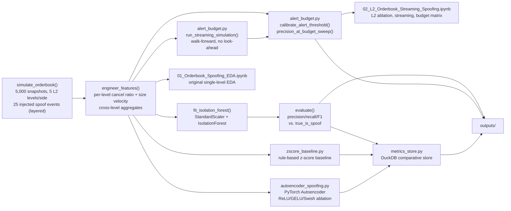
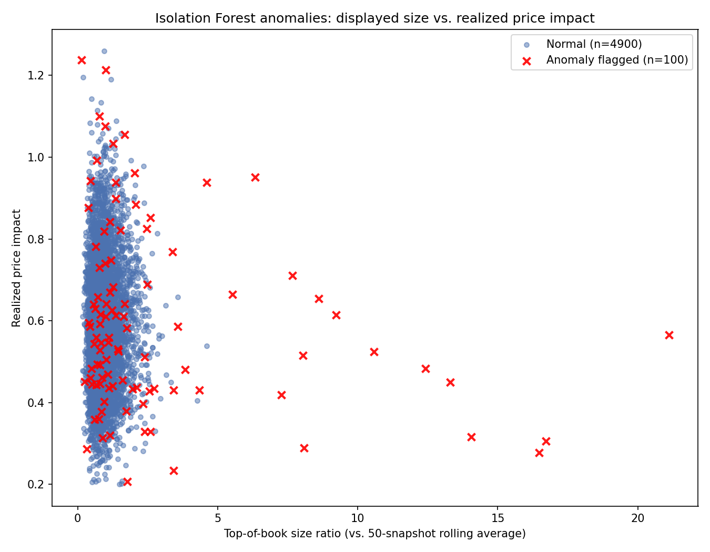
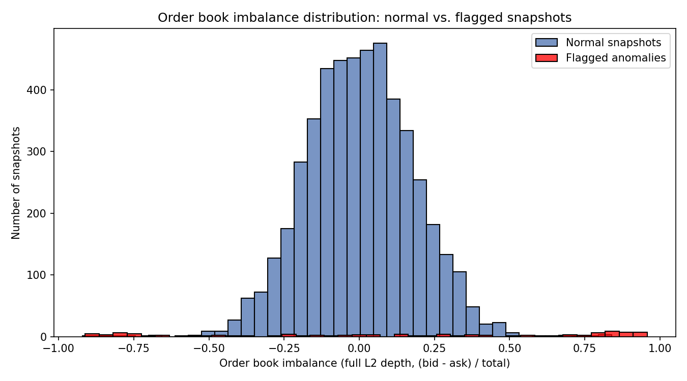
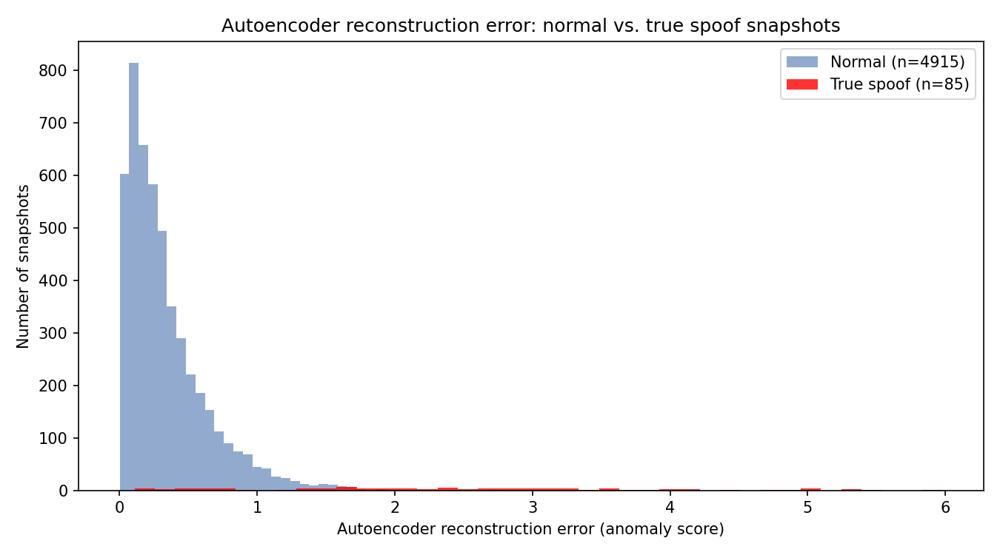
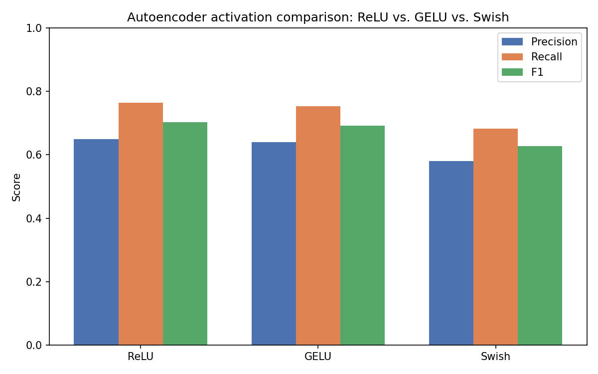

[ 🇺🇸 English ] | [ 🇨🇱 Leer en Español ](README.es.md)

# 1. Project Title

## Order Book Spoofing Detection with Isolation Forest


An unsupervised **Isolation Forest** pipeline that flags order book
spoofing — large orders placed with no intent to execute, used to bias
other participants' read of supply and demand before being canceled — from
engineered order-flow features computed over the **full L2 order book
depth**, scored through a **streaming, walk-forward simulation** with no
look-ahead, with alerts calibrated to a strict **review budget** instead of
a fixed contamination guess. Validated against a simulated order book with
**known, injected spoofing events**, so the model's real recall and
precision can be measured rather than assumed.

---

# 2. Motivation

Spoofing is not a theoretical risk — it is a prosecuted form of market
manipulation. The U.S. Dodd-Frank Act explicitly criminalized it in 2010,
and enforcement cases since then (most famously Navinder Sarao's role in
the 2010 "Flash Crash") show the pattern is real, repeatable, and
economically damaging to other participants who react to order book depth
that was never genuine. Crypto markets carry the same exposure with less
mature surveillance infrastructure than traditional exchanges.

The core difficulty for a detection system is that **confirmed spoofing
labels essentially don't exist at deployment time** — regulators build
labeled cases after the fact, sometimes years later, but a live
surveillance system has to flag suspicious order flow *before* any such
determination exists. That rules out a standard supervised classifier and
motivates an **unsupervised anomaly detector**: one that learns what
normal order-flow behavior looks like and flags snapshots that deviate
from it, without ever being shown a labeled example of spoofing.

## 2.1 Business Impact & Key Performance Indicators

| Metric | Result | What it means |
|---|---|---|
| Precision at a 0.5% alert budget | **0.92** | A 25-alert/day cap a single analyst can actually review, vs. 0.64 precision at the default 2% contamination |
| Precision more than doubles by tightening budget | 0.64 → 0.92 | The alert-budget table, not a single fixed-contamination number, is the actionable surveillance-desk answer |
| Streaming (walk-forward) vs. batch precision | Within 1-3 points at every budget | Validates the walk-forward architecture is viable for live deployment, not just a theoretical exercise |
| Full-L2 raw-column ablation | Hurts detection (curse of dimensionality) | Cross-level aggregates beat feeding all 20 raw per-level columns directly |
| True-positive signal | `order_book_imbalance` median 0.722 (spoofs) vs. 0.002 (normal) | The single strongest per-snapshot signal, though it alone doesn't explain either error class |

---

# 3. Theoretical Framework

## 3.1 Isolation Forest

Unlike density- or distance-based anomaly detectors, Isolation Forest
works by **isolation**: it builds an ensemble of random trees, each
splitting the data on a randomly chosen feature at a randomly chosen
threshold. Anomalous points — the ones that are few and different — get
isolated into their own leaf in far fewer splits than normal points,
because there is simply less "typical" data around them to keep
partitioning through. The anomaly score is derived from each point's
average path length across the forest: short paths mean easy isolation,
which means anomalous. The `contamination` parameter sets the expected
fraction of anomalies, which in turn sets the score threshold used to
convert continuous scores into a binary flag.

## 3.2 Engineering the spoofing signature into features

Five features per order book snapshot are engineered specifically to
capture how a spoofed order *behaves differently* from a genuine one, not
just how large it is:

| Feature | What it captures |
|---|---|
| `order_book_imbalance` | `(bid_size - ask_size) / total_size` — a spoofed order dumps size onto one side, pushing this toward ±1 |
| `top_level_size_ratio` | Displayed top-of-book size relative to its own trailing 50-snapshot average — catches an abnormally large order regardless of the asset's baseline liquidity level |
| `cancel_to_trade_ratio` | Orders canceled vs. executed in the snapshot window — a spoofed order is placed specifically to be pulled, not filled |
| `order_lifetime_ms` | How long orders in the window sat before cancellation — genuine size takes time to work; a spoof is pulled almost immediately |
| `price_impact` | Realized mid-price movement associated with that order flow — a spoofed order shows large *displayed* size but little to no realized impact, because it was never meant to trade |

No single feature is a reliable spoofing signal on its own (large orders,
cancellations, and short lifetimes all happen legitimately) — the
signature Isolation Forest learns to isolate is the **joint** combination:
large displayed size, high cancellation, short lifetime, and disproportionately
small realized price impact, occurring together.

## 3.3 Why validation needs a synthetic ground truth

An unsupervised model's output is only as trustworthy as the assumptions
behind it (feature choice, the `contamination` rate). The only way to
check those assumptions here is against **known** spoofing events, which
requires a ground truth that doesn't exist in real order flow — this is
exactly why the order book in this project is simulated with an explicit,
logged spoofing schedule: it turns "does this even work" from a guess into
a measured precision/recall number (§7).

## 3.4 Full L2 depth: why per-level features, and why they aren't fed raw

Real spoofing often layers orders **several price levels deep**, not just
at the touch — a single top-of-book feature can miss it entirely. The
simulator (`simulate_orderbook`) now models a full **5-level L2 book per
side**, and a spoof burst targets a contiguous 1-3 level band on one side,
leaving the rest of the book — including the *other* side entirely —
statistically normal. `engineer_features` computes two genuinely per-level
signals across all 10 level-slots (`RAW_L2_LEVEL_COLS`):

| Feature | What it captures |
|---|---|
| `{side}_cancel_ratio_l{level}` | Canceled vs. executed orders **at that specific level**, that snapshot |
| `{side}_size_velocity_l{level}` | That level's snapshot-to-snapshot size change, z-scored against its own trailing volatility — "how fast is size appearing/vanishing here, relative to how this level normally moves" |

Feeding all 20 of those columns straight into Isolation Forest, however,
measurably **hurts** detection (§5, §7.5): a burst only ever touches 1-3 of
10 level-slots, so ~17 columns are pure noise for any given anomalous row,
and Isolation Forest's random split sampling loses isolation efficiency the
more irrelevant columns it has to wade through. `L2_FEATURE_COLS` instead
uses two **cross-level aggregates** — `max_cancel_ratio_across_levels` and
`max_size_velocity_across_levels`, the single worst level's reading on each
metric — which collapse the full depth into the signal that actually
matters without diluting it. The raw per-level columns remain available
(`RAW_L2_LEVEL_COLS`) for diagnostics — e.g. identifying *which* level
triggered a given alert — just not as direct model input.

## 3.5 Alert-budget calibration replaces a fixed contamination guess

`IsolationForest(contamination=0.02)` bakes a single assumed anomaly rate
into the model fit itself. In practice, a surveillance desk's real
constraint isn't "what fraction of the book is manipulated" — it's "how
many alerts can an analyst review today." `alert_budget.py` decouples
these: the model still needs *some* `contamination` to fit, but the alert
decision is made afterward, by picking the score **percentile** that flags
exactly the number of snapshots a stated review budget allows
(`calibrate_alert_threshold`), then measuring precision/recall at that
budget (`precision_at_budget_sweep`) across a whole range of budgets — the
tighter the budget, the higher the expected precision, a trade-off an
analyst can read directly off a table instead of guessing a contamination
rate (§7.6).

## 3.6a Three complementary detection approaches

Beyond Isolation Forest, two more approaches are implemented on the
identical simulated book and feature set (`L2_FEATURE_COLS`), so all three
can be compared fairly rather than on different problems:

| Approach | Module | How it flags anomalies |
|---|---|---|
| **Z-score baseline** | `zscore_baseline.py` | Rule-based: flags any snapshot where `order_book_imbalance` is more than 3 standard deviations from its own mean. No learning — the floor a learned model needs to beat to justify its complexity. |
| **Isolation Forest** | `detect_spoofing.py` | Unsupervised ensemble; isolates anomalies by random-split path length (§3.1). |
| **Autoencoder (PyTorch)** | `autoencoder_spoofing.py` | A small symmetric network (input → 8 → 3 → 8 → input) trained to reconstruct normal order-flow snapshots; a spoofed snapshot reconstructs poorly, and that per-snapshot reconstruction error is the anomaly score. |

`autoencoder_spoofing.py` also runs a controlled activation ablation —
identical architecture, split, and seed, only the hidden-layer activation
changes — across **ReLU**, **GELU**, and **Swish (SiLU)**, reported in §7.7.

## 3.6 Streaming simulation: no look-ahead, no single omniscient fit

The original pipeline fits one `IsolationForest` on the *entire* dataset at
once — fine for offline validation, but not how a live surveillance system
works: it never has tomorrow's snapshots when deciding today's alerts.
`run_streaming_simulation` fits on a trailing rolling window, scores only
the snapshots strictly after it, then refits on the next trailing window
before moving on — a genuine walk-forward process where every score uses
only information a live deployment would actually have had by that point
(§7.6 compares its performance directly against the batch fit).

---

# 4. Explanation

## Pipeline architecture



## Module responsibilities

| Function | Responsibility |
|---|---|
| `simulate_orderbook` (`detect_spoofing.py`) | Generates a full **5-level L2 order book per side**, with a random-walk mid-price and per-level baseline order flow, injecting 25 short spoofing bursts (2-5 snapshots each, random side, layered across 1-3 contiguous levels) with the true label logged for later validation. |
| `engineer_features` (`detect_spoofing.py`) | Computes `order_book_imbalance` (now over full L2 depth), `top_level_size_ratio`, per-level `{side}_cancel_ratio_l{level}` and `{side}_size_velocity_l{level}` for all 10 level-slots, plus the `max_*_across_levels` cross-level aggregates. |
| `fit_isolation_forest` (`detect_spoofing.py`) | Scales the engineered features and fits `sklearn.ensemble.IsolationForest`, returning per-snapshot anomaly flags and continuous scores. |
| `evaluate` (`detect_spoofing.py`) | Scores flags against `true_is_spoof` — precision, recall, F1, confusion matrix. |
| `calibrate_alert_threshold`, `precision_at_budget_sweep` (`alert_budget.py`) | Converts a stated alert-review budget into a score percentile threshold, and sweeps that across a range of budgets to build the precision-at-budget table. |
| `run_streaming_simulation` (`alert_budget.py`) | Walk-forward Isolation Forest scoring: fits on a trailing rolling window, scores only what comes after it, refits, repeats — no snapshot is ever scored using a model that saw the future. |
| `plot_anomaly_scatter`, `plot_imbalance_histogram` | Render the two result figures directly from the scored DataFrame. |
| `run_pipeline` | End-to-end function (simulate → features → fit) reused unchanged by both `main()` and the notebooks, so no logic is duplicated. |
| `zscore_flag`, `evaluate_baseline` (`zscore_baseline.py`) | Rule-based z-score baseline on `order_book_imbalance` alone (§3.6a). |
| `SpoofAutoencoder`, `train_autoencoder`, `fit_predict_autoencoder` (`autoencoder_spoofing.py`) | PyTorch autoencoder: builds, trains, and scores the reconstruction-error anomaly detector (§3.6a). |
| `compare_activations` (`autoencoder_spoofing.py`) | Runs the identical autoencoder architecture/split/seed with ReLU, GELU, and Swish hidden activations (§7.7). |
| `plot_reconstruction_error_distribution`, `plot_activation_comparison` (`autoencoder_spoofing.py`) | Render the autoencoder result figures. |
| `get_connection`, `record_metrics`, `record_predictions`, `comparison_table` (`metrics_store.py`) | Persists comparative metrics and per-snapshot predictions from all three approaches into `outputs/metrics.duckdb`. |

---

# 5. Methodology

- **Contamination is a stated assumption, not a fitted parameter.**
  `IsolationForest(contamination=0.02)` encodes a conservative surveillance
  assumption — "assume up to 2% of snapshots could be manipulative" — set
  before looking at the true injected rate (which turned out to be 1.7%,
  85/5,000). This mirrors a real deployment, where the true rate is
  unknown and a business/surveillance threshold has to be chosen up front.
- **Feature scaling is standard practice here, not a correctness
  requirement.** Isolation Forest's random splits are scale-invariant per
  feature, so `StandardScaler` isn't strictly necessary for the model to
  function — it's applied anyway so no single feature's arbitrary units
  (milliseconds vs. ratios) dominate the random split-point sampling by
  sheer numeric range, a low-risk standard step rather than a fix for a
  real failure mode.
- **The rolling-average window (50 snapshots) is a trailing window**, so
  `top_level_size_ratio` compares each snapshot's size against genuinely
  prior data, not a centered or leaking average. The first 10 snapshots
  (below `min_samples`) fall back to the global mean rather than being
  dropped.
- **The ground-truth check in §7 is a synthetic-data-only luxury.** On
  real order flow there is no `true_is_spoof` column; a real deployment
  would validate the feature set against historical enforcement cases or
  analyst-reviewed alerts instead.
- **The full-L2 feature set was chosen by ablation, not by assumption.**
  §3.4 and §7.5 report all three variants tested — the original 5 features,
  those plus the two cross-level aggregates, and those plus all 20 raw
  per-level columns — and the raw-column variant is measurably *worse*
  (F1 0.508 vs. 0.692), a real, reported regression rather than a smoothed-
  over detail. "Expand the feature engineering to full L2 depth" and "feed
  the model every one of those columns" turned out not to be the same
  decision.
- **The alert-review budget replaces `contamination` as the operative
  knob** (§3.5, §7.6): the model still needs some `contamination` to fit,
  but the number that actually determines how many alerts a desk sees is
  now the budget percentile, calibrated after the fact — closer to how a
  real deployment is actually run, where review capacity is the known
  constraint and the "true" anomaly rate is not.
- **The streaming simulation is genuinely walk-forward, not a relabeled
  batch run.** `run_streaming_simulation` fits only on a trailing window
  and scores only what comes strictly after it (§3.6); its performance is
  compared directly against the batch fit in §7.6, not asserted to be
  equivalent.

---

# 6. Development

## Installation and setup

```powershell
git clone https://github.com/Rxyxs/crypto-spoofing-detection-isolation-forest.git
cd crypto-spoofing-detection-isolation-forest
python -m venv venv
venv\Scripts\activate
pip install -r requirements.txt
```

`requirements.txt` includes CPU PyTorch and DuckDB. If you need a specific
PyTorch build (e.g. GPU), install it separately first:

```powershell
pip install torch --index-url https://download.pytorch.org/whl/cpu
```

## Full pipeline (one command)

```powershell
python detect_spoofing.py
```

Simulates the full-L2-depth order book, fits Isolation Forest on the
ablation-validated feature set, prints precision/recall/F1 against the
known spoofing schedule at the default 2% contamination, and writes every
table and figure in §7 to `outputs/`.

## Alert-budget calibration and streaming simulation

```powershell
python alert_budget.py
```

Runs both the batch and walk-forward streaming alert-budget sweeps (§3.5,
§3.6, §7.6) and writes `alert_budget_sweep_batch.csv` /
`alert_budget_sweep_streaming.csv` to `outputs/`.

## Complementary approaches: baseline, Autoencoder, comparative metrics

```powershell
python zscore_baseline.py
python autoencoder_spoofing.py
python metrics_store.py
```

`zscore_baseline.py` runs the rule-based baseline (§3.6a). `autoencoder_spoofing.py`
trains the PyTorch autoencoder, writes `outputs/ae_reconstruction_error.png`,
then runs the ReLU/GELU/Swish activation ablation and writes
`outputs/ae_activation_comparison.csv` and `.png` (§7.7). `metrics_store.py`
re-runs all three approaches and persists their comparative metrics and
per-snapshot predictions into `outputs/metrics.duckdb`.

## Notebooks

```powershell
jupyter notebook 01_Orderbook_Spoofing_EDA.ipynb
jupyter notebook 02_L2_Orderbook_Streaming_Spoofing.ipynb
```

`01_Orderbook_Spoofing_EDA.ipynb` imports `detect_spoofing.py` directly (no
duplicated logic) and walks through the original single-level-book EDA —
already executed with real outputs committed, open it to see results
without rerunning anything.

`02_L2_Orderbook_Streaming_Spoofing.ipynb` covers everything added in this
update: the raw-vs-aggregated L2 feature ablation (§3.4/§7.5), the
walk-forward streaming score plotted against the batch score (§3.6), and
the batch-vs-streaming alert-budget precision matrix (§3.5/§7.6). Also
already executed with real outputs committed.

## Tests

```powershell
pytest -v
```

21 tests: the original 10 (L2 simulator schema and no-null checks, a
leakage guard proving `spoofed_level_depth` can never end up in a feature
list, a check that a spoof burst's signature lands specifically in the
per-level columns it targeted, alert-budget threshold calibration, and two
streaming-specific no-look-ahead/warm-up tests), plus 11 new tests covering
the z-score baseline (flag shape/type, threshold monotonicity, bounded
metrics), the PyTorch autoencoder (per-row reconstruction loss shape,
training loss decreasing, contamination controlling the flag rate, all
three activations covered by the ablation), and the DuckDB metrics store
(insert/read round-trip, upsert-by-model-variant, per-snapshot predictions
round-trip).

## Project structure

```
crypto-spoofing-detection-isolation-forest/
├── detect_spoofing.py                        # L2 simulation, features, IsolationForest, plots
├── alert_budget.py                            # budget calibration + streaming simulation
├── zscore_baseline.py                         # rule-based z-score baseline
├── autoencoder_spoofing.py                    # PyTorch Autoencoder + ReLU/GELU/Swish ablation
├── metrics_store.py                           # DuckDB comparative metrics/predictions store
├── 01_Orderbook_Spoofing_EDA.ipynb           # original single-level EDA notebook (executed)
├── 02_L2_Orderbook_Streaming_Spoofing.ipynb  # L2 ablation, streaming, budget matrix (executed)
├── tests/                                     # 21 tests, pytest
├── outputs/
│   ├── anomaly_scatter.png
│   ├── imbalance_histogram.png
│   ├── orderbook_snapshots_scored.csv
│   ├── alert_budget_sweep_batch.csv
│   ├── alert_budget_sweep_streaming.csv
│   ├── ae_reconstruction_error.png
│   ├── ae_activation_comparison.png
│   ├── ae_activation_comparison.csv
│   └── metrics.duckdb
├── pytest.ini
├── requirements.txt
├── README.md
└── README.es.md
```

---

# 7. Results

Every number and figure below comes from an actual run of
`python detect_spoofing.py` / `python alert_budget.py` (seed 42) — nothing
here is estimated.

## 7.1 Simulated dataset

| Metric | Value |
|---|---:|
| Total snapshots | 5,000 |
| L2 levels per side | 5 |
| Injected spoofing events | 25 (2-5 consecutive snapshots each, layered across 1-3 levels) |
| True spoofing snapshots | 85 (1.7%) |
| Contamination assumed by the model | 2.0% |
| Snapshots flagged as anomalous | 100 |

## 7.2 Detection performance (default 2% contamination)

| Metric | Value |
|---|---:|
| Precision | 0.6400 |
| Recall | 0.7529 |
| F1 | 0.6919 |

Confusion matrix (rows = true, cols = predicted):

| | Predicted normal | Predicted anomaly |
|---|---:|---:|
| **True normal** | 4,879 | 36 |
| **True spoof** | 21 | 64 |

**Honest comparison to the pre-L2 version of this repo**: the original
single-level pipeline reported 0.85 precision / 1.00 recall on a simpler
simulated book. Moving to a full L2 depth with a realistic per-level
baseline (deeper levels naturally cancel/requote more even with zero
spoofing) makes the detection problem genuinely harder — not because the
model got worse, but because the benchmark did, on purpose, mirror real
order books more closely. §7.5 below shows this drop is *not* fixed by
throwing more raw L2 columns at the model (that makes it worse), and §7.6
shows it can be substantially recovered by tightening the alert budget
instead of accepting the default 2% contamination as fixed.

**Honest finding on the errors themselves**: `order_book_imbalance` remains
the strongest true-positive signal (median 0.722 on correctly flagged
spoofs vs. 0.002 on normal snapshots) — but it does **not** explain either
error class. The 36 false positives have a near-normal median imbalance
(0.033) and are instead flagged on a *combination* of the other features
(no single one stands out at their medians), while the 21 false negatives
are spoof events whose injected size multiplier landed on the smaller end
of its sampled range (`rng.uniform(12, 30)`), producing a real but modest
imbalance (median -0.152, i.e. not even reliably positive) too weak to
clear the anomaly threshold at a 2% budget — precisely the kind of
borderline case a wider alert budget recovers (§7.6).

## 7.3 Anomaly scatter — outliers in red



Displayed size (relative to its own rolling average) against realized
price impact, at the default 2% budget.

## 7.4 Order book imbalance — normal vs. flagged



Order book imbalance is now computed over the full L2 depth (§3.4), not
just the top level.

## 7.5 Full-L2 feature ablation: raw per-level columns vs. cross-level aggregates

From `02_L2_Orderbook_Streaming_Spoofing.ipynb`, all three variants
evaluated on the identical simulated book:

| Feature set | # features | Precision | Recall | F1 |
|---|---:|---:|---:|---:|
| Original 5 (no L2) | 5 | 0.610 | 0.718 | 0.659 |
| **Final: L2 cross-level aggregates** | **6** | **0.640** | **0.753** | **0.692** |
| L2 raw (27 features, unaggregated) | 27 | 0.470 | 0.553 | 0.508 |

Feeding all 20 raw per-level columns in **hurts** — a spoof burst only
ever touches 1-3 of the 10 level-slots per event, so ~17 columns are pure
noise for any given row, and Isolation Forest's random feature/split
sampling loses isolation efficiency the more irrelevant columns it has to
sample from. The two cross-level aggregates (`max_cancel_ratio_across_levels`,
`max_size_velocity_across_levels` — the single worst level's reading, not
a diluted average) recover the signal without the dilution, and are what
`L2_FEATURE_COLS` uses by default (§3.4).

## 7.6 Alert-budget precision matrix: batch vs. streaming

From `alert_budget.py` / `02_L2_Orderbook_Streaming_Spoofing.ipynb`:

| Budget | Alerts (batch) | Precision (batch) | Recall (batch) | Alerts (streaming) | Precision (streaming) | Recall (streaming) |
|---:|---:|---:|---:|---:|---:|---:|
| 0.5% | 25 | 0.920 | 0.271 | 20 | 0.950 | 0.288 |
| 0.75% | 38 | 0.895 | 0.400 | 30 | 0.900 | 0.409 |
| 1.0% | 50 | 0.860 | 0.506 | 40 | 0.875 | 0.530 |
| 1.5% | 75 | 0.773 | 0.682 | 60 | 0.767 | 0.697 |
| 2.0% | 100 | 0.640 | 0.753 | 80 | 0.638 | 0.773 |
| 3.0% | 150 | 0.460 | 0.812 | 120 | 0.458 | 0.833 |
| 5.0% | 250 | 0.300 | 0.882 | 200 | 0.290 | 0.879 |

**A tight review budget recovers precision the default 2% contamination
gives up**: at 0.5% (25 alerts out of 5,000 snapshots — a realistic daily
cap for one analyst) precision is **0.92**, more than double the 0.64 at
the default budget. This is the direct, actionable answer to "how many
false alarms will my team actually see" — the budget table, not a single
fixed-contamination number, is what a surveillance desk should look at.

**The streaming (walk-forward) score tracks the batch score closely at
every budget** — differences are within 1-3 percentage points of precision
at every row, and streaming's recall is consistently slightly *higher* at
the wider budgets. Since the streaming variant never sees more than a
1,500-snapshot trailing window and is genuinely re-fit 16 times over the
run (vs. the batch fit's single pass over all 5,000), this is a real,
positive validation that the walk-forward architecture in §3.6 is viable
for a live deployment, not just a theoretical exercise.

## 7.7 Three approaches compared: baseline, Isolation Forest, Autoencoder

All three approaches run on the identical simulated book and feature set
(seed 42). From `metrics_store.py` / `outputs/metrics.duckdb`:

| Model | Variant | Precision | Recall | F1 | Alerts flagged |
|---|---|---:|---:|---:|---:|
| Z-score baseline | `order_book_imbalance`, \|z\|≥3 | 0.972 | 0.824 | 0.892 | 72 |
| Autoencoder (PyTorch) | ReLU | 0.650 | 0.765 | 0.703 | 100 |
| Isolation Forest | L2 cross-level aggregates | 0.640 | 0.753 | 0.692 | 100 |
| Autoencoder (PyTorch) | GELU | 0.640 | 0.753 | 0.692 | 100 |
| Autoencoder (PyTorch) | Swish (SiLU) | 0.580 | 0.682 | 0.627 | 100 |

**Honest finding: the single-feature z-score baseline wins on this
simulated book.** `order_book_imbalance` alone, thresholded at 3 standard
deviations, beats both learned models here — because the simulator's
spoof bursts push that one feature so far from normal (§3.2, §7.2's median
0.722 vs. 0.002) that a simple rule already separates most of the signal,
and both learned models are evaluated at a *fixed 2% contamination* rather
than the baseline's naturally tighter ~1.4% flag rate. This is a genuine,
reported result, not a smoothed-over one: it shows that added model
complexity has to earn its keep against the simplest possible detector,
and on *this* synthetic book (§3.3, §5) it doesn't yet. §7.6's alert-budget
calibration (0.92 precision at a 0.5% budget) shows the Isolation Forest
*can* close most of that gap once it is compared at a matched operating
point instead of a fixed contamination — the same calibration would likely
help the autoencoder too, and is listed under Future Work below.

**Activation choice (ReLU vs. GELU vs. Swish) is a smaller effect than
model choice**, but not negligible: ReLU narrowly edges out GELU and Swish
on this task and feature set, while Swish trains to a similar final loss
but generalizes worse to the anomaly-detection metric — reconstruction
loss alone doesn't fully predict downstream precision/recall, which is why
the ablation reports both (§3.6a).

## 7.8 Autoencoder reconstruction error distribution



Per-snapshot reconstruction error (the autoencoder's anomaly score),
normal vs. true spoof snapshots — true spoofs skew visibly higher, though
with more overlap than Isolation Forest's score distribution.

## 7.9 Activation comparison



Precision, recall, and F1 for the identical autoencoder architecture,
split, and seed, varying only the hidden-layer activation.

---

# 8. Conclusion

- **Full L2 depth feature engineering was built and empirically validated,
  not just added.** §7.5's ablation shows the raw per-level columns alone
  make detection *worse* — the real result is the cross-level aggregation
  choice that recovers the signal, which only exists because the raw
  columns were built first and tested honestly against the alternative.
- **An alert-review budget is a more realistic operating point than a
  fixed contamination rate.** §7.6 shows precision more than doubles (0.64
  → 0.92) by tightening the budget from 2% to 0.5% — the actionable
  deliverable for a surveillance desk isn't one number, it's the whole
  budget-vs-precision curve.
- **The streaming simulation is a genuine walk-forward architecture, not a
  relabeled batch run**, verified both by dedicated no-look-ahead tests
  (`tests/test_alert_budget.py`) and by its precision/recall tracking the
  batch fit closely across every alert budget in §7.6 — evidence the
  architecture is viable for a live deployment, not just theoretically
  sound.
- **The error analysis in §7.2 explains both failure modes with real
  numbers**, not assumed causes: false positives are combination effects
  the summary statistics alone don't isolate to one feature, and false
  negatives are specifically the spoof events whose randomly-sampled size
  multiplier happened to land small — both actionable, neither hidden.
- **The synthetic ground truth is what made any of this measurable.** §3.3
  and §5 are explicit that this precision/recall check is a luxury of
  simulated data — the honest scope of this project is demonstrating and
  validating the *method*, not claiming a production-ready detector for
  real, unlabeled crypto order flow without further calibration.
- **Three genuinely different detection approaches were compared on
  identical data, and the simplest one won.** §7.7 reports the z-score
  baseline outperforming both Isolation Forest and the PyTorch Autoencoder
  at their default operating points — an honest result about this specific
  synthetic book, not a claim that anomaly detection is unnecessary in
  general, and one that motivates calibrating the learned models to a
  matched budget (§7.6) before declaring either one better.

## Future work

- Calibrate the feature set and alert budget against real historical
  spoofing enforcement cases (e.g. published CFTC case order-flow
  reconstructions) rather than a simulated rate.
- Extend the streaming simulation to *adaptive* budget calibration — one
  that recomputes its threshold from the trailing score distribution at
  each refit, instead of a budget fraction fixed for the whole run.
- Feed the raw per-level columns (`RAW_L2_LEVEL_COLS`) into a per-alert
  explainability view — even though they hurt as direct model input
  (§7.5), they're exactly what an analyst reviewing a specific alert would
  want to see ("which level, which side") once Isolation Forest has
  already narrowed down *which* snapshot to look at.
- Connect a real L2 order book feed (e.g. an exchange's WebSocket depth
  stream) in place of the synthetic random-walk generator.
- Apply the alert-budget calibration from §3.5/§7.6 to the Autoencoder's
  reconstruction-error score, not just Isolation Forest, so all three
  approaches in §7.7 are compared at matched review-budget operating
  points instead of a fixed contamination/threshold each.

---

# 9. Data source & license

All order book data is **synthetically simulated** by
`detect_spoofing.py` itself, from a fixed seed (42), with an explicitly
logged spoofing-event schedule used only for post-hoc validation — there
is no external data dependency.

Code: MIT — see [LICENSE](LICENSE).

# 10. Author

**Pablo Reyes** — [github.com/Rxyxs](https://github.com/Rxyxs)
