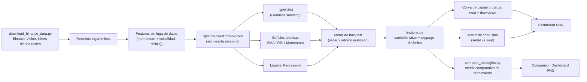
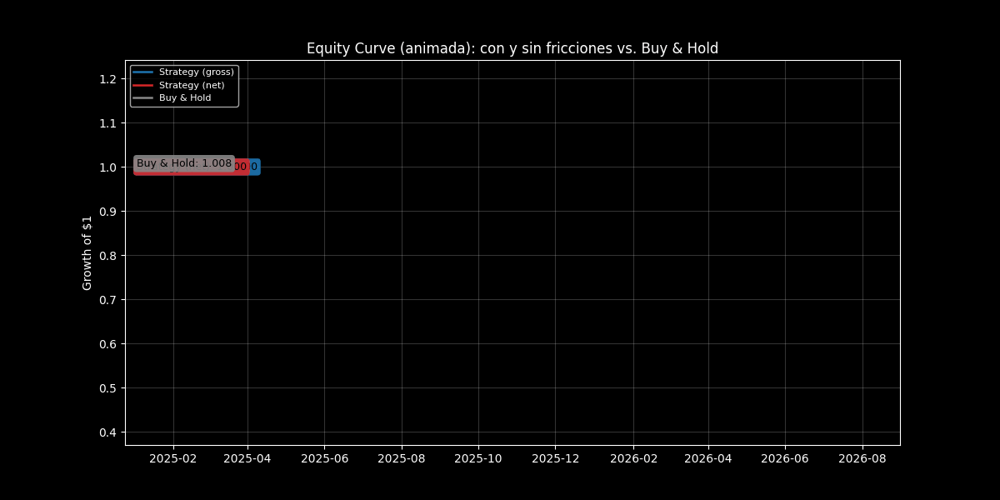
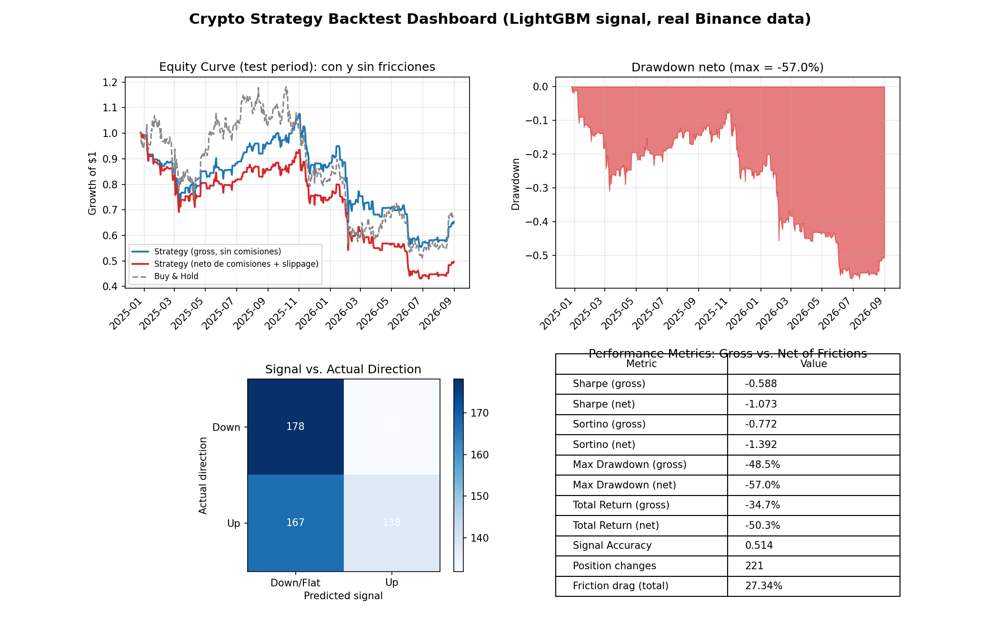
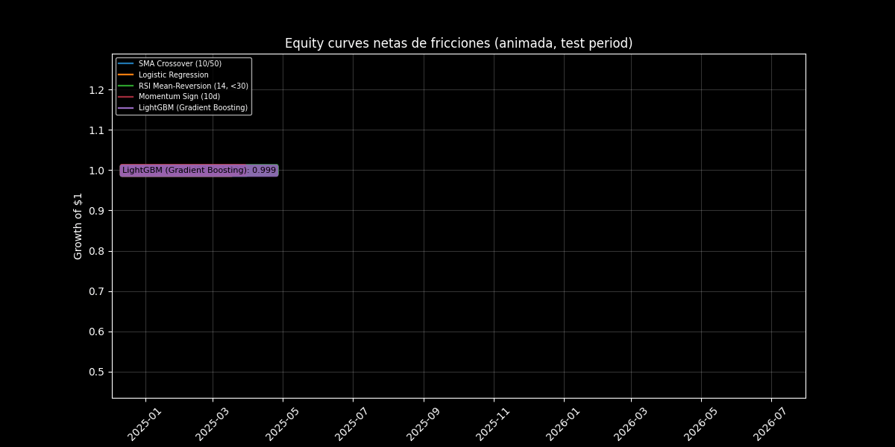
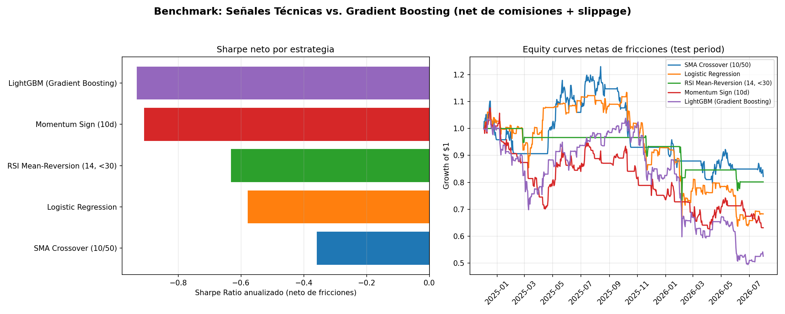

[ 🇺🇸 Read in English ](README.md) | [ 🇨🇱 Español ]

# Crypto Strategy Backtest Analytics

## Un Motor Estadístico de Backtesting para Evaluar Señales de Trading


## Técnicas usadas

| Técnica | Dónde |
|---|---|
| Señales de cruce de SMA, reversión a la media con RSI, signo del momentum | `technical_signals.py` |
| Señales de ML: Regresión Logística + LightGBM | `ml_models.py` |
| Modelo de fricciones: comisión + slippage escalado por volatilidad | `frictions.py` |
| Motor de backtest con Sharpe/drawdown/retorno bruto vs. neto | `backtest_engine.py` |
| Benchmark cabeza a cabeza de 5 estrategias, historial en DuckDB | `compare_strategies.py`, `db_persistence.py` |

[**Gráfico interactivo**: curvas de equity netas de fricción para las 5 estrategias en el set de test real de 606 días](https://htmlpreview.github.io/?https://github.com/Rxyxs/crypto-quant-techniques-lab/blob/main/08-strategy-backtesting/outputs/interactive/equity_curves_comparison.html)

---

## Impacto de Negocio e Indicadores Clave (KPIs)

| Métrica | Resultado | Qué significa |
|---|---|---|
| Mejor Sharpe neto (comparación de 5 estrategias) | SMA Crossover, -0,358 | La regla más simple le gana a LightGBM neto de fricciones -- más complejidad de modelo no ganó automáticamente |
| Peor arrastre por fricción | LightGBM, 27,28% del retorno | Mayor tasa de rotación de posiciones erosiona el edge bruto del modelo y más |
| Precisión de señal vs. Sharpe | 0,507 de precisión, Sharpe igual negativo | Un clasificador cercano a una moneda al aire igual puede perder dinero una vez aplicadas las fricciones -- la precisión sola no implica rentabilidad |
| Período de test | 606 días, BTCUSDT real de Binance, split cronológico | Sin lookahead bias por construcción, sin ventana alcista elegida a conveniencia |
| Resultado honesto principal | Las 5 estrategias netas negativas en esta ventana | Reportado directamente en vez de recortado hasta encontrar un período favorable |

Una señal de trading no vale nada hasta que sobrevive a un backtest riguroso
— la mayoría de las ideas de generación de señales que se ven prometedoras
en un scatter plot fallan una vez que se aplican realismo transaccional,
orden cronológico estricto y métricas ajustadas por riesgo. Este motor le da
a una mesa de trading o a un investigador cuantitativo un arnés de
evaluación único y reutilizable que:

- **Previene el error más común en backtesting** — la fuga de datos futuros
  (lookahead bias) — por construcción, ya que cada feature en la que se basa
  la señal se calcula estrictamente con información disponible antes del
  período que predice.
- **Reporta desempeño ajustado por riesgo, no solo retornos**: una curva de
  capital por sí sola puede esconder una estrategia que solo gana asumiendo
  un riesgo de drawdown que ninguna mesa toleraría en la práctica; el Sharpe
  ratio y el drawdown máximo se reportan junto al retorno bruto.
- **Cobra comisiones y slippage reales, no una curva de fantasía**: cada
  estrategia se evalúa bruta y neta de un modelo de fricciones (comisión
  taker de Binance + slippage dinámico por volatilidad), porque una curva de
  equity "sin comisiones" es exactamente el tipo de resultado que engaña a
  un desk antes de que el capital real lo pague.
- **Convierte las predicciones de un clasificador en un registro de trading
  auditable**: la matriz de confusión conecta directamente la señal del
  modelo con si el mercado efectivamente se movió en esa dirección, que es
  la primera pregunta que hace cualquier revisor de riesgo antes de confiar
  capital a una señal.

## Arquitectura



## Stack Tecnológico

| Capa | Tecnología | Rol |
|---|---|---|
| Ingesta de datos | **requests** + Binance Vision | Descarga automática de klines diarios reales, sin API key |
| Manipulación de datos | **Pandas / NumPy** | Manejo de la serie de precios, ingeniería de features, contabilidad del backtest |
| Señal ML | **LightGBM** (Gradient Boosting) | Modelo principal del motor; clasificador direccional no lineal |
| Señal ML (baseline) | **scikit-learn** (`LogisticRegression`) | Baseline lineal, parte del benchmark comparativo |
| Señales técnicas | Implementación propia (`technical_signals.py`) | Cruce de medias móviles, RSI de reversión, momentum -- el benchmark "tradicional" |
| Fricciones | Implementación propia (`frictions.py`) | Comisión taker/maker de Binance + slippage dinámico por volatilidad |
| Evaluación | **scikit-learn** (`confusion_matrix`, `accuracy_score`) | Compara la señal contra la dirección real del mercado |
| Visualización | **Matplotlib** | Dashboards de backtest y de benchmark comparativo |
| Análisis | **Jupyter / nbconvert** | `notebooks/02_Binance_Frictions_and_ML_Backtest.ipynb`, ejecutado de punta a punta |
| Entorno de ejecución | **Python 3.10+** | Línea base del proyecto |

## Metodología: cero fuga de datos futuros

Cada feature (momentum móvil, volatilidad móvil, retornos rezagados) se
construye a partir de retornos desplazados al menos un día antes de aplicar
cualquier ventana, de modo que una feature disponible en el día *t* nunca
contiene información del propio día *t*. Las tres señales técnicas
(`technical_signals.py`) siguen exactamente el mismo estándar -- el cruce de
medias, el RSI y el momentum se calculan con datos hasta *t-1*, nunca con el
cierre del propio día que predicen. El split train/test es **cronológico**,
no aleatorio — el modelo se entrena solo con la porción temprana de la serie
y se evalúa exclusivamente en la porción posterior, no vista, imitando cómo
se desplegaría realmente una señal en producción.

## Datos: BTCUSDT real, Binance Vision

`download_binance_data.py` descarga los archivos mensuales de `klines`
(velas) diarias desde [Binance Vision](https://data.binance.vision) -- el
archivo histórico de mercado de Binance, público, gratuito y sin necesidad
de API key. `backtest_engine.load_price_data()` usa el CSV local en
`data/raw/` si ya existe, y lo descarga automáticamente la primera vez; solo
recurre a una serie sintética (GBM con agrupamiento de volatilidad tipo
GARCH(1,1)) si la descarga falla por falta de conexión, para que el pipeline
completo siempre tenga algo con qué correr de punta a punta.

Rango descargado en esta corrida: **2,038 velas diarias reales de BTCUSDT**,
2021-01-01 → 2026-07-31.

## Modelo de fricciones: comisiones + slippage dinámico

`frictions.py` cobra dos componentes de costo en cada día en que la posición
realmente cambia (no en cada día que se mantiene sin tocar):

- **Comisión taker**: 10 bps (tarifa base de Binance spot, VIP 0 sin
  descuento BNB) -- este motor decide la posición al cierre de una vela ya
  conocida y necesita entrar/salir en la apertura siguiente, lo que en la
  práctica es una orden de mercado (taker), no una orden límite. Se deja
  también disponible una tarifa maker (8 bps) de referencia, como escenario
  alternativo de una ejecución más paciente.
- **Slippage dinámico**: `base_bps + multiplicador × volatilidad_reciente`,
  usando la misma feature de volatilidad rolling (`vol_20d`) ya calculada
  para el modelo -- el slippage se ensancha en períodos de alta volatilidad
  y se achica en calma, en vez de ser una constante arbitraria.

## Resultados Visuales

### Motor principal (LightGBM), corrida real

`backtest_engine.py`, datos reales de Binance, 2,017 filas tras construir
features, split cronológico 70/30 → período de test de 606 días
(2024-12-03 → 2026-07-31):

El panel de equity curve también está disponible como gráfico animado que sigue el valor en vivo de cada serie:




| Métrica | Bruta (sin comisiones) | Neta (con fricciones) |
|---|---:|---:|
| Sharpe Ratio (anualizado) | -0.463 | **-0.932** |
| Drawdown Máximo | -46.8% | **-52.5%** |
| Retorno Total | -31.0% | **-47.5%** |
| Precisión de la Señal | 0.507 | 0.507 |
| Cambios de posición | -- | 221 |
| Drag total por fricciones | -- | 27.28% (22.10% comisión + 5.18% slippage) |

El período de test real (dic. 2024 -- jul. 2026) fue un tramo bajista para
BTCUSDT (buy & hold también negativo en esta ventana) -- el modelo pierde
menos que comprar y mantener en términos brutos, pero las comisiones y el
slippage de 221 cambios de posición se comen esa ventaja y la vuelven
negativa neta. Exactamente el tipo de resultado que una curva de equity sin
comisiones esconde, y que este proyecto existe para exponer.

### Matriz comparativa de rendimiento: técnicas tradicionales vs. Gradient Boosting

`compare_strategies.py`, las cinco estrategias evaluadas sobre el mismo test
set (606 días) y el mismo modelo de fricciones:

El panel de equity curves también está disponible como gráfico animado entre las cinco estrategias:




| Estrategia | Sharpe bruto | Sharpe neto | Max DD neto | Retorno neto | Drag por fricciones |
|---|---:|---:|---:|---:|---:|
| **SMA Crossover (10/50)** | -0.301 | **-0.358** | -35.2% | -17.8% | 2.34% |
| Logistic Regression | -0.062 | -0.579 | -43.9% | -31.7% | 26.81% |
| RSI Mean-Reversion (14, <30) | -0.584 | -0.632 | -26.6% | -19.9% | 1.52% |
| Momentum Sign (10d) | -0.634 | -0.908 | -42.0% | -36.9% | 12.14% |
| LightGBM (Gradient Boosting) | -0.463 | -0.932 | -52.5% | -47.5% | 27.28% |

Ninguna de las cinco logra retorno neto positivo en este tramo de mercado
bajista específico -- un resultado honesto, no recortado hasta encontrar una
ventana favorable. Y el hallazgo más interesante no es el esperado: **el
cruce de medias móviles, la regla más simple del grupo, termina con el mejor
Sharpe neto**, mientras que LightGBM -- el modelo más sofisticado -- termina
con el peor, arrastrado por una tasa de rotación de posiciones más alta y,
por lo tanto, un drag de fricciones mucho mayor (27.28% vs. 2.34% de SMA).
Más complejidad no ganó automáticamente; el detalle completo, con curvas de
equity superpuestas, está en
`notebooks/02_Binance_Frictions_and_ML_Backtest.ipynb`.

## Cómo Empezar

```powershell
py -m venv venv
./venv/Scripts/pip install -r requirements.txt

# Descarga el historial real de BTCUSDT desde Binance Vision (una sola vez;
# las corridas siguientes reutilizan el CSV local en data/raw/)
./venv/Scripts/python download_binance_data.py

# Motor principal: entrena LightGBM, corre el backtest con y sin fricciones
./venv/Scripts/python backtest_engine.py

# Benchmark comparativo: 3 señales técnicas + Logistic Regression + LightGBM
# También persiste esta corrida en outputs/backtest_history.duckdb (ver abajo)
./venv/Scripts/python compare_strategies.py
```

### Notebook de análisis

```powershell
./venv/Scripts/pip install jupyter ipykernel nbconvert
./venv/Scripts/jupyter nbconvert --to notebook --execute --inplace notebooks/02_Binance_Frictions_and_ML_Backtest.ipynb
```

Ambos scripts regeneran sus dashboards en `outputs/` e imprimen la tabla
completa de métricas en la consola; el notebook profundiza en las curvas de
equity brutas vs. netas y en el benchmark comparativo con detalle adicional.

### Historial de corridas en DuckDB

`compare_strategies.py` escribe un CSV/JSON nuevo en cada corrida, pero
ninguno de los dos deja un registro consultable entre corridas.
`db_persistence.py` agrega esa capa de forma aditiva: cada corrida del
benchmark comparativo se agrega a un archivo DuckDB embebido local
(`outputs/backtest_history.duckdb`, gitignored y regenerado bajo demanda --
nunca versionado) con una fila en `runs` y una fila por estrategia en
`strategy_results`, de modo que el ranking entre corridas es consultable con
SQL en vez de comparar JSON a mano.

```powershell
./venv/Scripts/python db_persistence.py            # corre el benchmark y lo persiste
./venv/Scripts/python db_persistence.py --report    # imprime el historial guardado
```

### Tests

```powershell
./venv/Scripts/pip install pytest
./venv/Scripts/python -m pytest tests -q
```

19 tests unitarios cubren la construcción de features sin lookahead, las
señales técnicas, el modelo de fricciones (los costos solo se cobran en
turnover, el retorno neto nunca supera al bruto), el contrato de salida de
ambos modelos de ML, y el roundtrip de persistencia en DuckDB -- todos
rápidos, sobre datos sintéticos, sin necesidad de red.

## Estructura del proyecto

```
crypto-strategy-backtest-analytics/
├── data/
│   └── raw/                          # BTCUSDT_1d_binance_vision.csv (real, gitignored)
├── notebooks/
│   └── 02_Binance_Frictions_and_ML_Backtest.ipynb
├── outputs/
│   ├── dashboard.png                 # motor principal (LightGBM), version-controlled
│   ├── comparison_dashboard.png      # benchmark de 5 estrategias, version-controlled
│   ├── comparison_table.csv          # matriz comparativa (generada)
│   └── comparison_summary.json       # resumen (generado)
├── download_binance_data.py          # ingesta real desde Binance Vision
├── frictions.py                      # comisiones taker/maker + slippage dinámico
├── technical_signals.py              # SMA crossover, RSI mean-reversion, momentum
├── ml_models.py                      # Logistic Regression + LightGBM, compartido
├── backtest_engine.py                # motor principal: datos -> features -> señal -> backtest -> dashboard
├── compare_strategies.py             # benchmark: técnicas vs. ML, con fricciones
├── db_persistence.py                 # persistencia en DuckDB de corridas comparativas (historial consultable)
├── tests/                            # suite pytest: señales, fricciones, motor, modelos ML, DuckDB
├── requirements.txt
├── LICENSE
├── README.md
└── README.es.md
```

## Próximos Pasos

- Walk-forward multi-ventana en vez de un único split 70/30, para separar
  "la estrategia funciona mal en general" de "funcionó mal en este período
  de mercado bajista específico" -- la limitación más honesta de esta
  versión, nombrada explícitamente en la conclusión del notebook.
- Ensamblar las cinco señales (técnicas + ML) en vez de elegir una sola
  ganadora, y medir si el ensamble reduce el drag de fricciones sin perder
  la señal direccional que cada una captura por separado.
- Extender el modelo de fricciones con impacto de mercado dependiente del
  tamaño de la posición (slippage no lineal para tickets grandes), más allá
  del término lineal en volatilidad actual.

## Licencia

MIT — ver [LICENSE](LICENSE).

## Autor

**Pablo Reyes** — [github.com/Rxyxs](https://github.com/Rxyxs)
