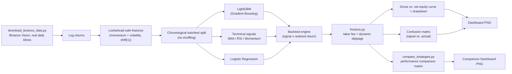

[ 🇺🇸 English ] | [ 🇨🇱 Leer en Español ](README.es.md)

# Crypto Strategy Backtest Analytics

## A Statistical Backtesting Engine for Trading Signal Evaluation


---

## Business Impact & Key Performance Indicators

| Metric | Result | What it means |
|---|---|---|
| Best net Sharpe (5-strategy comparison) | SMA Crossover, -0.358 | The plainest rule beats LightGBM net of frictions -- more model complexity didn't automatically win |
| Worst friction drag | LightGBM, 27.28% of return | Higher position-turnover rate erodes the model's gross edge and then some |
| Signal accuracy vs. Sharpe | 0.507 accuracy, still net-negative Sharpe | A coin-flip-adjacent classifier can still lose money once frictions apply -- accuracy alone doesn't imply profitability |
| Test period | 606 days, real Binance BTCUSDT, chronological split | No lookahead bias by construction, no cherry-picked bullish window |
| Honest headline result | All 5 strategies net-negative in this window | Reported plainly rather than trimmed until a favorable period turns up |

A trading signal is worthless until it survives a rigorous backtest — most
signal-generation ideas that look promising in a scatter plot fail once
transaction realism, chronological ordering, and risk-adjusted metrics are
applied. This engine gives a trading desk or quant researcher a single,
reusable evaluation harness that:

- **Prevents the single most common backtesting error** — lookahead bias —
  by construction, since every feature the signal is based on is computed
  strictly from information available before the period it predicts.
- **Reports risk-adjusted performance, not just returns**: an equity curve
  alone can hide a strategy that only wins by taking on drawdown risk no
  desk would actually tolerate; Sharpe ratio and max drawdown are reported
  side by side with raw return.
- **Charges real commissions and slippage, not a fantasy curve**: every
  strategy is evaluated both gross and net of a friction model (Binance
  taker fee + dynamic volatility-scaled slippage), because a "commission-free"
  equity curve is exactly the kind of result that fools a desk before real
  capital pays for it.
- **Turns a classifier's predictions into an auditable trading record**: the
  confusion matrix ties the model's signal directly to whether the market
  actually moved that way, which is the first question any risk reviewer
  asks before a signal is trusted with capital.

## Architecture



## Technology Stack

| Layer | Technology | Role |
|---|---|---|
| Data ingestion | **requests** + Binance Vision | Automated download of real daily klines, no API key required |
| Data manipulation | **Pandas / NumPy** | Price series handling, feature engineering, backtest accounting |
| ML signal | **LightGBM** (Gradient Boosting) | The engine's primary model; non-linear directional classifier |
| ML signal (baseline) | **scikit-learn** (`LogisticRegression`) | Linear baseline, part of the comparative benchmark |
| Technical signals | Custom implementation (`technical_signals.py`) | SMA crossover, RSI mean-reversion, momentum — the "traditional" benchmark |
| Frictions | Custom implementation (`frictions.py`) | Binance taker/maker commission + dynamic volatility-scaled slippage |
| Evaluation | **scikit-learn** (`confusion_matrix`, `accuracy_score`) | Scores the signal against the realized market direction |
| Visualization | **Matplotlib** | Backtest and comparative-benchmark dashboards |
| Analysis | **Jupyter / nbconvert** | `notebooks/02_Binance_Frictions_and_ML_Backtest.ipynb`, executed end to end |
| Runtime | **Python 3.10+** | Project baseline |

## Methodology: no lookahead bias

Every feature (rolling momentum, rolling volatility, lagged returns) is built
from returns shifted by at least one day before any window is applied, so a
feature available on day *t* never contains information from day *t* itself.
The three technical signals (`technical_signals.py`) follow exactly the same
standard — the moving-average crossover, RSI, and momentum are all computed
using data through *t-1*, never the very close they're predicting. The
train/test split is **chronological**, not shuffled — the model is trained
only on the earlier portion of the series and evaluated exclusively on the
later, unseen portion, mirroring how a signal would actually be deployed in
production.

## Data: real BTCUSDT, Binance Vision

`download_binance_data.py` downloads monthly daily `klines` (candlestick)
archives from [Binance Vision](https://data.binance.vision) — Binance's
public, free, no-authentication historical market-data archive.
`backtest_engine.load_price_data()` uses the local CSV in `data/raw/` if it
already exists, and downloads it automatically on first run; it only falls
back to a synthetic series (GBM with GARCH(1,1)-style volatility clustering)
if the download fails for lack of network access, so the full pipeline
always has something to run against end to end.

Downloaded range in this run: **2,038 real daily BTCUSDT candles**,
2021-01-01 → 2026-07-31.

## Friction model: commissions + dynamic slippage

`frictions.py` charges two cost components on every day the position
actually changes (never on a day it's simply held):

- **Taker commission**: 10 bps (Binance spot base rate, VIP 0, no BNB
  discount) — this engine decides the position at an already-known bar's
  close and needs to enter/exit at the next bar's open, which in practice
  is a market order (taker), not a limit order. An 8 bps maker fee is also
  made available as a reference alternative, for the scenario of a more
  patient, limit-order execution.
- **Dynamic slippage**: `base_bps + multiplier × recent_volatility`, using
  the same rolling volatility feature (`vol_20d`) already computed for the
  model — slippage widens during high-volatility stretches and narrows
  during calm ones, instead of being an arbitrary constant.

## Visual Results

### Primary engine (LightGBM), real run

`backtest_engine.py`, real Binance data, 2,017 rows after feature
construction, chronological 70/30 split → 606-day test period
(2024-12-03 → 2026-07-31):

The equity curve panel above is also available as an animated race chart tracking the live value of each series:


| Metric | Gross (no commissions) | Net (with frictions) |
|---|---:|---:|
| Sharpe Ratio (annualized) | -0.463 | **-0.932** |
| Max Drawdown | -46.8% | **-52.5%** |
| Total Return | -31.0% | **-47.5%** |
| Signal Accuracy | 0.507 | 0.507 |
| Position changes | -- | 221 |
| Total friction drag | -- | 27.28% (22.10% commission + 5.18% slippage) |

The real test period (Dec. 2024 – Jul. 2026) was a bearish stretch for
BTCUSDT (buy & hold is also negative over this window) — the model loses
less than buying and holding in gross terms, but the commissions and
slippage from 221 position changes eat that edge and then some, turning it
net negative. Exactly the kind of result a commission-free equity curve
hides, and exactly what this project exists to surface.

### Performance comparison matrix: traditional technical signals vs. Gradient Boosting

`compare_strategies.py`, all five strategies evaluated on the identical test
set (606 days) with the identical friction model:

The equity-curve panel is also available as an animated race chart across the five strategies:


| Strategy | Sharpe gross | Sharpe net | Max DD net | Return net | Friction drag |
|---|---:|---:|---:|---:|---:|
| **SMA Crossover (10/50)** | -0.301 | **-0.358** | -35.2% | -17.8% | 2.34% |
| Logistic Regression | -0.062 | -0.579 | -43.9% | -31.7% | 26.81% |
| RSI Mean-Reversion (14, <30) | -0.584 | -0.632 | -26.6% | -19.9% | 1.52% |
| Momentum Sign (10d) | -0.634 | -0.908 | -42.0% | -36.9% | 12.14% |
| LightGBM (Gradient Boosting) | -0.463 | -0.932 | -52.5% | -47.5% | 27.28% |

None of the five achieves a positive net return over this specific bearish
stretch — an honest result, not trimmed until a favorable window turns up.
And the most interesting finding isn't the expected one: **the simple
moving-average crossover, the plainest rule of the group, ends up with the
best net Sharpe**, while LightGBM — the most sophisticated model — ends up
with the worst, dragged down by a higher position-turnover rate and,
consequently, a far larger friction drag (27.28% vs. SMA's 2.34%). More
complexity didn't automatically win; the full detail, with overlaid equity
curves, is in `notebooks/02_Binance_Frictions_and_ML_Backtest.ipynb`.

## Getting Started

```powershell
py -m venv venv
./venv/Scripts/pip install -r requirements.txt

# Downloads real BTCUSDT history from Binance Vision (once; subsequent runs
# reuse the local CSV in data/raw/)
./venv/Scripts/python download_binance_data.py

# Primary engine: trains LightGBM, runs the backtest gross and net of frictions
./venv/Scripts/python backtest_engine.py

# Comparative benchmark: 3 technical signals + Logistic Regression + LightGBM
# Also persists this run into outputs/backtest_history.duckdb (see below)
./venv/Scripts/python compare_strategies.py
```

### Analysis notebook

```powershell
./venv/Scripts/pip install jupyter ipykernel nbconvert
./venv/Scripts/jupyter nbconvert --to notebook --execute --inplace notebooks/02_Binance_Frictions_and_ML_Backtest.ipynb
```

Both scripts regenerate their dashboards in `outputs/` and print the full
metrics table to the console; the notebook goes deeper into the gross-vs-net
equity curves and the comparative benchmark.

### Run history in DuckDB

`compare_strategies.py` writes a fresh CSV/JSON snapshot on every run, but
neither keeps a queryable record across runs. `db_persistence.py` adds that
as a thin, additive layer: every comparative-benchmark run is appended to a
local embedded DuckDB file (`outputs/backtest_history.duckdb`, gitignored
and regenerated on demand — never committed) with one `runs` row and one
`strategy_results` row per strategy, so the ranking across runs is queryable
with SQL instead of diffing JSON files by hand.

```powershell
./venv/Scripts/python db_persistence.py            # run the benchmark and persist it
./venv/Scripts/python db_persistence.py --report    # print the stored run history
```

### Tests

```powershell
./venv/Scripts/pip install pytest
./venv/Scripts/python -m pytest tests -q
```

19 unit tests cover the no-lookahead feature construction, the technical
signals, the friction model (fees only charge on turnover, net return never
exceeds gross), both ML models' output contracts, and the DuckDB persistence
round-trip — all fast, on synthetic data, no network required.

## Project Structure

```
crypto-strategy-backtest-analytics/
├── data/
│   └── raw/                          # BTCUSDT_1d_binance_vision.csv (real, gitignored)
├── notebooks/
│   └── 02_Binance_Frictions_and_ML_Backtest.ipynb
├── outputs/
│   ├── dashboard.png                 # primary engine (LightGBM), version-controlled
│   ├── comparison_dashboard.png      # 5-strategy benchmark, version-controlled
│   ├── comparison_table.csv          # comparison matrix (generated)
│   └── comparison_summary.json       # summary (generated)
├── download_binance_data.py          # real ingestion from Binance Vision
├── frictions.py                      # taker/maker commissions + dynamic slippage
├── technical_signals.py              # SMA crossover, RSI mean-reversion, momentum
├── ml_models.py                      # Logistic Regression + LightGBM, shared
├── backtest_engine.py                # primary engine: data -> features -> signal -> backtest -> dashboard
├── compare_strategies.py             # benchmark: technical vs. ML, with frictions
├── db_persistence.py                 # DuckDB persistence of comparison runs (queryable history)
├── tests/                            # pytest suite: signals, frictions, engine, ML models, DuckDB
├── requirements.txt
├── LICENSE
├── README.md
└── README.es.md
```

## Roadmap

- Multi-window walk-forward instead of a single 70/30 split, to separate
  "this strategy performs poorly in general" from "it performed poorly in
  this specific bearish market period" — this version's most honest
  limitation, named explicitly in the notebook's conclusion.
- Ensemble the five signals (technical + ML) instead of picking a single
  winner, and measure whether the ensemble reduces friction drag without
  losing the directional signal each one captures on its own.
- Extend the friction model with position-size-dependent market impact
  (non-linear slippage for large tickets), beyond the current linear term
  in realized volatility.

## License

MIT — see [LICENSE](LICENSE).

## Author

**Pablo Reyes** — [github.com/Rxyxs](https://github.com/Rxyxs)
