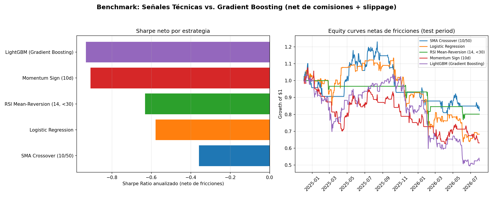
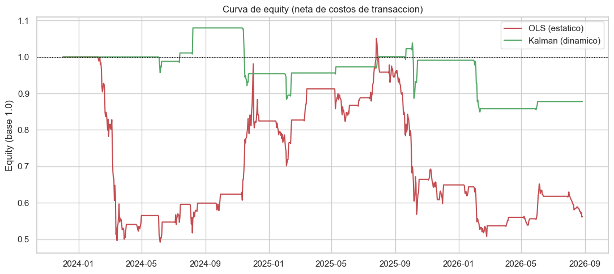
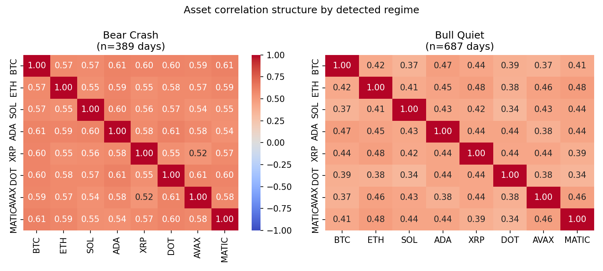

[ 🇺🇸 Read in English ](README.md) | [ 🇨🇱 Español ]

# Crypto Quant Techniques Lab

[](https://github.com/Rxyxs/crypto-quant-techniques-lab/actions/workflows/ci.yml)

Un solo laboratorio, ocho técnicas independientes aplicadas a datos de mercado cripto — detección de señales, microestructura de mercado, construcción de portafolios y NLP. Cada técnica vive en su propia carpeta numerada, con su propio README, dependencias y tests, y puede correr de forma independiente. Este repo reemplaza ocho repos separados de una sola técnica que antes vivían en este perfil; consolidarlos aquí deja más claro el punto real: son variaciones sobre un mismo toolkit (arbitraje estadístico, detección de anomalías, ML supervisado/no supervisado), no ocho proyectos sin relación.

## Técnicas

| # | Técnica | Carpeta | Qué hace |
|---|---|---|---|
| 01 | Clasificación de dirección (deep learning) | [`01-direction-classification-deep-learning`](01-direction-classification-deep-learning) | Redes densas (ReLU vs. Tanh) clasifican la dirección de la siguiente vela sobre datos OHLCV simulados AR(1)/GARCH y datos reales de Binance. |
| 02 | Liquidez e impacto en precio | [`02-liquidity-price-impact`](02-liquidity-price-impact) | Modelo XGBoost del impacto en precio del order book a partir de features sintéticas de profundidad/desbalance. |
| 03 | Pairs trading (cointegración) | [`03-pairs-trading-cointegration`](03-pairs-trading-cointegration) | Screening estadístico de cointegración + hedge ratio dinámico con filtro de Kalman para pairs trading. |
| 04 | Optimización de portafolio (Markowitz) | [`04-portfolio-markowitz-optimization`](04-portfolio-markowitz-optimization) | Construcción de portafolio por frontera eficiente sobre un universo de activos cripto. |
| 05 | Detección de regímenes y correlación | [`05-regime-detection-correlation`](05-regime-detection-correlation) | Detección de regímenes vía Markov switching y su efecto en la correlación entre activos. |
| 06 | Screening de sentimiento (NLP) | [`06-sentiment-nlp-screening`](06-sentiment-nlp-screening) | Sentimiento FinBERT sobre titulares financieros vs. volumen de trading. |
| 07 | Detección de spoofing en order book | [`07-orderbook-spoofing-detection`](07-orderbook-spoofing-detection) | Isolation Forest + autoencoder sobre datos streaming de order book L2, con calibración de alert-budget. |
| 08 | Backtesting de estrategias | [`08-strategy-backtesting`](08-strategy-backtesting) | Motor de backtesting estadístico comparando señales de trading bajo fricciones realistas. |

## Qué encontró cada una de las ocho técnicas

Todos los números provienen de una corrida real del pipeline de esa carpeta. Conviene leer la columna derecha antes que la del medio: **la mayoría de estos resultados son negativos, y se quedaron.**

| # | Técnica | Número principal | Qué dice en realidad |
|---|---|---|---|
| **01** | Clasificación de dirección | Accuracy real en BTCUSDT **0,519**, ROC-AUC 0,536 | Apenas por encima de la moneda al aire. Sobre datos sintéticos con señal AR(1) inyectada llega a 0,596 — la brecha entre ambos *es* el hallazgo. El proyecto trata **>90% de accuracy como señal de fuga de datos, no como descubrimiento** |
| **02** | Liquidez e impacto de precio | R² **0,100** a un horizonte de 1 minuto, 5,2% menos de RMSE | Habilidad real pero chica, y se evapora rápido: a 5 minutos el R² es −0,008 y a 15 minutos −0,068 — *peor que un pronóstico ingenuo*. El horizonte, no el modelo, decide si hay algo que predecir |
| **03** | Pairs trading (cointegración) | Kalman **−12,2%** contra OLS estático **−43,7%** neto | Los dos pierden plata. El hedge ratio dinámico recorta la pérdida 3,6x y el drawdown máximo de −51,6% a −21,4%, con 13 operaciones en vez de 21. Una mejora que sigue siendo pérdida se reporta como exactamente eso |
| **04** | Optimización de portafolio | Sharpe máximo **0,720**, asignando 74,6% BTC / 23,2% SOL / 2,2% BNB | Una asignación real y desbalanceada a partir de 24 meses de historia real de Binance — no la torta diversificada prolija de un ejemplo de manual |
| **05** | Detección de regímenes | Correlación por pares **0,42 → 0,58** agrupada (1,37x), **0,29 → 0,56** rodante (1,90x) | La diversificación se degrada justo cuando se necesita. Dos estadísticos, dos magnitudes — [§6.3](05-regime-detection-correlation/README.es.md) explica por qué difieren en vez de citar el mayor |
| **06** | Screening de sentimiento (NLP) | Recall de FinBERT: **100%** en negativas, 78,6% en positivas, **32,5% en neutrales** | El modelo empuja los titulares neutrales hacia las clases polares. Un punto ciego que aparece al medir recall por clase en vez de reportar un único número de accuracy |
| **07** | Spoofing en el libro de órdenes | Precisión **0,92** con presupuesto de alertas del 0,5% contra **0,64** con la contaminación por defecto del 2% | El único resultado inequívocamente positivo. La precisión más que se duplica al calibrar contra lo que un analista puede revisar de verdad — 25 alertas por día, no el valor por defecto de una librería |
| **08** | Backtesting de estrategias | Mejor Sharpe neto: **SMA Crossover en −0,358**; LightGBM el peor en −0,93 | Las cinco estrategias pierden plata neta de fricciones, y **la regla más simple le gana al gradient boosting**. El mayor turnover de LightGBM quema el 27,28% de su retorno en fricciones |

**Una accuracy de señal de 0,507 igual produjo un Sharpe neto negativo** (08). Esa línea sola es la tesis del laboratorio: la accuracy no implica rentabilidad una vez que se cobran comisiones y slippage.

---

## Evidencia

### Cinco estrategias, cinco Sharpe negativos, y gana la más simple



**Cómo leerla.** A la izquierda, el Sharpe anualizado **neto de comisiones y slippage**, una barra por estrategia — el eje va de −0,8 a 0, así que toda barra es una pérdida y una barra *más corta* es mejor. A la derecha, las curvas de equity detrás de esas barras, todas partiendo en $1.

El orden es el hallazgo. **LightGBM, el único modelo de machine learning de la comparación, es el peor de los cinco** (−0,93, terminando cerca de $0,53), mientras que un cruce de medias móviles 10/50 es el menos malo (−0,358, cerca de $0,84). El mecanismo está en las fricciones: LightGBM opera más, y un turnover más alto quema el 27,28% de su retorno bruto antes de que la calidad de la señal alcance a importar.

### Una mejora que sigue siendo pérdida



**Cómo leerla.** Las dos curvas son netas de costos de transacción y parten en 1,0. En rojo el hedge ratio OLS estático, ajustado una sola vez sobre toda la muestra; en verde la beta online del filtro de Kalman, reestimada día a día solo con datos disponibles hasta ese día.

La roja se derrumba a ~0,5 en dos meses y no se recupera, terminando en −43,7%. La verde se mantiene cerca de 1,0 casi toda la ventana y termina en −12,2%. El estimador dinámico es inequívocamente mejor — pérdida 3,6x menor, drawdown de −51,6% a −21,4% — **y aun así pierde plata.** Presentarlo como un triunfo porque le ganó a la alternativa sería la lectura fácil; la honesta es que la estrategia no funciona en esta ventana y el hedge ratio nunca fue el problema limitante.

Esta figura existe por una auditoría: el pipeline original ajustaba el OLS sobre *toda* la historia de precios y reusaba esa beta para puntuar días anteriores a los datos que la produjeron. Ese look-ahead bias ahora lo atrapa un test de invariancia por truncamiento que corre en CI.

### La diversificación colapsa cuando se la necesita



**Cómo leerla.** Una matriz de correlación por régimen descubierto, sobre los mismos ocho activos. Los regímenes son **no supervisados** — no se usó ninguna etiqueta de "este día fue un crash"; k=2 se eligió por silhouette sobre k=2..6.

Cada par está más rojo a la izquierda. Agrupando los días de cada régimen, el promedio fuera de la diagonal sube de **0,419 en Bull Quiet a 0,576 en Bear Crash**. Un portafolio dimensionado con una única matriz de correlación estática carga más riesgo concentrado del que su propio modelo de riesgo asume, justo en los 389 días en que eso importa.

---

## El patrón que cruza las ocho

Ocho técnicas, construidas por separado, sobre el mismo mercado. Convergen en una conclusión incómoda:

> **El edge mayormente no está — y la forma honesta de mostrarlo es dejar los resultados negativos.**

- **Las fricciones deciden el ranking, no la calidad del modelo.** En 08 el modelo de gradient boosting queda último y la regla técnica más simple queda primera, enteramente por el turnover. En 03 la pérdida bruta de −5,9% se convierte en −12,2% neta.
- **La accuracy no es rentabilidad.** 0,507 de accuracy de señal en 08, con Sharpe neto negativo. 0,519 de accuracy sobre BTCUSDT real en 01, contra 0,596 sobre datos sintéticos con una señal inyectada a propósito.
- **El horizonte decide si hay algo predecible.** En 02 el R² es 0,100 a un minuto y *negativo* a cinco y quince — el mismo modelo, las mismas features.
- **Calibrar le gana a los valores por defecto.** En 07, pasar del 2% de contaminación por defecto de una librería a un presupuesto del 0,5% ajustado a la capacidad real de revisión de un analista lleva la precisión de 0,64 a 0,92.
- **Un número alto se trata como síntoma.** 01 declara de frente que un >90% de accuracy en este problema se leería como señal de fuga de datos, no como resultado.

Las dos técnicas que pasaron por una auditoría dedicada de integridad temporal (03 y 08) concentran 64 de los 120 tests del laboratorio, porque cada verificación de invariancia por truncamiento y de Sortino de esa auditoría corre en CI en cada push.

---

## Metodología: integridad temporal, métricas ajustadas por riesgo y fricciones

Dos técnicas -- 03 (pairs trading) y 08 (backtesting de estrategias) -- pasaron por una auditoría dedicada que el resto del laboratorio todavía no tiene. El README de cada carpeta trae el detalle completo; esto es el resumen a nivel de repositorio:

- **Look-ahead bias, encontrado y eliminado en 03.** El pipeline ajustaba el hedge ratio de pairs trading (OLS) una sola vez sobre TODO el historial de precios, y reusaba ese mismo beta para puntuar todo el backtest -- incluidos días que, en tiempo real, ocurrieron antes de que existieran los datos detrás de ese beta. Se corrigió cambiando el camino de la señal en vivo (`run_full_pipeline`) al beta online del filtro de Kalman (`kalman_pairs.py`), que se re-estima día a día solo con datos disponibles hasta ese día -- el ajuste OLS estático se sigue calculando e imprimiendo, pero solo como referencia etiquetada, nunca alimenta el backtest. Verificado con un test de invarianza por truncamiento, no solo con una lectura de código: agregar filas futuras a la serie de precios no puede cambiar un beta, spread, z-score o posición ya calculados para un día anterior (`03-pairs-trading-cointegration/tests/test_lookahead_audit.py`).
- **Sortino Ratio, agregado a 03 y a 08.** Ajuste por riesgo que solo mira la desviación a la baja (`sqrt(promedio(min(retorno − MAR, 0)²))`, MAR = minimum acceptable return), probado para confirmar que efectivamente ignora la dispersión al alza que Sharpe sí penaliza -- dos series de retornos con la misma caída y la misma media pero distinta varianza al alza dan el mismo Sortino y distinto Sharpe -- y que devuelve `NaN`, nunca una división por cero ni un `0.0` engañoso, cuando una muestra no tiene ningún retorno por debajo del MAR.
- **Fricciones, explícitas en ambas, no idénticas.** Las dos cobran la misma comisión taker de 10 bps por defecto, y ninguna llena órdenes gratis al cierre. `08` escala su slippage con la volatilidad realizada (`base_bps + vol_multiplier × volatilidad_reciente`); `03` usa en cambio un slippage estático de entrada/salida -- una diferencia real entre los dos motores, no paridad completa, documentada como tal en vez de pasada por alto.

## Resultados de muestra

Un gráfico interactivo representativo por técnica, generado a partir de los datos/corrida real de cada carpeta (ver el README de cada carpeta para resultados completos y metodología):

| # | Técnica | Gráfico interactivo |
|---|---|---|
| 01 | Clasificación de dirección | [PnL walk-forward bruto vs. neto de costos](https://htmlpreview.github.io/?https://github.com/Rxyxs/crypto-quant-techniques-lab/blob/main/01-direction-classification-deep-learning/outputs/interactive/walkforward_pnl_interactive.html) |
| 02 | Liquidez e impacto en precio | [Precio real BTCUSDT vs. desbalance de order book/trade-flow](https://htmlpreview.github.io/?https://github.com/Rxyxs/crypto-quant-techniques-lab/blob/main/02-liquidity-price-impact/outputs/interactive/price_vs_liquidity_imbalance.html) |
| 03 | Pairs trading (cointegración) | [Spread cointegrado y z-score rodante](https://htmlpreview.github.io/?https://github.com/Rxyxs/crypto-quant-techniques-lab/blob/main/03-pairs-trading-cointegration/outputs/interactive/spread_zscore_interactive.html) |
| 04 | Optimización de portafolio (Markowitz) | [Frontera eficiente con portafolios de máximo Sharpe / mínima volatilidad](https://htmlpreview.github.io/?https://github.com/Rxyxs/crypto-quant-techniques-lab/blob/main/04-portfolio-markowitz-optimization/outputs/interactive/efficient_frontier_interactive.html) |
| 05 | Detección de regímenes y correlación | [Trayectoria de precio acumulada coloreada por régimen](https://htmlpreview.github.io/?https://github.com/Rxyxs/crypto-quant-techniques-lab/blob/main/05-regime-detection-correlation/outputs/interactive/regime_colored_price.html) |
| 06 | Screening de sentimiento (NLP) | [Score de sentimiento FinBERT vs. volumen de trading](https://htmlpreview.github.io/?https://github.com/Rxyxs/crypto-quant-techniques-lab/blob/main/06-sentiment-nlp-screening/outputs/interactive/sentiment_vs_volume.html) |
| 07 | Detección de spoofing en order book | [Línea de tiempo de alertas de spoofing](https://htmlpreview.github.io/?https://github.com/Rxyxs/crypto-quant-techniques-lab/blob/main/07-orderbook-spoofing-detection/outputs/interactive/spoofing_alert_timeline.html) |
| 08 | Backtesting de estrategias | [Curvas de equity netas de fricción, 5 estrategias](https://htmlpreview.github.io/?https://github.com/Rxyxs/crypto-quant-techniques-lab/blob/main/08-strategy-backtesting/outputs/interactive/equity_curves_comparison.html) |

## Por qué un repo en vez de ocho

Cada técnica es real, ejecutable y probada de forma independiente (ver el README de cada carpeta para setup y resultados) — esto no es esconder alcance, es representarlo con precisión. Ocho repos con el prefijo `crypto-` se leen como ocho proyectos sin relación; una carpeta de laboratorio con ocho técnicas se lee como lo que realmente es: una exploración sistemática del mismo toolkit — detección de anomalías, ML supervisado/no supervisado, series de tiempo estadísticas — aplicado a distintos problemas del mismo mercado.

## Cómo correr una técnica

Cada carpeta es autocontenida:

```bash
cd 0N-nombre-tecnica
python -m venv venv
venv/Scripts/pip install -r requirements.txt   # Windows
python <entry_point>.py
```

Ver el README de cada carpeta para el entry point exacto, resultados reales de una corrida real, y cualquier hallazgo negativo honesto.

## Integración continua

[`.github/workflows/ci.yml`](.github/workflows/ci.yml) corre **7 jobs en cada push y pull request** a `main` (`ubuntu-latest`, Python 3.10, pip cacheado por carpeta) -- un job por cada técnica que tiene una carpeta `tests/`. `06-sentiment-nlp-screening` todavía no tiene una, así que no está en la matriz.

| Técnica | Tests | Técnica | Tests |
|---|---|---|---|
| 01 — Clasificación de dirección | 6 | 05 — Detección de regímenes | 11 |
| 02 — Liquidez e impacto en precio | 10 | 07 — Spoofing en order book | 21 |
| 03 — Pairs trading | 35 | 08 — Backtesting de estrategias | 29 |
| 04 — Optimización de portafolio | 8 | **Total** | **120** |

`03` y `08` cargan mas de la mitad de ese total (64 de 120) porque son las dos técnicas con la auditoría dedicada de arriba -- cada test de invarianza por truncamiento, filtro de Kalman y Sortino de esa auditoría corre acá en cada push, no solo una vez en local.

## Checklist de producción

Lo que está realmente verificado a este commit, cerrando la tercera semana de trabajo en este laboratorio -- cada fila enlaza a donde se chequea, no solo se afirma:

| | Item | Evidencia |
|---|---|---|
| ✅ | CI automatizado multimódulo (7/7 jobs en GitHub Actions, Python 3.10) | [Integración continua](#integración-continua) arriba; badge al inicio de esta página |
| ✅ | Sin look-ahead bias en `03` y `08` (verificado vía tests de invarianza por truncamiento) | `03-pairs-trading-cointegration/tests/test_lookahead_audit.py`, `08-strategy-backtesting/tests/test_lookahead_and_metrics_audit.py` -- acotado a estas dos; las otras seis técnicas todavía no tuvieron esta auditoría específica |
| ✅ | Métricas ajustadas por riesgo: Sharpe (`03`, `04`, `08`) y Sortino (`03`, `08`) implementados | `pairs_trading_engine.py::sortino_ratio`, `backtest_engine.py::sortino_ratio`, el propio Sharpe de `04` en su frontera eficiente |
| ✅ | Fricciones de mercado reales en `03` y `08` (comisiones taker/maker + slippage) | `frictions.py` (dinámico, escalado por volatilidad) y `pairs_trading_engine.py::compute_transaction_cost_returns` (entrada/salida estático) -- ver la nota de metodología arriba sobre la diferencia real entre los dos |
| ✅ | Pipeline de pairs trading dinámico (filtro de Kalman online) | `run_full_pipeline` en `03` ahora alimenta su backtest desde el beta de `kalman_pairs.py`, no desde un ajuste OLS estático de toda la muestra |
| ✅ | Persistencia en DuckDB y datos reales de Binance, en la mayoría del laboratorio | DuckDB en las 8 carpetas de técnicas; descargas reales de Binance en `01`, `02`, `03`, `04`, `08` -- no existe una capa de serving en producción acá, esto es persistencia y datos de mercado reales, no un servicio desplegado |

## Autor

Pablo Reyes — [github.com/Rxyxs](https://github.com/Rxyxs)
Código: MIT — ver [LICENSE](LICENSE)
